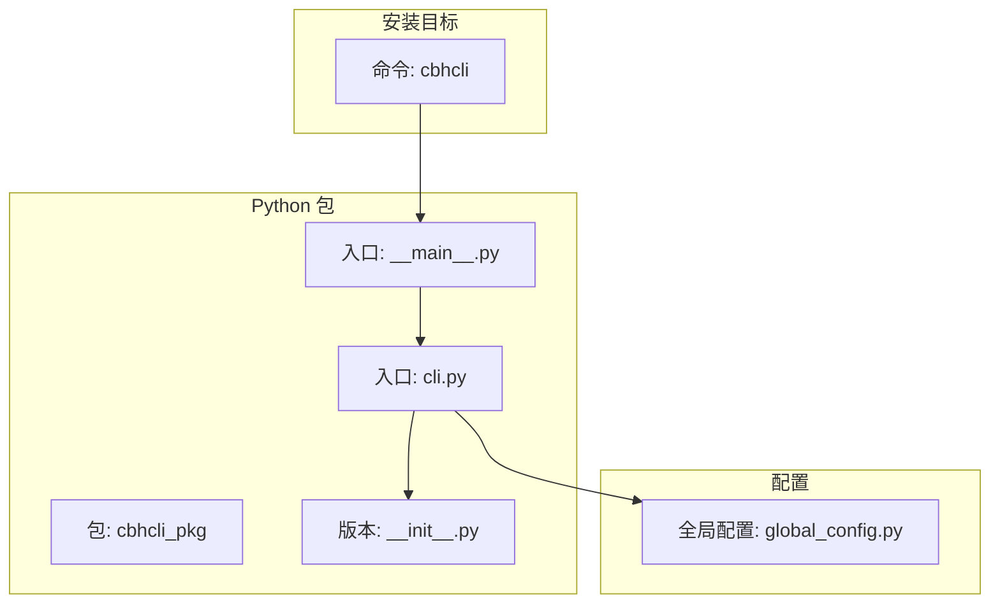
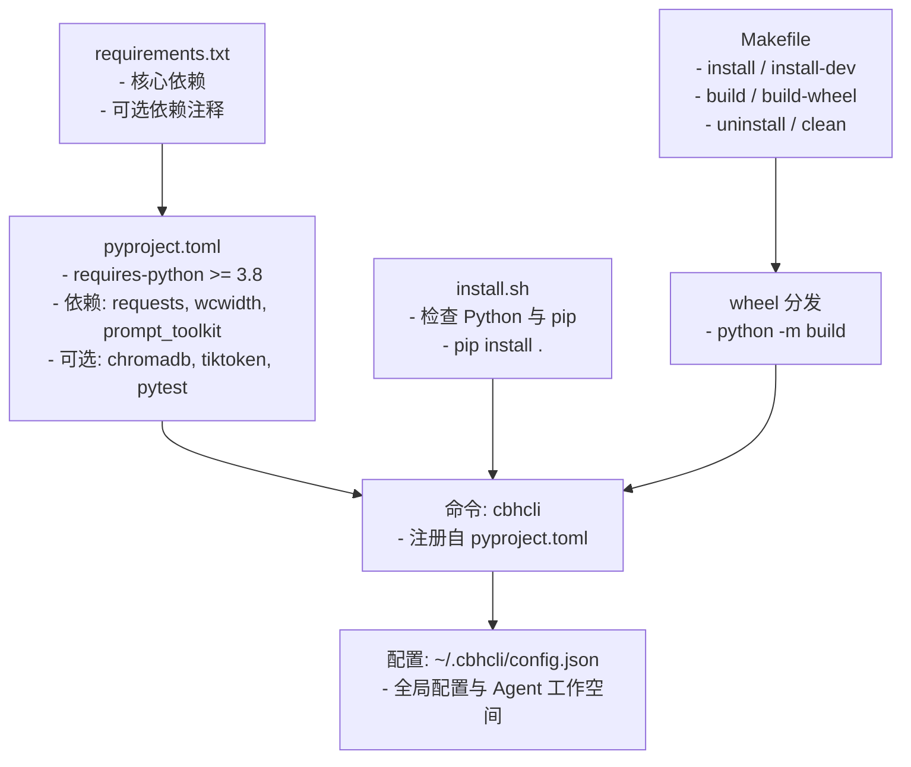
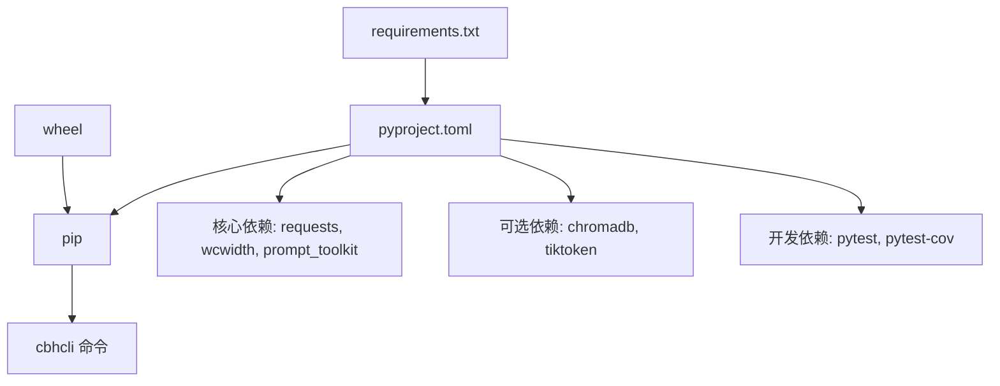

# 安装与配置

<cite>
**本文引用的文件**
- [INSTALL.md](file://INSTALL.md)
- [README.md](file://README.md)
- [install.sh](file://install.sh)
- [requirements.txt](file://requirements.txt)
- [pyproject.toml](file://pyproject.toml)
- [Makefile](file://Makefile)
- [package.json](file://package.json)
- [windows使用注意事项.txt](file://windows使用注意事项.txt)
- [cbhcli_pkg/__main__.py](file://cbhcli_pkg/__main__.py)
- [cbhcli_pkg/cli.py](file://cbhcli_pkg/cli.py)
- [cbhcli_pkg/__init__.py](file://cbhcli_pkg/__init__.py)
- [cbhcli_pkg/config/global_config.py](file://cbhcli_pkg/config/global_config.py)
- [test_v3.py](file://test_v3.py)
</cite>

## 目录
1. [简介](#简介)
2. [项目结构](#项目结构)
3. [核心组件](#核心组件)
4. [架构总览](#架构总览)
5. [详细组件分析](#详细组件分析)
6. [依赖关系分析](#依赖关系分析)
7. [性能考虑](#性能考虑)
8. [故障排查指南](#故障排查指南)
9. [结论](#结论)
10. [附录](#附录)

## 简介
本指南面向首次安装与配置 CBHCLI 的用户，涵盖系统要求与前置条件、多种安装方式（pip 安装、源码编译安装、包管理器安装）、依赖项安装（核心依赖与可选依赖）、环境配置（Python 环境、PATH、权限）、安装验证（版本检查、功能测试）、跨平台特殊配置（Linux、macOS、Windows），以及卸载与重新安装的完整流程。

## 项目结构
CBHCLI 是一个基于 Python 的 CLI 应用，提供多 Agent 管理、工具调用、知识库与会话管理能力。其核心入口通过命令行分发脚本注册，安装后可在任意位置直接运行。

图表来源
- [pyproject.toml:44-45](file://pyproject.toml#L44-L45)
- [cbhcli_pkg/__main__.py:1-7](file://cbhcli_pkg/__main__.py#L1-L7)
- [cbhcli_pkg/cli.py:1-112](file://cbhcli_pkg/cli.py#L1-L112)
- [cbhcli_pkg/__init__.py:1-9](file://cbhcli_pkg/__init__.py#L1-L9)
- [cbhcli_pkg/config/global_config.py:1-154](file://cbhcli_pkg/config/global_config.py#L1-L154)

章节来源
- [pyproject.toml:44-45](file://pyproject.toml#L44-L45)
- [cbhcli_pkg/__main__.py:1-7](file://cbhcli_pkg/__main__.py#L1-L7)
- [cbhcli_pkg/cli.py:1-112](file://cbhcli_pkg/cli.py#L1-L112)
- [cbhcli_pkg/__init__.py:1-9](file://cbhcli_pkg/__init__.py#L1-L9)
- [cbhcli_pkg/config/global_config.py:1-154](file://cbhcli_pkg/config/global_config.py#L1-L154)

## 核心组件
- 命令行入口与参数解析：负责解析 --version、--help 等参数，并在无参数时启动主应用。
- 主应用入口：启动 CBHCLIApp 并处理键盘中断与异常。
- 版本信息：来自包元数据与 __init__.py。
- 全局配置：统一在用户主目录下的 .cbhcli 目录中管理配置文件与工作空间。

章节来源
- [cbhcli_pkg/cli.py:73-112](file://cbhcli_pkg/cli.py#L73-L112)
- [cbhcli_pkg/__main__.py:1-7](file://cbhcli_pkg/__main__.py#L1-L7)
- [cbhcli_pkg/__init__.py:1-9](file://cbhcli_pkg/__init__.py#L1-L9)
- [cbhcli_pkg/config/global_config.py:1-154](file://cbhcli_pkg/config/global_config.py#L1-L154)

## 架构总览
CBHCLI 的安装与运行涉及以下关键环节：
- Python 版本与依赖约束由 pyproject.toml 管理
- 可选依赖通过额外安装启用向量检索与精确 Token 计数
- 安装后通过命令分发脚本注册 cbhcli 命令
- 运行时读取用户主目录下的配置文件进行初始化

图表来源
- [pyproject.toml:13-38](file://pyproject.toml#L13-L38)
- [requirements.txt:1-7](file://requirements.txt#L1-L7)
- [install.sh:1-29](file://install.sh#L1-L29)
- [Makefile:13-23](file://Makefile#L13-L23)
- [pyproject.toml:44-45](file://pyproject.toml#L44-L45)
- [cbhcli_pkg/config/global_config.py:8-11](file://cbhcli_pkg/config/global_config.py#L8-L11)

章节来源
- [pyproject.toml:13-38](file://pyproject.toml#L13-L38)
- [requirements.txt:1-7](file://requirements.txt#L1-L7)
- [install.sh:1-29](file://install.sh#L1-L29)
- [Makefile:13-23](file://Makefile#L13-L23)
- [pyproject.toml:44-45](file://pyproject.toml#L44-L45)
- [cbhcli_pkg/config/global_config.py:8-11](file://cbhcli_pkg/config/global_config.py#L8-L11)

## 详细组件分析

### 系统要求与前置条件
- Python 版本要求
  - 项目元数据要求 Python >= 3.8
  - README 提示 Python 3.8 或更高版本
- 操作系统兼容性
  - classifiers 显示支持 OS Independent
  - Windows 使用注意事项提示控制台颜色配置
- 硬件需求
  - 无特定硬件要求；向量检索与 Token 计数为可选增强功能

章节来源
- [pyproject.toml:13-25](file://pyproject.toml#L13-L25)
- [README.md:33-35](file://README.md#L33-L35)
- [windows使用注意事项.txt:1-2](file://windows使用注意事项.txt#L1-L2)

### 多种安装方式
- 方法一：从源码安装（开发模式）
  - 步骤要点：克隆/下载仓库、进入目录、pip install -e .
- 方法二：从源码安装（标准模式）
  - 步骤要点：克隆/下载仓库、进入目录、pip install .
- 方法三：构建并安装 wheel 发行版
  - 步骤要点：安装 build、python -m build、pip install dist/*.whl
- 包管理器安装
  - 通过 pip 安装标准发布包或 wheel

章节来源
- [INSTALL.md:10-45](file://INSTALL.md#L10-L45)
- [README.md:37-52](file://README.md#L37-L52)
- [Makefile:13-23](file://Makefile#L13-L23)

### 依赖项安装
- 核心依赖
  - requests、wcwidth、prompt_toolkit
- 可选依赖
  - chromadb：用于语义搜索
  - tiktoken：用于精确 Token 计数
- 开发依赖
  - pytest、pytest-cov

章节来源
- [pyproject.toml:26-42](file://pyproject.toml#L26-L42)
- [requirements.txt:1-7](file://requirements.txt#L1-L7)
- [README.md:54-61](file://README.md#L54-L61)

### 环境配置
- Python 环境设置
  - 推荐使用 Python 3.8+
  - 开发建议：使用 venv 创建隔离环境
- PATH 配置
  - 安装后应能在任意位置运行 cbhcli
  - 若命令不可用，检查安装路径是否在 PATH 中
- 权限设置
  - 在类 Unix 系统上，确保 Python 可执行文件与 pip 可用
  - Windows 控制台颜色显示需按注意事项配置

章节来源
- [INSTALL.md:63-69](file://INSTALL.md#L63-L69)
- [install.sh:9-19](file://install.sh#L9-L19)
- [windows使用注意事项.txt:1-2](file://windows使用注意事项.txt#L1-L2)

### 安装验证
- 版本检查
  - 使用 cbhcli --version 或 cbhcli -v
- 功能测试
  - 使用 cbhcli --help 或直接运行以进入交互
  - Makefile 提供 test 目标用于快速验证
- 常见问题排查
  - 命令未找到：检查 PATH、尝试 --user 安装、重启终端
  - Windows 控制台颜色异常：按注意事项添加注册表项

章节来源
- [INSTALL.md:47-53](file://INSTALL.md#L47-L53)
- [INSTALL.md:63-69](file://INSTALL.md#L63-L69)
- [Makefile:25-27](file://Makefile#L25-L27)
- [cbhcli_pkg/cli.py:81-94](file://cbhcli_pkg/cli.py#L81-L94)

### 跨平台特殊配置
- Linux/macOS
  - 确保 Python 与 pip 可用，必要时使用 --user 安装
- Windows
  - 控制台颜色显示需添加注册表项以启用虚拟终端级别

章节来源
- [INSTALL.md:63-69](file://INSTALL.md#L63-L69)
- [windows使用注意事项.txt:1-2](file://windows使用注意事项.txt#L1-L2)

### 卸载与重新安装
- 卸载
  - pip uninstall cbhcli
- 重新安装
  - 采用上述任一安装方式重新执行
  - 如需清理构建产物，可使用 make clean

章节来源
- [INSTALL.md:55-61](file://INSTALL.md#L55-L61)
- [Makefile:29-35](file://Makefile#L29-L35)

## 依赖关系分析
CBHCLI 的安装与运行依赖关系如下：

图表来源
- [pyproject.toml:26-42](file://pyproject.toml#L26-L42)
- [requirements.txt:1-7](file://requirements.txt#L1-L7)
- [pyproject.toml:44-45](file://pyproject.toml#L44-L45)

章节来源
- [pyproject.toml:26-42](file://pyproject.toml#L26-L42)
- [requirements.txt:1-7](file://requirements.txt#L1-L7)
- [pyproject.toml:44-45](file://pyproject.toml#L44-L45)

## 性能考虑
- 向量检索与重排序
  - 可选依赖 chromadb 与重排序模型可提升检索质量，但会增加资源占用
- Token 计数
  - 可选依赖 tiktoken 提供更精确的 Token 计数，有助于上下文管理
- 构建与安装
  - 使用 make build-wheel 仅生成 wheel，减少不必要的源码打包开销

章节来源
- [README.md:54-61](file://README.md#L54-L61)
- [Makefile:17-19](file://Makefile#L17-L19)

## 故障排查指南
- 命令不可用
  - 检查 PATH 是否包含 Python 的 Scripts 目录
  - 尝试 pip install --user . 以用户级安装
  - 重启终端使 PATH 生效
- Windows 控制台颜色异常
  - 按注意事项添加注册表项以启用虚拟终端级别
- 安装脚本执行失败
  - 确认已安装 Python 3.6+ 与 pip
  - install.sh 会在缺少 pip 时尝试安装

章节来源
- [INSTALL.md:63-69](file://INSTALL.md#L63-L69)
- [install.sh:9-19](file://install.sh#L9-L19)
- [windows使用注意事项.txt:1-2](file://windows使用注意事项.txt#L1-L2)

## 结论
CBHCLI 的安装与配置相对简单，核心在于满足 Python 版本要求、正确安装依赖与可选组件，并确保命令可用。通过多种安装方式与 Makefile 的辅助，用户可灵活选择适合自己的部署路径。遇到问题时，可依据本文档的验证与排查步骤快速定位并解决。

## 附录
- 快速命令参考
  - 安装（开发模式）：pip install -e .
  - 安装（标准模式）：pip install .
  - 构建 wheel：python -m build
  - 卸载：pip uninstall cbhcli
  - 测试安装：make test
  - 清理：make clean

章节来源
- [INSTALL.md:10-45](file://INSTALL.md#L10-L45)
- [Makefile:13-23](file://Makefile#L13-L23)
- [Makefile:25-27](file://Makefile#L25-L27)
- [Makefile:29-35](file://Makefile#L29-L35)