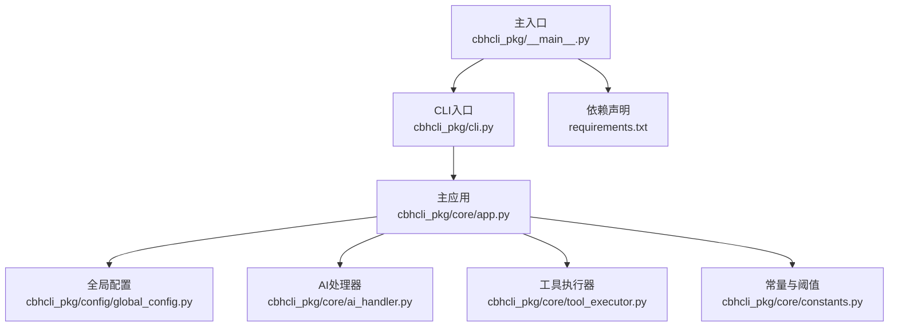
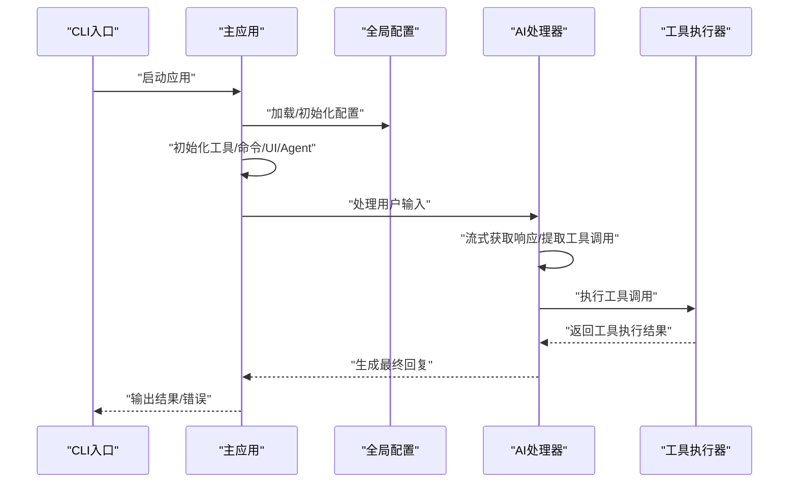
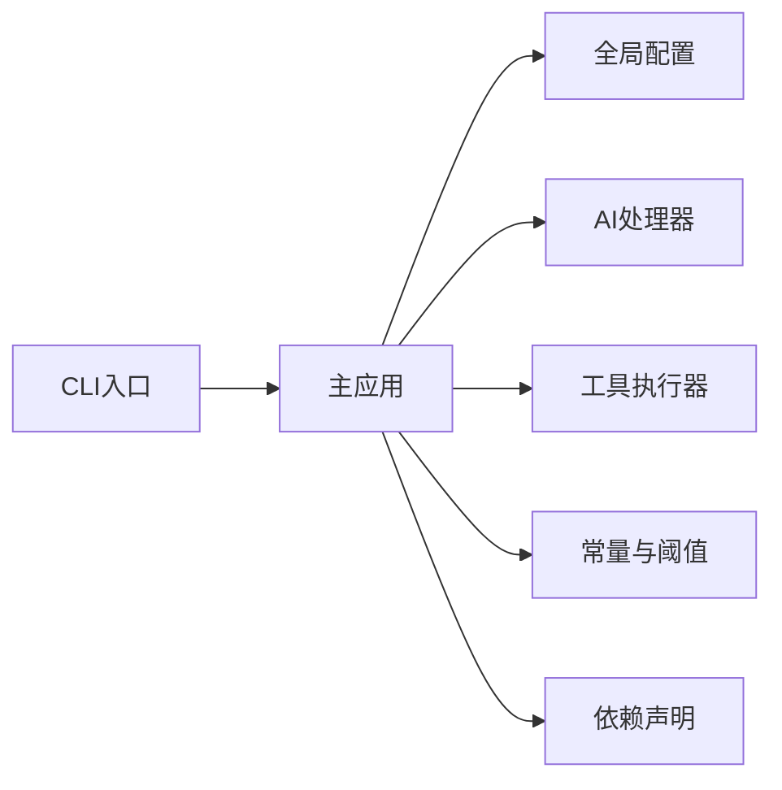
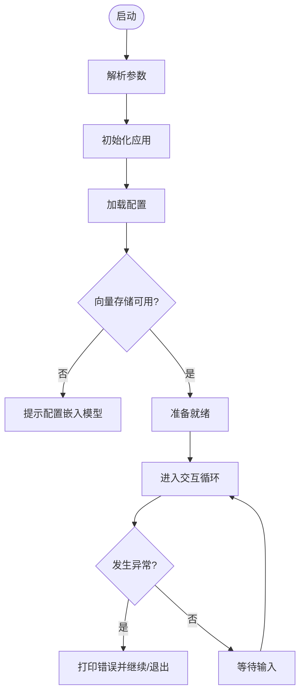

# 监控与日志

<cite>
**本文引用的文件**
- [README.md](file://README.md)
- [cbhcli_pkg/__main__.py](file://cbhcli_pkg/__main__.py)
- [cbhcli_pkg/cli.py](file://cbhcli_pkg/cli.py)
- [cbhcli_pkg/core/app.py](file://cbhcli_pkg/core/app.py)
- [cbhcli_pkg/config/global_config.py](file://cbhcli_pkg/config/global_config.py)
- [cbhcli_pkg/core/ai_handler.py](file://cbhcli_pkg/core/ai_handler.py)
- [cbhcli_pkg/core/tool_executor.py](file://cbhcli_pkg/core/tool_executor.py)
- [cbhcli_pkg/core/constants.py](file://cbhcli_pkg/core/constants.py)
- [requirements.txt](file://requirements.txt)
</cite>

## 目录
1. [简介](#简介)
2. [项目结构](#项目结构)
3. [核心组件](#核心组件)
4. [架构总览](#架构总览)
5. [详细组件分析](#详细组件分析)
6. [依赖分析](#依赖分析)
7. [性能考虑](#性能考虑)
8. [故障排查指南](#故障排查指南)
9. [结论](#结论)
10. [附录](#附录)

## 简介
本指南面向CBHCLI的运维与开发团队，聚焦“监控与日志管理”。当前代码库未内置统一的日志框架或监控指标采集逻辑，因此本指南基于现有代码结构与运行行为，提供一套可落地的监控与日志实践方案，涵盖：
- 日志系统配置与使用：日志级别、输出格式、轮转策略
- 系统监控指标：CPU、内存、网络I/O、磁盘空间
- 应用健康检查：服务状态、依赖服务、告警配置
- 日志收集与分析：聚合、实时监控、历史分析
- 性能监控工具集成：APM、分布式追踪、性能基准测试
- 监控告警配置与管理：阈值、通知渠道、故障处理流程
- 监控仪表板设计与维护建议

## 项目结构
CBHCLI采用命令行交互式架构，主入口负责参数解析与应用启动，核心应用负责Agent/会话/工具链路调度，配置模块负责持久化与默认参数。

**图示来源**
- [cbhcli_pkg/__main__.py:1-7](file://cbhcli_pkg/__main__.py#L1-L7)
- [cbhcli_pkg/cli.py:73-112](file://cbhcli_pkg/cli.py#L73-L112)
- [cbhcli_pkg/core/app.py:54-72](file://cbhcli_pkg/core/app.py#L54-L72)
- [cbhcli_pkg/config/global_config.py:13-154](file://cbhcli_pkg/config/global_config.py#L13-L154)
- [cbhcli_pkg/core/ai_handler.py:21-50](file://cbhcli_pkg/core/ai_handler.py#L21-L50)
- [cbhcli_pkg/core/tool_executor.py:15-33](file://cbhcli_pkg/core/tool_executor.py#L15-L33)
- [cbhcli_pkg/core/constants.py:1-50](file://cbhcli_pkg/core/constants.py#L1-L50)
- [requirements.txt:1-7](file://requirements.txt#L1-L7)

**章节来源**
- [README.md:269-295](file://README.md#L269-L295)
- [cbhcli_pkg/__main__.py:1-7](file://cbhcli_pkg/__main__.py#L1-L7)
- [cbhcli_pkg/cli.py:73-112](file://cbhcli_pkg/cli.py#L73-L112)
- [cbhcli_pkg/core/app.py:54-72](file://cbhcli_pkg/core/app.py#L54-L72)

## 核心组件
- 主入口与CLI：负责参数解析、帮助信息展示、版本查询与应用启动。
- 主应用（CBHCLIApp）：负责配置加载、Agent/会话/工具链路初始化、命令路由、运行循环与错误处理。
- 全局配置（GlobalConfig）：负责配置文件读写、默认配置、模型与Agent设置管理。
- AI处理器（AIHandler）：负责LLM流式响应处理、工具调用提取与执行、多轮对话协调。
- 工具执行器（ToolExecutor）：负责工具调用确认、执行与结果展示。
- 常量与阈值（constants）：定义上下文窗口、工具调用轮次、温度、超时等关键阈值。

**章节来源**
- [cbhcli_pkg/cli.py:73-112](file://cbhcli_pkg/cli.py#L73-L112)
- [cbhcli_pkg/core/app.py:54-72](file://cbhcli_pkg/core/app.py#L54-L72)
- [cbhcli_pkg/config/global_config.py:13-154](file://cbhcli_pkg/config/global_config.py#L13-L154)
- [cbhcli_pkg/core/ai_handler.py:21-50](file://cbhcli_pkg/core/ai_handler.py#L21-L50)
- [cbhcli_pkg/core/tool_executor.py:15-33](file://cbhcli_pkg/core/tool_executor.py#L15-L33)
- [cbhcli_pkg/core/constants.py:1-50](file://cbhcli_pkg/core/constants.py#L1-L50)

## 架构总览
CBHCLI的运行时交互路径如下：CLI解析参数后启动主应用；主应用初始化配置、工具、向量存储、命令与UI；进入交互循环；用户输入被AI处理器解析并可能触发工具执行；工具执行器调用具体工具并回显结果；异常通过CLI捕获并输出。

**图示来源**
- [cbhcli_pkg/cli.py:73-112](file://cbhcli_pkg/cli.py#L73-L112)
- [cbhcli_pkg/core/app.py:386-421](file://cbhcli_pkg/core/app.py#L386-L421)
- [cbhcli_pkg/core/ai_handler.py:51-96](file://cbhcli_pkg/core/ai_handler.py#L51-L96)
- [cbhcli_pkg/core/tool_executor.py:54-91](file://cbhcli_pkg/core/tool_executor.py#L54-L91)

## 详细组件分析

### 日志系统配置与使用
当前代码库未内置日志框架。建议采用标准库logging，并结合外部日志收集系统（如rsyslog、Fluent Bit、Filebeat）实现集中化与轮转。

- 日志级别设置
  - 建议：INFO/DEBUG/WARNING/ERROR四层。默认INFO，调试时临时提升至DEBUG。
  - 关键位置：应用启动、模型初始化、向量存储初始化、命令执行、工具调用、异常捕获。
- 输出格式配置
  - 建议：统一格式包含时间戳、级别、模块、消息体；JSON格式便于机器解析。
  - ANSI颜色仅用于终端交互输出，不应用于日志文件。
- 日志轮转策略
  - 建议：按大小轮转（如100MB）与按时间轮转（每日）双策略；保留N份备份。
  - 集中式：rsyslog或logrotate配合远程转发。

实施要点（基于现有代码位置）：
- 应用启动与错误处理：在CLI入口与主应用run循环中插入日志记录。
- 模型与向量初始化：在配置加载与向量存储初始化处记录状态与异常。
- 工具执行：在工具执行前后记录调用与结果摘要。

**章节来源**
- [cbhcli_pkg/cli.py:104-111](file://cbhcli_pkg/cli.py#L104-L111)
- [cbhcli_pkg/core/app.py:104-118](file://cbhcli_pkg/core/app.py#L104-L118)
- [cbhcli_pkg/core/app.py:120-147](file://cbhcli_pkg/core/app.py#L120-L147)
- [cbhcli_pkg/core/tool_executor.py:54-91](file://cbhcli_pkg/core/tool_executor.py#L54-L91)

### 系统监控指标
CBHCLI为本地CLI应用，无内置指标导出。建议通过以下方式采集与上报：

- CPU使用率
  - Linux：使用psutil或系统工具（如top、sar）采集进程CPU。
  - Docker/K8s：通过cAdvisor/Prometheus Node Exporter。
- 内存占用
  - 使用psutil或/proc/self/status读取RSS；关注峰值与持续占用。
- 网络I/O
  - LLM调用涉及HTTP请求，可通过Prometheus的exporter或应用埋点统计请求耗时与QPS。
- 磁盘空间
  - 监控~/.cbhcli目录所在分区剩余空间，设置阈值告警。

指标建议（基于代码行为）：
- 模型初始化与向量索引：记录耗时与成功率，便于定位性能瓶颈。
- 工具执行：记录平均耗时、失败率、输出长度分布。

**章节来源**
- [cbhcli_pkg/core/app.py:104-118](file://cbhcli_pkg/core/app.py#L104-L118)
- [cbhcli_pkg/core/app.py:120-147](file://cbhcli_pkg/core/app.py#L120-L147)
- [requirements.txt:1-7](file://requirements.txt#L1-L7)

### 应用健康检查机制
- 服务状态检查
  - CLI入口支持--version/--help，可作为基本可用性检查。
  - 主应用run循环中对KeyboardInterrupt与通用异常进行捕获并优雅提示。
- 依赖服务监控
  - 模型API、向量数据库（可选）：在初始化阶段记录失败原因，纳入健康检查。
- 告警配置
  - 建议：结合Prometheus Alertmanager或企业告警平台，针对启动失败、初始化异常、工具执行失败率设置阈值告警。

**章节来源**
- [cbhcli_pkg/cli.py:81-99](file://cbhcli_pkg/cli.py#L81-L99)
- [cbhcli_pkg/cli.py:104-111](file://cbhcli_pkg/cli.py#L104-L111)
- [cbhcli_pkg/core/app.py:104-118](file://cbhcli_pkg/core/app.py#L104-L118)

### 日志收集与分析
- 日志聚合
  - 使用rsyslog/Filebeat/Fluent Bit收集应用日志与系统日志，统一发送到ELK/EFK或Loki+Grafana。
- 实时监控
  - Grafana Loki结合Promtail实现日志流式查询与告警。
- 历史数据分析
  - 通过日志字段（如模块、级别、耗时、错误码）做趋势分析与根因定位。

**章节来源**
- [cbhcli_pkg/core/ai_handler.py:144-216](file://cbhcli_pkg/core/ai_handler.py#L144-L216)
- [cbhcli_pkg/core/tool_executor.py:54-91](file://cbhcli_pkg/core/tool_executor.py#L54-L91)

### 性能监控工具集成
- APM工具
  - Python应用可接入OpenTelemetry或商业APM（如DataDog、NewRelic），采集Traces/Metrics/Logs。
- 分布式追踪
  - 为LLM请求与工具执行生成Trace ID，跨服务串联调用链。
- 性能基准测试
  - 使用locust或自研脚本模拟多用户并发，测量P50/P95响应时间与吞吐。

**章节来源**
- [cbhcli_pkg/core/ai_handler.py:51-96](file://cbhcli_pkg/core/ai_handler.py#L51-L96)
- [cbhcli_pkg/core/tool_executor.py:54-91](file://cbhcli_pkg/core/tool_executor.py#L54-L91)

### 监控告警配置与管理
- 阈值设置
  - 模型初始化失败率、工具执行失败率、响应时间P95、磁盘剩余空间百分比。
- 通知渠道
  - 邮件、Slack、钉钉、企业微信等。
- 故障处理流程
  - 自动降级（禁用向量检索）、快速回滚、隔离异常Agent。

**章节来源**
- [cbhcli_pkg/core/app.py:104-118](file://cbhcli_pkg/core/app.py#L104-L118)
- [cbhcli_pkg/core/tool_executor.py:122-140](file://cbhcli_pkg/core/tool_executor.py#L122-L140)

### 监控仪表板设计与维护建议
- 仪表板建议
  - 实时概览：启动成功率、活跃Agent数、工具执行QPS、错误率。
  - 时序面板：模型调用耗时、工具执行耗时、上下文压缩触发次数。
  - 地图/热力图：按Agent维度展示资源占用与错误分布。
- 维护建议
  - 定期审查阈值与告警规则，避免噪声与漏报。
  - 为关键指标设置基线与同比/环比告警。

**章节来源**
- [cbhcli_pkg/core/app.py:361-384](file://cbhcli_pkg/core/app.py#L361-L384)
- [cbhcli_pkg/core/constants.py:6-8](file://cbhcli_pkg/core/constants.py#L6-L8)

## 依赖分析
- CLI与主应用：CLI负责参数解析与启动，主应用负责业务编排。
- 配置模块：提供默认配置与持久化能力，影响Agent/模型/向量初始化。
- AI与工具链：AI处理器负责LLM交互与工具调用，工具执行器负责执行与展示。
- 常量模块：提供上下文窗口、工具调用轮次、温度、超时等阈值。

**图示来源**
- [cbhcli_pkg/cli.py:73-112](file://cbhcli_pkg/cli.py#L73-L112)
- [cbhcli_pkg/core/app.py:54-72](file://cbhcli_pkg/core/app.py#L54-L72)
- [cbhcli_pkg/config/global_config.py:13-154](file://cbhcli_pkg/config/global_config.py#L13-L154)
- [cbhcli_pkg/core/ai_handler.py:21-50](file://cbhcli_pkg/core/ai_handler.py#L21-L50)
- [cbhcli_pkg/core/tool_executor.py:15-33](file://cbhcli_pkg/core/tool_executor.py#L15-L33)
- [cbhcli_pkg/core/constants.py:1-50](file://cbhcli_pkg/core/constants.py#L1-L50)
- [requirements.txt:1-7](file://requirements.txt#L1-L7)

**章节来源**
- [cbhcli_pkg/cli.py:73-112](file://cbhcli_pkg/cli.py#L73-L112)
- [cbhcli_pkg/core/app.py:54-72](file://cbhcli_pkg/core/app.py#L54-L72)
- [cbhcli_pkg/config/global_config.py:13-154](file://cbhcli_pkg/config/global_config.py#L13-L154)
- [cbhcli_pkg/core/ai_handler.py:21-50](file://cbhcli_pkg/core/ai_handler.py#L21-L50)
- [cbhcli_pkg/core/tool_executor.py:15-33](file://cbhcli_pkg/core/tool_executor.py#L15-L33)
- [cbhcli_pkg/core/constants.py:1-50](file://cbhcli_pkg/core/constants.py#L1-L50)
- [requirements.txt:1-7](file://requirements.txt#L1-L7)

## 性能考虑
- 上下文窗口与压缩
  - 默认上下文限制与压缩比例在常量中定义，AI处理器在多轮工具调用中动态评估是否需要压缩。
- 工具调用轮次与输出截断
  - 限制最大工具轮次与输出长度，避免长尾请求拖慢整体性能。
- 模型调用温度与超时
  - 统一温度与API超时，减少不稳定因素导致的性能波动。

**章节来源**
- [cbhcli_pkg/core/constants.py:6-23](file://cbhcli_pkg/core/constants.py#L6-L23)
- [cbhcli_pkg/core/ai_handler.py:68-96](file://cbhcli_pkg/core/ai_handler.py#L68-L96)
- [cbhcli_pkg/core/ai_handler.py:144-216](file://cbhcli_pkg/core/ai_handler.py#L144-L216)

## 故障排查指南
- 启动失败
  - 检查CLI参数与版本输出；确认配置文件存在且可读。
- 模型未配置
  - 主应用在缺少模型时提示用户使用/model命令配置。
- 向量存储初始化失败
  - 嵌入模型或重排序模型配置错误会导致初始化失败，需检查API Key与URL。
- 工具执行失败
  - 工具执行器会输出错误信息；检查工具参数与权限。
- 中断与异常
  - CLI捕获KeyboardInterrupt与通用异常，输出友好提示并退出。

**图示来源**
- [cbhcli_pkg/cli.py:81-111](file://cbhcli_pkg/cli.py#L81-L111)
- [cbhcli_pkg/core/app.py:104-118](file://cbhcli_pkg/core/app.py#L104-L118)
- [cbhcli_pkg/core/app.py:120-147](file://cbhcli_pkg/core/app.py#L120-L147)

**章节来源**
- [cbhcli_pkg/cli.py:81-111](file://cbhcli_pkg/cli.py#L81-L111)
- [cbhcli_pkg/core/app.py:104-118](file://cbhcli_pkg/core/app.py#L104-L118)
- [cbhcli_pkg/core/app.py:120-147](file://cbhcli_pkg/core/app.py#L120-L147)
- [cbhcli_pkg/core/tool_executor.py:122-140](file://cbhcli_pkg/core/tool_executor.py#L122-L140)

## 结论
CBHCLI当前未内置统一的日志与监控体系，但其清晰的模块边界为后续集成提供了良好基础。建议：
- 引入标准日志框架并配置集中化与轮转；
- 通过APM与Prometheus采集关键指标；
- 建立健康检查与告警机制；
- 设计可视化仪表板并持续优化阈值；
- 在工具与模型调用处埋点，形成完整的可观测性闭环。

## 附录
- 配置文件位置与结构：~/.cbhcli/config.json
- Agent工作空间：~/.cbhcli/agents/<agent_name>/
- 可选依赖：向量数据库与Token计数库

**章节来源**
- [README.md:150-206](file://README.md#L150-L206)