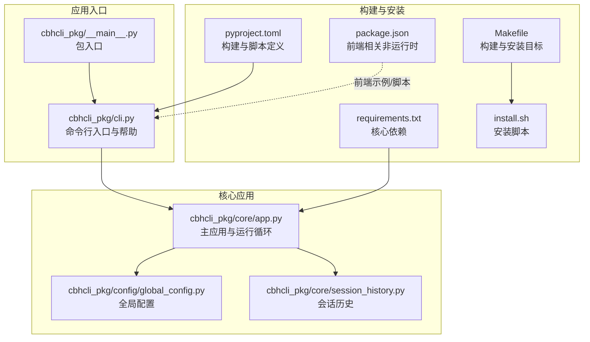
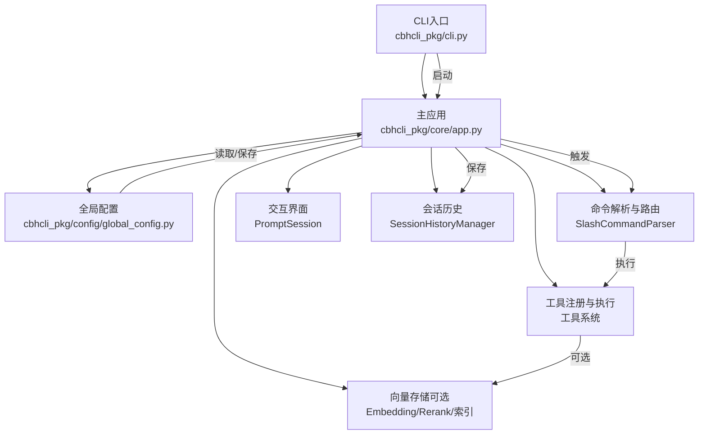
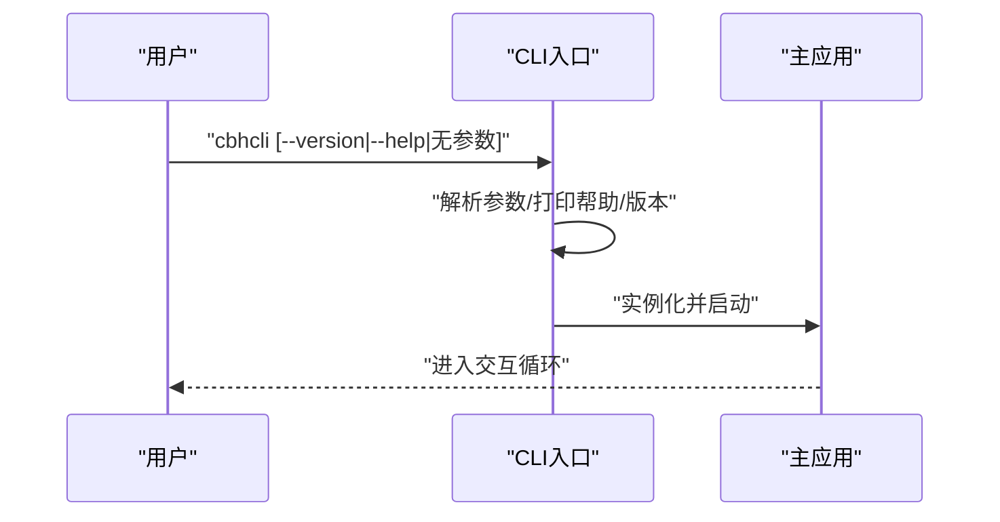
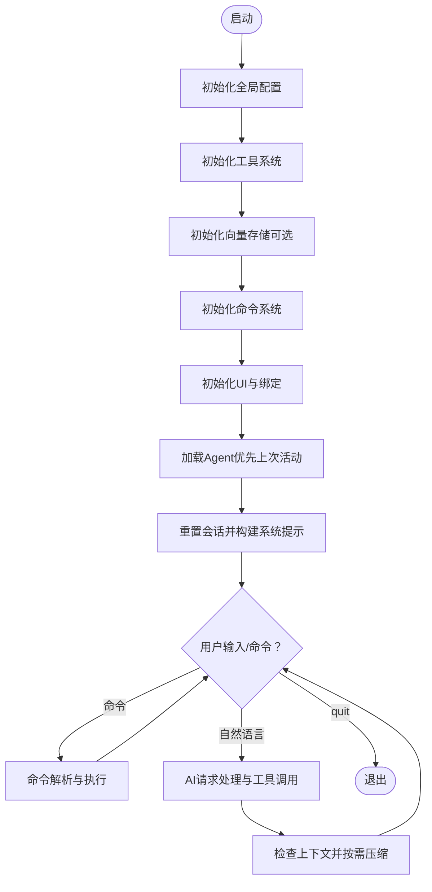
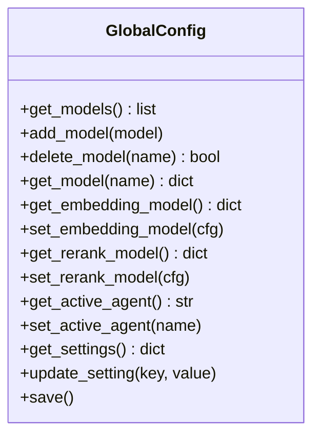
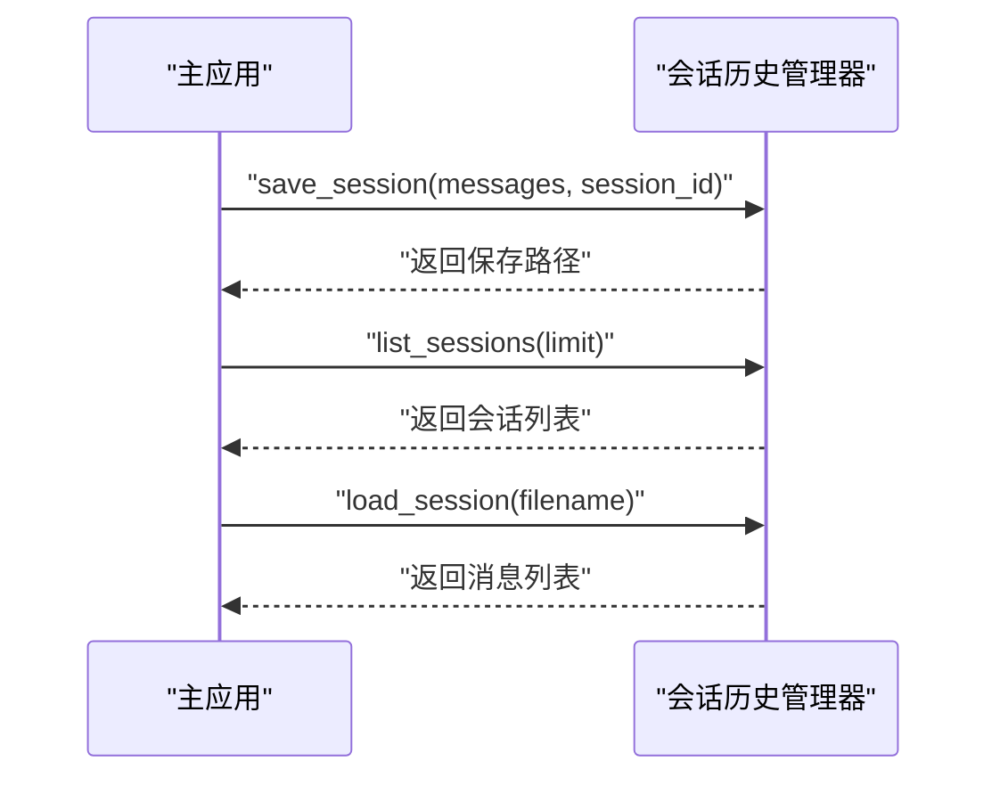
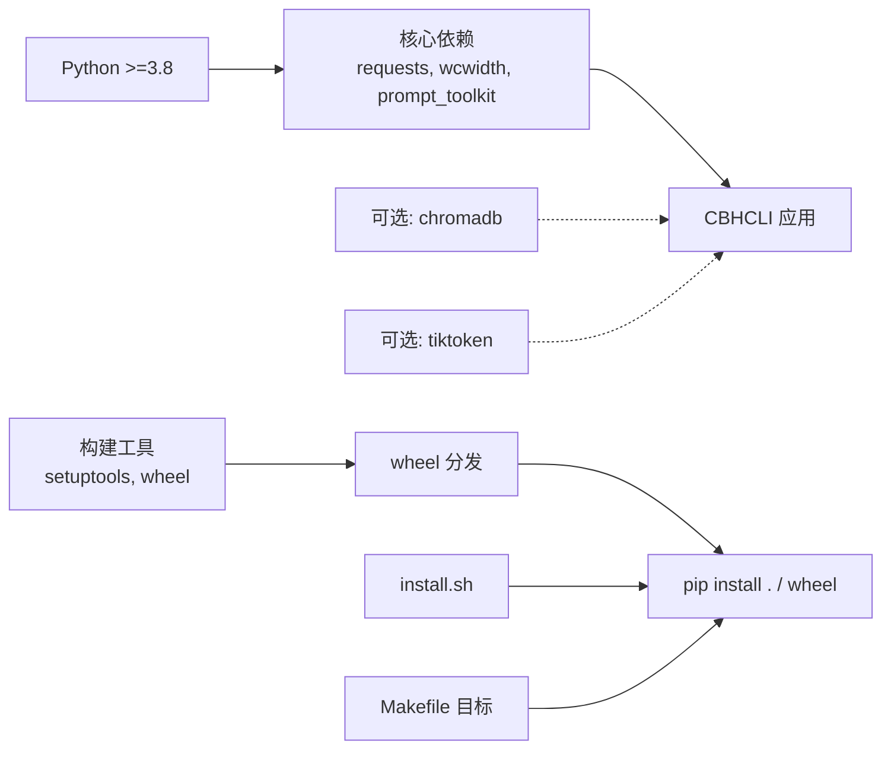

# 部署与运维

<cite>
**本文引用的文件**
- [README.md](file://README.md)
- [INSTALL.md](file://INSTALL.md)
- [install.sh](file://install.sh)
- [requirements.txt](file://requirements.txt)
- [pyproject.toml](file://pyproject.toml)
- [Makefile](file://Makefile)
- [package.json](file://package.json)
- [cbhcli_pkg/cli.py](file://cbhcli_pkg/cli.py)
- [cbhcli_pkg/__main__.py](file://cbhcli_pkg/__main__.py)
- [cbhcli_pkg/core/app.py](file://cbhcli_pkg/core/app.py)
- [cbhcli_pkg/config/global_config.py](file://cbhcli_pkg/config/global_config.py)
- [cbhcli_pkg/core/session_history.py](file://cbhcli_pkg/core/session_history.py)
</cite>

## 目录
1. [简介](#简介)
2. [项目结构](#项目结构)
3. [核心组件](#核心组件)
4. [架构总览](#架构总览)
5. [详细组件分析](#详细组件分析)
6. [依赖分析](#依赖分析)
7. [性能考虑](#性能考虑)
8. [故障排查指南](#故障排查指南)
9. [结论](#结论)
10. [附录](#附录)

## 简介
本指南面向运维工程师与平台管理员，围绕 CBHCLI 在生产环境中的部署与运维展开，涵盖服务器准备、依赖安装、配置设置、启动验证、容器化部署（含 Docker 与 Kubernetes）、监控与日志、备份与恢复、升级与迁移、安全加固、运维自动化、容量规划与性能调优、故障响应与应急处理以及合规与审计等方面。文档严格基于仓库内的安装与配置文件进行说明，并提供可视化图示帮助理解。

## 项目结构
CBHCLI 采用 Python 包结构组织，核心入口通过命令行脚本注册，应用主逻辑集中在核心模块中，配置统一管理在全局配置模块，会话历史持久化在各 Agent 工作空间的 history 目录中。

图表来源
- [cbhcli_pkg/cli.py:73-112](file://cbhcli_pkg/cli.py#L73-L112)
- [cbhcli_pkg/__main__.py:1-7](file://cbhcli_pkg/__main__.py#L1-L7)
- [cbhcli_pkg/core/app.py:54-72](file://cbhcli_pkg/core/app.py#L54-L72)
- [cbhcli_pkg/config/global_config.py:13-54](file://cbhcli_pkg/config/global_config.py#L13-L54)
- [cbhcli_pkg/core/session_history.py:8-23](file://cbhcli_pkg/core/session_history.py#L8-L23)
- [pyproject.toml:44-45](file://pyproject.toml#L44-L45)
- [requirements.txt:1-7](file://requirements.txt#L1-L7)
- [Makefile:1-55](file://Makefile#L1-L55)
- [install.sh:1-29](file://install.sh#L1-L29)
- [package.json:1-22](file://package.json#L1-L22)

章节来源
- [README.md:269-295](file://README.md#L269-L295)
- [pyproject.toml:1-53](file://pyproject.toml#L1-L53)
- [Makefile:1-55](file://Makefile#L1-L55)
- [install.sh:1-29](file://install.sh#L1-L29)

## 核心组件
- CLI 入口与帮助：负责解析参数、输出帮助与版本信息，并启动主应用。
- 主应用（CBHCLIApp）：负责初始化配置、工具系统、向量存储（可选）、命令系统、UI 与交互循环、Agent 加载与会话管理。
- 全局配置（GlobalConfig）：集中管理模型、嵌入模型、重排序模型、Agent 默认与活动状态、应用设置（如自动压缩、工作空间路径等），并提供持久化保存。
- 会话历史（SessionHistoryManager）：负责将会话消息保存到 Agent 工作空间的 history 目录，支持列出、加载与恢复。

章节来源
- [cbhcli_pkg/cli.py:73-112](file://cbhcli_pkg/cli.py#L73-L112)
- [cbhcli_pkg/core/app.py:54-72](file://cbhcli_pkg/core/app.py#L54-L72)
- [cbhcli_pkg/config/global_config.py:13-54](file://cbhcli_pkg/config/global_config.py#L13-L54)
- [cbhcli_pkg/core/session_history.py:8-23](file://cbhcli_pkg/core/session_history.py#L8-L23)

## 架构总览
下图展示 CBHCLI 的运行时架构与关键交互：CLI 启动主应用，主应用加载全局配置与 Agent，初始化工具与向量能力（可选），进入交互循环；命令通过解析器路由至相应处理器；会话历史持久化到工作空间。

图表来源
- [cbhcli_pkg/cli.py:73-112](file://cbhcli_pkg/cli.py#L73-L112)
- [cbhcli_pkg/core/app.py:54-180](file://cbhcli_pkg/core/app.py#L54-L180)
- [cbhcli_pkg/config/global_config.py:13-54](file://cbhcli_pkg/config/global_config.py#L13-L54)
- [cbhcli_pkg/core/session_history.py:8-23](file://cbhcli_pkg/core/session_history.py#L8-L23)

## 详细组件分析

### CLI 入口与参数解析
- 支持 --version 与 --help 输出版本与帮助。
- 未知参数会提示并输出帮助。
- 正常启动时实例化主应用并进入运行循环。

图表来源
- [cbhcli_pkg/cli.py:73-112](file://cbhcli_pkg/cli.py#L73-L112)

章节来源
- [cbhcli_pkg/cli.py:73-112](file://cbhcli_pkg/cli.py#L73-L112)

### 主应用生命周期与会话管理
- 初始化顺序：配置 → 工具 → 向量存储（可选）→ 命令 → UI → Agent。
- 自动加载“main”Agent，若不存在则创建；尝试加载上次活动 Agent。
- 会话重置时自动保存当前会话到 history 目录，支持 /resume 恢复。
- 上下文接近阈值时自动压缩，支持手动压缩与查看上下文使用。

图表来源
- [cbhcli_pkg/core/app.py:204-331](file://cbhcli_pkg/core/app.py#L204-L331)
- [cbhcli_pkg/core/session_history.py:24-47](file://cbhcli_pkg/core/session_history.py#L24-L47)

章节来源
- [cbhcli_pkg/core/app.py:204-331](file://cbhcli_pkg/core/app.py#L204-L331)
- [cbhcli_pkg/core/session_history.py:24-47](file://cbhcli_pkg/core/session_history.py#L24-L47)

### 全局配置与持久化
- 配置文件位置：用户主目录下的 .cbhcli/config.json。
- 关键域：models（模型列表）、embedding_model（嵌入模型）、rerank_model（重排序模型）、agents（默认与活动 Agent）、settings（自动压缩、压缩比例、工作空间基路径、是否使用 ChromaDB 内置嵌入、知识库根目录）。
- 提供模型增删改查、嵌入/重排序模型配置、设置更新与保存等接口。

图表来源
- [cbhcli_pkg/config/global_config.py:13-154](file://cbhcli_pkg/config/global_config.py#L13-L154)

章节来源
- [cbhcli_pkg/config/global_config.py:13-154](file://cbhcli_pkg/config/global_config.py#L13-L154)

### 会话历史与恢复
- 保存位置：Agent 工作空间下的 history 目录，文件名包含时间戳与会话 ID。
- 支持列出最近会话、按文件名或序号恢复、加载指定会话并注入消息（跳过系统消息）。

图表来源
- [cbhcli_pkg/core/session_history.py:24-71](file://cbhcli_pkg/core/session_history.py#L24-L71)
- [cbhcli_pkg/core/app.py:291-301](file://cbhcli_pkg/core/app.py#L291-L301)

章节来源
- [cbhcli_pkg/core/session_history.py:24-71](file://cbhcli_pkg/core/session_history.py#L24-L71)
- [cbhcli_pkg/core/app.py:291-301](file://cbhcli_pkg/core/app.py#L291-L301)

## 依赖分析
- Python 版本要求：3.8 及以上。
- 核心依赖：requests、wcwidth、prompt_toolkit。
- 可选依赖：chromadb（向量搜索）、tiktoken（精确 Token 计数）。
- 构建与脚本：通过 setuptools/wheel 构建，命令行入口由 pyproject.toml 注册。
- 安装方式：开发模式、标准安装、wheel 安装、Makefile 目标、安装脚本。

图表来源
- [pyproject.toml:13-30](file://pyproject.toml#L13-L30)
- [requirements.txt:1-7](file://requirements.txt#L1-L7)
- [Makefile:13-28](file://Makefile#L13-L28)
- [install.sh:21-26](file://install.sh#L21-L26)

章节来源
- [pyproject.toml:13-30](file://pyproject.toml#L13-L30)
- [requirements.txt:1-7](file://requirements.txt#L1-L7)
- [Makefile:13-28](file://Makefile#L13-L28)
- [install.sh:21-26](file://install.sh#L21-L26)

## 性能考虑
- 上下文压缩：当接近模型上下文阈值时自动压缩，可调整压缩比例与阈值；必要时手动压缩与查看上下文使用。
- Token 计数：可结合 tiktoken 获取更精确的 Token 估算，有助于控制成本与延迟。
- 向量索引：手动触发索引以减少启动时开销，仅在知识库内容变更后重新索引。
- 并发与资源：单进程 CLI 应用，适合单用户交互；如需多用户并发，建议通过容器编排隔离实例或引入代理层。

章节来源
- [cbhcli_pkg/core/app.py:361-385](file://cbhcli_pkg/core/app.py#L361-L385)
- [requirements.txt:5-7](file://requirements.txt#L5-L7)

## 故障排查指南
- 命令不可用：确认安装方式与 PATH，必要时使用 --user 重装或重启终端。
- 模型未配置：Agent 未绑定模型时无法发起 AI 请求，使用 /model 命令配置。
- 向量功能异常：检查嵌入模型配置与向量存储初始化日志；未配置嵌入模型时会提示启用方式。
- 会话恢复失败：确认 history 目录存在与文件名正确；支持按序号或文件名恢复。
- 安装脚本问题：确保 Python3 与 pip 可用，脚本会自动安装 pip 并执行安装。

章节来源
- [INSTALL.md:63-69](file://INSTALL.md#L63-L69)
- [cbhcli_pkg/core/app.py:104-149](file://cbhcli_pkg/core/app.py#L104-L149)
- [cbhcli_pkg/core/session_history.py:43-71](file://cbhcli_pkg/core/session_history.py#L43-L71)
- [install.sh:9-19](file://install.sh#L9-L19)

## 结论
本指南基于仓库现有文件，给出了 CBHCLI 在生产环境中的部署与运维要点：清晰的安装路径、可选的向量能力、完善的会话历史持久化、可扩展的配置管理与命令体系。后续可在容器化、监控与日志、备份与恢复、升级与迁移、安全加固、自动化与容量规划方面进一步完善。

## 附录

### 生产环境部署流程（步骤概览）
- 服务器准备
  - 系统：满足 Python 3.8+ 要求。
  - 权限：具备 pip 安装权限与用户主目录写权限（用于 .cbhcli 配置与数据）。
- 依赖安装
  - 使用 pip 安装：标准安装或开发模式安装。
  - 可选：安装 chromadb 与 tiktoken 以启用向量搜索与精确 Token 计数。
- 配置设置
  - 全局配置：在 ~/.cbhcli/config.json 中配置模型、嵌入模型、重排序模型与应用设置。
  - Agent 工作空间：默认位于 ~/.cbhcli/agents/<agent_name>/，包含 config.json、技能/性格/工具/使用说明、memory.md、history、knowledge 等。
- 启动验证
  - 运行 cbhcli，查看版本与帮助；创建/切换 Agent；配置模型；执行基本命令与会话恢复。

章节来源
- [INSTALL.md:8-28](file://INSTALL.md#L8-L28)
- [requirements.txt:1-7](file://requirements.txt#L1-L7)
- [README.md:150-206](file://README.md#L150-L206)
- [cbhcli_pkg/config/global_config.py:13-54](file://cbhcli_pkg/config/global_config.py#L13-L54)

### 容器化部署方案（概念性说明）
- Docker 镜像构建
  - 基础镜像：官方 Python 运行时镜像（3.8+）。
  - 安装：COPY 项目目录后执行 pip 安装（可选 --user）。
  - 可选：安装 chromadb/tiktoken 以启用向量与 Token 计数。
  - 入口：CMD ["cbhcli"]。
- Kubernetes 部署
  - Deployment：单副本或根据并发需求多副本（建议通过外部代理或会话隔离）。
  - ConfigMap：存放最小化配置（如模型基础信息），敏感信息使用 Secret。
  - PVC：挂载 ~/.cbhcli 到持久卷，保障配置与会话历史持久化。
  - Service/Ingress：暴露 Web/TTY 接入（如需）。
- 集群管理
  - 资源配额：CPU/内存限制与请求。
  - 健康检查：就绪探针可简单检测进程存活。
  - 日志采集：容器 stdout/stderr 采集到集中日志系统。

[本节为概念性说明，不直接对应具体源文件，故不附“图表来源/章节来源”]

### 监控与日志管理策略（概念性说明）
- 系统监控：CPU、内存、磁盘占用与容器健康状态。
- 应用日志：STDOUT/STDERR 采集，结合容器日志驱动与集中日志系统。
- 性能指标：可选埋点（如请求耗时、Token 数、压缩次数），通过指标系统采集。

[本节为概念性说明，不直接对应具体源文件，故不附“图表来源/章节来源”]

### 备份与恢复方案（概念性说明）
- 配置备份：定期备份 ~/.cbhcli/config.json。
- 数据备份：备份 ~/.cbhcli/agents/<agent>/history 与 knowledge 目录。
- 灾难恢复：在新节点上恢复配置与数据目录，重新安装应用，验证 Agent 与会话恢复。

[本节为概念性说明，不直接对应具体源文件，故不附“图表来源/章节/sources”]

### 升级与迁移策略（概念性说明）
- 版本升级：使用 pip 升级包；如涉及破坏性变更，先备份配置与数据。
- 配置迁移：对照新增字段（如有）更新 config.json；Agent 工作空间结构保持稳定。
- 数据迁移：迁移 ~/.cbhcli 目录；验证向量索引与知识库状态（必要时重新索引）。

[本节为概念性说明，不直接对应具体源文件，故不附“图表来源/章节来源”]

### 安全加固措施（概念性说明）
- 访问控制：限制 ~/.cbhcli 目录权限；避免在共享主机上使用全局安装。
- 网络安全：模型与向量服务的 API Key 与 Base URL 使用 Secret 管理；避免明文配置。
- 数据保护：对敏感文件（如 memory.md）进行最小权限访问；定期审计配置与日志。

[本节为概念性说明，不直接对应具体源文件，故不附“图表来源/章节来源”]

### 运维自动化脚本与工具
- Makefile 目标：install、install-dev、build、build-wheel、uninstall、test、clean、install-build-tools、full-install。
- 安装脚本：install.sh 自动检测 Python 与 pip 并执行安装。
- 前端 package.json：包含 Node/JS 示例脚本（非运行时必需），可用于本地演示或脚本辅助。

章节来源
- [Makefile:5-55](file://Makefile#L5-L55)
- [install.sh:1-29](file://install.sh#L1-L29)
- [package.json:1-22](file://package.json#L1-L22)

### 容量规划与性能调优建议（概念性说明）
- 存储：为 ~/.cbhcli 配置足够磁盘空间，尤其是 knowledge 与 history 的增长。
- 计算：根据上下文长度与工具调用复杂度评估 CPU；启用 tiktoken 以更准确估算 Token 成本。
- 索引：控制向量索引频率，仅在内容变更后重新索引，降低 API 调用与时间成本。

[本节为概念性说明，不直接对应具体源文件，故不附“图表来源/章节来源”]

### 故障响应与应急处理流程（概念性说明）
- 快速诊断：检查安装路径、Python 版本、依赖完整性与配置文件格式。
- 回滚策略：保留上一版本 wheel 或镜像，快速回退。
- 应急预案：隔离问题实例，恢复配置与数据卷，重新部署。

[本节为概念性说明，不直接对应具体源文件，故不附“图表来源/章节来源”]

### 合规性与审计要求（概念性说明）
- 配置审计：定期比对 config.json 与基线配置，记录变更。
- 日志审计：保留至少 90 天的操作日志与错误日志，支持事件追溯。
- 数据最小化：仅保留必要的知识库与会话历史，遵守数据保留政策。

[本节为概念性说明，不直接对应具体源文件，故不附“图表来源/章节来源”]