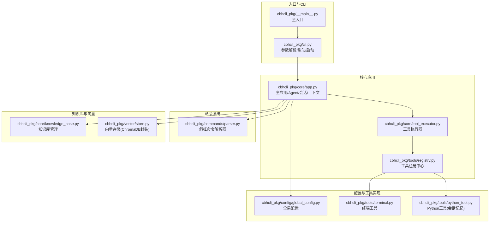
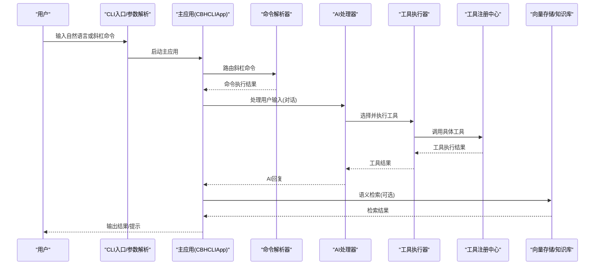
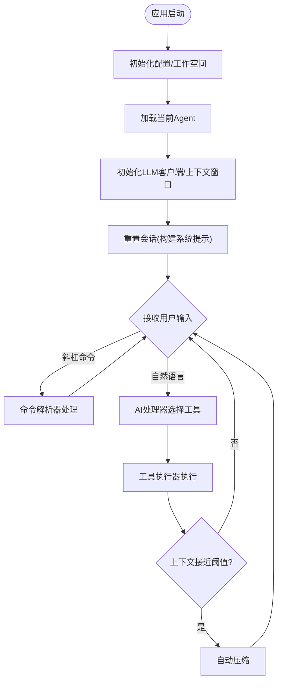
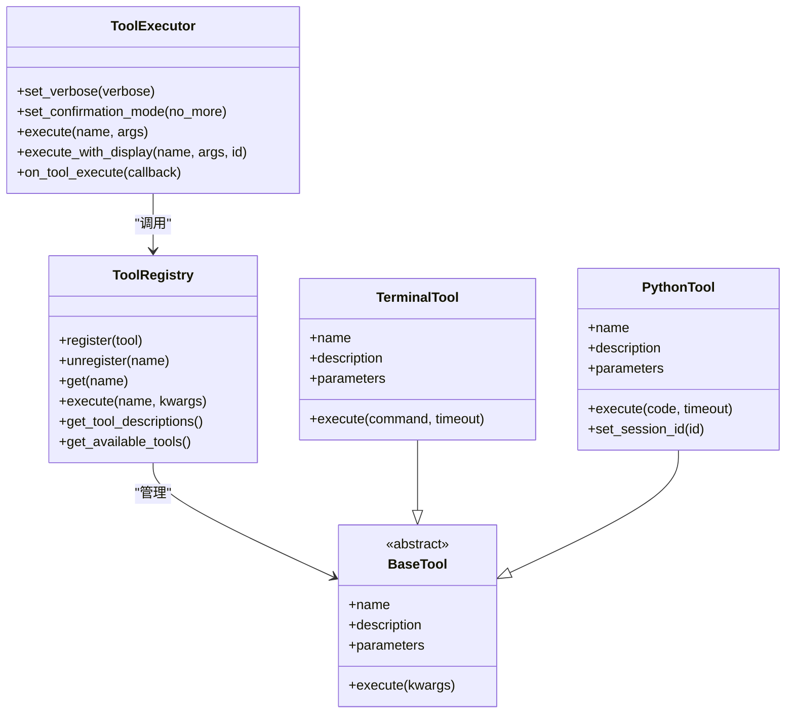
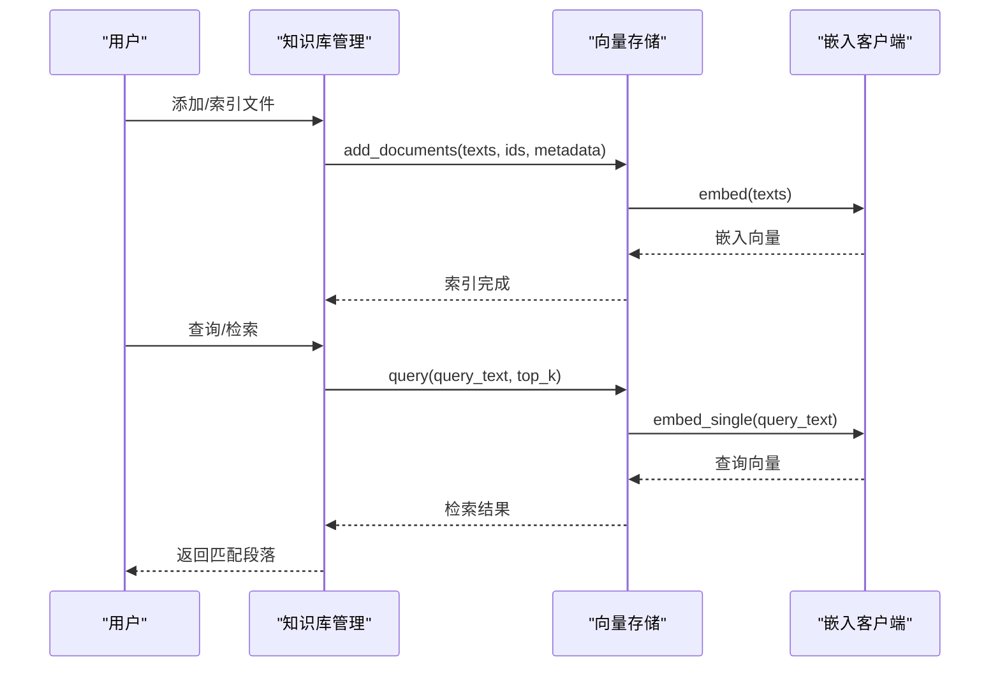
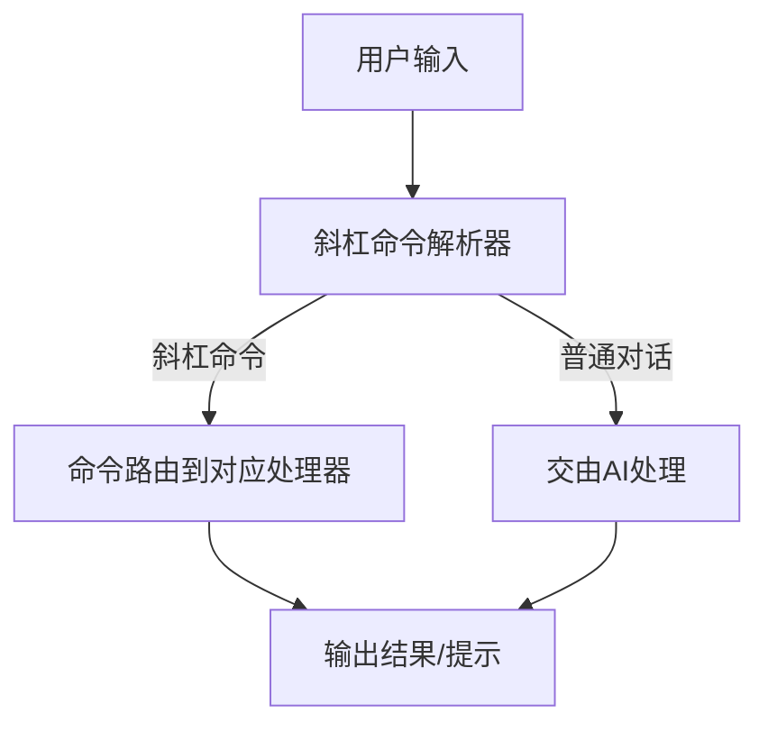
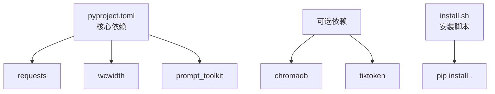

# 应用场景与价值

<cite>
**本文引用的文件**
- [README.md](file://README.md)
- [install.sh](file://install.sh)
- [requirements.txt](file://requirements.txt)
- [pyproject.toml](file://pyproject.toml)
- [cbhcli_pkg/__main__.py](file://cbhcli_pkg/__main__.py)
- [cbhcli_pkg/cli.py](file://cbhcli_pkg/cli.py)
- [cbhcli_pkg/core/app.py](file://cbhcli_pkg/core/app.py)
- [cbhcli_pkg/core/tool_executor.py](file://cbhcli_pkg/core/tool_executor.py)
- [cbhcli_pkg/tools/registry.py](file://cbhcli_pkg/tools/registry.py)
- [cbhcli_pkg/tools/terminal.py](file://cbhcli_pkg/tools/terminal.py)
- [cbhcli_pkg/tools/python_tool.py](file://cbhcli_pkg/tools/python_tool.py)
- [cbhcli_pkg/core/knowledge_base.py](file://cbhcli_pkg/core/knowledge_base.py)
- [cbhcli_pkg/config/global_config.py](file://cbhcli_pkg/config/global_config.py)
- [cbhcli_pkg/vector/store.py](file://cbhcli_pkg/vector/store.py)
- [cbhcli_pkg/commands/parser.py](file://cbhcli_pkg/commands/parser.py)
</cite>

## 目录
1. [简介](#简介)
2. [项目结构](#项目结构)
3. [核心组件](#核心组件)
4. [架构总览](#架构总览)
5. [详细组件分析](#详细组件分析)
6. [依赖分析](#依赖分析)
7. [性能考虑](#性能考虑)
8. [故障排查指南](#故障排查指南)
9. [结论](#结论)
10. [附录](#附录)

## 简介
CBHCLI 是一款“AI驱动的终端助手”，围绕“多Agent管理、工具调用、知识库与会话管理”构建，旨在通过自然语言指令让AI自动识别并执行合适的工具，完成复杂的系统运维、开发与数据处理任务。其核心价值在于：
- 降低技术门槛：非编程人员也能通过自然语言完成系统管理与数据处理。
- 提升效率：自动上下文压缩、向量检索增强、工具链编排，减少重复劳动。
- 可扩展与可定制：支持多模型切换、可插拔工具、MCP扩展、向量检索与重排序。

## 项目结构
CBHCLI 采用模块化分层设计，主要分为 CLI 入口、核心应用、工具系统、命令解析、配置与向量存储等模块。整体结构如下：

图表来源
- [cbhcli_pkg/__main__.py:1-7](file://cbhcli_pkg/__main__.py#L1-L7)
- [cbhcli_pkg/cli.py:1-112](file://cbhcli_pkg/cli.py#L1-L112)
- [cbhcli_pkg/core/app.py:1-478](file://cbhcli_pkg/core/app.py#L1-L478)
- [cbhcli_pkg/core/tool_executor.py:1-168](file://cbhcli_pkg/core/tool_executor.py#L1-L168)
- [cbhcli_pkg/tools/registry.py:1-115](file://cbhcli_pkg/tools/registry.py#L1-L115)
- [cbhcli_pkg/commands/parser.py:1-94](file://cbhcli_pkg/commands/parser.py#L1-L94)
- [cbhcli_pkg/core/knowledge_base.py:1-207](file://cbhcli_pkg/core/knowledge_base.py#L1-L207)
- [cbhcli_pkg/vector/store.py:1-175](file://cbhcli_pkg/vector/store.py#L1-L175)
- [cbhcli_pkg/config/global_config.py:1-154](file://cbhcli_pkg/config/global_config.py#L1-L154)
- [cbhcli_pkg/tools/terminal.py:1-99](file://cbhcli_pkg/tools/terminal.py#L1-L99)
- [cbhcli_pkg/tools/python_tool.py:1-207](file://cbhcli_pkg/tools/python_tool.py#L1-L207)

章节来源
- [README.md:269-295](file://README.md#L269-L295)
- [pyproject.toml:44-45](file://pyproject.toml#L44-L45)

## 核心组件
- CLI入口与参数解析：负责版本/帮助输出、启动主应用。
- 主应用（CBHCLIApp）：负责Agent管理、会话生命周期、上下文压缩、工具执行调度、向量索引与命令路由。
- 工具系统：统一注册与执行，支持终端命令、文件读写/编辑、Python代码执行、内存搜索、知识库查询等。
- 命令系统：斜杠命令解析与路由，覆盖Agent、模型、会话、知识库、向量索引、MCP等管理。
- 知识库与向量：基于ChromaDB的向量存储，支持嵌入模型与重排序，提供语义检索能力。
- 全局配置：集中管理模型、嵌入模型、重排序模型、Agent与设置。

章节来源
- [cbhcli_pkg/cli.py:73-112](file://cbhcli_pkg/cli.py#L73-L112)
- [cbhcli_pkg/core/app.py:54-331](file://cbhcli_pkg/core/app.py#L54-L331)
- [cbhcli_pkg/core/tool_executor.py:15-168](file://cbhcli_pkg/core/tool_executor.py#L15-L168)
- [cbhcli_pkg/tools/registry.py:51-115](file://cbhcli_pkg/tools/registry.py#L51-L115)
- [cbhcli_pkg/commands/parser.py:16-94](file://cbhcli_pkg/commands/parser.py#L16-L94)
- [cbhcli_pkg/core/knowledge_base.py:7-207](file://cbhcli_pkg/core/knowledge_base.py#L7-L207)
- [cbhcli_pkg/vector/store.py:37-175](file://cbhcli_pkg/vector/store.py#L37-L175)
- [cbhcli_pkg/config/global_config.py:13-154](file://cbhcli_pkg/config/global_config.py#L13-L154)

## 架构总览
CBHCLI 的运行时交互流程如下：用户通过CLI输入自然语言或斜杠命令；CLI将命令交由命令解析器处理；若为普通对话则委托AI处理器，AI根据系统提示与工具描述选择合适工具并执行；工具执行器负责确认、执行与结果展示；同时上下文窗口监控与自动压缩保障长对话稳定性；向量存储与知识库提供语义检索能力。

图表来源
- [cbhcli_pkg/cli.py:73-112](file://cbhcli_pkg/cli.py#L73-L112)
- [cbhcli_pkg/core/app.py:386-440](file://cbhcli_pkg/core/app.py#L386-L440)
- [cbhcli_pkg/core/tool_executor.py:42-92](file://cbhcli_pkg/core/tool_executor.py#L42-L92)
- [cbhcli_pkg/tools/registry.py:70-97](file://cbhcli_pkg/tools/registry.py#L70-L97)
- [cbhcli_pkg/core/knowledge_base.py:151-207](file://cbhcli_pkg/core/knowledge_base.py#L151-L207)

## 详细组件分析

### 组件A：主应用与会话管理（CBHCLIApp）
- 职责：初始化配置、Agent与会话、工具系统、命令路由、UI与交互、上下文压缩、向量索引与MCP管理。
- 关键流程：
  - Agent加载与切换：根据全局配置加载活动Agent，初始化LLM客户端、上下文窗口、会话历史与MCP管理器。
  - 会话重置：保存当前会话历史、清空Python会话记忆、构建系统提示（含工具描述、模型名、长期记忆）。
  - 上下文压缩：当接近模型上下文阈值时自动压缩，保障长对话稳定。
  - 命令路由：将斜杠命令交由解析器处理，支持Agent、模型、会话、知识库、向量索引、MCP等管理。
  - 工具执行：委托AI处理器进行工具选择与执行，并支持记忆更新回调。

图表来源
- [cbhcli_pkg/core/app.py:204-331](file://cbhcli_pkg/core/app.py#L204-L331)
- [cbhcli_pkg/core/app.py:361-440](file://cbhcli_pkg/core/app.py#L361-L440)

章节来源
- [cbhcli_pkg/core/app.py:54-331](file://cbhcli_pkg/core/app.py#L54-L331)

### 组件B：工具系统与工具执行器
- 工具注册中心：统一注册、查找与执行工具，提供工具描述与参数Schema，便于AI在系统提示中了解可用能力。
- 工具执行器：负责工具调用前的确认、执行、结果格式化与输出；支持详细/简洁模式切换；提供回调钩子。
- 内置工具：
  - 终端工具：执行任意shell命令，支持超时控制与错误输出。
  - Python工具：执行Python代码，支持会话记忆（同一会话变量持久化）。
  - 文件工具：读取/写入/编辑文件。
  - 知识库与内存搜索：基于向量检索的语义搜索。

图表来源
- [cbhcli_pkg/tools/registry.py:51-115](file://cbhcli_pkg/tools/registry.py#L51-L115)
- [cbhcli_pkg/core/tool_executor.py:15-168](file://cbhcli_pkg/core/tool_executor.py#L15-L168)
- [cbhcli_pkg/tools/terminal.py:7-99](file://cbhcli_pkg/tools/terminal.py#L7-L99)
- [cbhcli_pkg/tools/python_tool.py:127-207](file://cbhcli_pkg/tools/python_tool.py#L127-L207)

章节来源
- [cbhcli_pkg/core/tool_executor.py:15-168](file://cbhcli_pkg/core/tool_executor.py#L15-L168)
- [cbhcli_pkg/tools/registry.py:1-115](file://cbhcli_pkg/tools/registry.py#L1-L115)
- [cbhcli_pkg/tools/terminal.py:1-99](file://cbhcli_pkg/tools/terminal.py#L1-L99)
- [cbhcli_pkg/tools/python_tool.py:1-207](file://cbhcli_pkg/tools/python_tool.py#L1-L207)

### 组件C：知识库与向量检索
- 知识库管理：Agent专属知识库目录，支持添加/删除/列出文件，按段落索引到向量数据库。
- 向量存储：封装ChromaDB，支持自定义嵌入模型API；预先计算嵌入向量，避免默认模型调用；提供查询与统计。
- 检索流程：用户通过工具或命令触发检索，系统将查询文本编码为向量，在集合中检索Top-K相似段落并返回元数据与距离。

图表来源
- [cbhcli_pkg/core/knowledge_base.py:31-207](file://cbhcli_pkg/core/knowledge_base.py#L31-L207)
- [cbhcli_pkg/vector/store.py:99-175](file://cbhcli_pkg/vector/store.py#L99-L175)

章节来源
- [cbhcli_pkg/core/knowledge_base.py:1-207](file://cbhcli_pkg/core/knowledge_base.py#L1-L207)
- [cbhcli_pkg/vector/store.py:1-175](file://cbhcli_pkg/vector/store.py#L1-L175)

### 组件D：命令系统与交互
- 斜杠命令解析器：统一解析“/命令 参数”，注册与帮助输出，支持按需Agent上下文。
- CLI帮助与快捷键：提供命令清单、工具清单、快捷键（如Ctrl+R切换工具显示模式）。
- 安装与运行：支持从源码安装、脚本安装与可选依赖（向量数据库、Token计数）。

图表来源
- [cbhcli_pkg/commands/parser.py:26-94](file://cbhcli_pkg/commands/parser.py#L26-L94)
- [cbhcli_pkg/cli.py:7-71](file://cbhcli_pkg/cli.py#L7-L71)

章节来源
- [cbhcli_pkg/commands/parser.py:1-94](file://cbhcli_pkg/commands/parser.py#L1-L94)
- [cbhcli_pkg/cli.py:1-112](file://cbhcli_pkg/cli.py#L1-L112)
- [install.sh:1-29](file://install.sh#L1-L29)
- [requirements.txt:1-7](file://requirements.txt#L1-L7)

## 依赖分析
- 运行时依赖：requests、wcwidth、prompt_toolkit。
- 可选依赖：chromadb（向量检索）、tiktoken（Token计数）。
- 安装方式：支持pip安装与脚本安装，提供开发与测试依赖。

图表来源
- [pyproject.toml:26-30](file://pyproject.toml#L26-L30)
- [pyproject.toml:32-38](file://pyproject.toml#L32-L38)
- [install.sh:21-26](file://install.sh#L21-L26)

章节来源
- [pyproject.toml:1-53](file://pyproject.toml#L1-L53)
- [requirements.txt:1-7](file://requirements.txt#L1-L7)
- [install.sh:1-29](file://install.sh#L1-L29)

## 性能考虑
- 上下文压缩：当接近模型上下文阈值时自动压缩，减少Token占用，提升长对话稳定性。
- 向量检索：预先计算嵌入向量，避免ChromaDB调用默认模型，降低API开销与延迟。
- 工具执行：支持超时控制与输出截断，避免长时间阻塞与过长输出影响交互体验。
- 会话记忆：Python工具支持会话记忆，减少重复计算与重复导入带来的额外开销。

章节来源
- [cbhcli_pkg/core/app.py:361-385](file://cbhcli_pkg/core/app.py#L361-L385)
- [cbhcli_pkg/vector/store.py:118-126](file://cbhcli_pkg/vector/store.py#L118-L126)
- [cbhcli_pkg/tools/terminal.py:31-99](file://cbhcli_pkg/tools/terminal.py#L31-L99)
- [cbhcli_pkg/tools/python_tool.py:170-207](file://cbhcli_pkg/tools/python_tool.py#L170-L207)

## 故障排查指南
- 模型未配置：若Agent未配置模型，将提示使用斜杠命令配置模型。
- 向量存储初始化失败：若嵌入模型配置无效或ChromaDB未安装，会提示失败并建议配置或安装。
- 命令执行失败：斜杠命令执行异常会返回错误信息，可查看帮助或检查参数。
- 工具执行失败：工具异常会返回错误详情，必要时检查权限、路径或超时设置。
- 会话历史保存：重置会话时会尝试保存当前会话历史至history目录。

章节来源
- [cbhcli_pkg/core/app.py:410-420](file://cbhcli_pkg/core/app.py#L410-L420)
- [cbhcli_pkg/core/app.py:104-149](file://cbhcli_pkg/core/app.py#L104-L149)
- [cbhcli_pkg/commands/parser.py:51-78](file://cbhcli_pkg/commands/parser.py#L51-L78)
- [cbhcli_pkg/core/tool_executor.py:84-91](file://cbhcli_pkg/core/tool_executor.py#L84-L91)
- [cbhcli_pkg/core/app.py:290-297](file://cbhcli_pkg/core/app.py#L290-L297)

## 结论
CBHCLI 通过“自然语言+工具编排”的方式，将AI与终端工具深度融合，形成一套面向开发者、系统管理员与数据分析师的高效工作流平台。其优势体现在：
- 多Agent与会话管理：支持个性化Agent与长期记忆，满足多样化使用场景。
- 工具链自动化：AI自动识别并执行合适工具，显著降低操作复杂度。
- 向量检索增强：结合嵌入模型与重排序，提升知识库检索质量。
- 可扩展与可定制：支持多模型切换、MCP扩展、可插拔工具与向量存储。

适用条件与限制：
- 适用：需要频繁进行系统运维、代码编写、数据处理与知识检索的用户。
- 限制：需要正确配置模型与嵌入模型；向量检索依赖可选依赖（如ChromaDB）；对安全敏感的生产环境需谨慎授权工具执行。

## 附录

### 使用场景与价值分析

- 软件开发辅助
  - 场景：快速创建/编辑文件、执行构建命令、运行测试、调试与日志分析。
  - 价值：通过自然语言描述任务，AI自动选择并执行终端命令与Python工具，减少手写脚本与重复操作。
  - 工作流示意：
    1) 用户输入：“创建一个test.py文件，内容为print('hello')”
    2) AI识别：选择“write”工具
    3) 工具执行：写入文件并返回结果
  - 章节来源
    - [README.md:94-98](file://README.md#L94-L98)
    - [cbhcli_pkg/tools/terminal.py:31-99](file://cbhcli_pkg/tools/terminal.py#L31-L99)
    - [cbhcli_pkg/tools/python_tool.py:170-207](file://cbhcli_pkg/tools/python_tool.py#L170-L207)

- 系统管理自动化
  - 场景：批量文件操作、进程监控、日志检索、配置变更与验证。
  - 价值：通过自然语言描述系统任务，AI自动组合工具完成复杂运维流程。
  - 工作流示意：
    1) 用户输入：“读取当前目录下的所有文件”
    2) AI识别：选择“terminal”工具执行目录扫描
    3) 工具执行：返回文件列表
  - 章节来源
    - [README.md:94-98](file://README.md#L94-L98)
    - [cbhcli_pkg/tools/terminal.py:31-99](file://cbhcli_pkg/tools/terminal.py#L31-L99)

- 数据分析处理
  - 场景：数据探索、清洗、统计与可视化准备。
  - 价值：利用Python工具的会话记忆能力，跨多次调用共享变量与中间结果，提升迭代效率。
  - 工作流示意：
    1) 用户输入：“加载CSV并显示前5行”
    2) AI识别：选择“python”工具执行数据加载
    3) 工具执行：返回数据视图
  - 章节来源
    - [README.md:141-149](file://README.md#L141-L149)
    - [cbhcli_pkg/tools/python_tool.py:170-207](file://cbhcli_pkg/tools/python_tool.py#L170-L207)

- 文档知识管理
  - 场景：将文档加入知识库，进行语义检索与问答。
  - 价值：通过向量检索快速定位相关内容，支持多Agent知识隔离与共享。
  - 工作流示意：
    1) 用户输入：“将README.md加入知识库并索引”
    2) 系统：复制文件到知识库目录并分段索引
    3) 用户输入：“解释CBHCLI的核心特性”
    4) 系统：基于向量检索返回相关段落
  - 章节来源
    - [README.md:100-105](file://README.md#L100-L105)
    - [cbhcli_pkg/core/knowledge_base.py:31-149](file://cbhcli_pkg/core/knowledge_base.py#L31-L149)
    - [cbhcli_pkg/vector/store.py:99-175](file://cbhcli_pkg/vector/store.py#L99-L175)

- 角色价值总结
  - 开发者：降低重复性操作成本，加速开发与调试。
  - 系统管理员：简化运维流程，提升问题定位与修复效率。
  - 数据分析师：通过会话记忆与语义检索，提升数据探索与分析效率。
  - 章节来源
    - [README.md:76-149](file://README.md#L76-L149)

### 竞争优势与技术创新点
- 自然语言到工具链的自动编排：AI根据系统提示与工具描述自动选择并执行工具，减少手工脚本与命令拼接。
- 多Agent与会话记忆：支持个性化Agent与长期记忆，满足多角色、多任务场景。
- 向量检索与重排序：结合嵌入模型与重排序服务，提升检索质量与相关性。
- 可插拔工具与MCP扩展：支持第三方工具接入与MCP协议扩展，增强生态能力。
- 章节来源
  - [README.md:5-30](file://README.md#L5-L30)
  - [cbhcli_pkg/core/app.py:263-277](file://cbhcli_pkg/core/app.py#L263-L277)
  - [cbhcli_pkg/core/knowledge_base.py:151-207](file://cbhcli_pkg/core/knowledge_base.py#L151-L207)

### 适用条件与限制
- 适用条件
  - 需要频繁进行终端操作与工具调用
  - 需要语义检索与知识管理
  - 支持多Agent与会话记忆的协作场景
- 限制
  - 需要正确配置模型与嵌入模型
  - 向量检索依赖可选依赖（如ChromaDB）
  - 工具执行涉及系统权限与安全风险，需谨慎授权
- 章节来源
  - [README.md:33-61](file://README.md#L33-L61)
  - [cbhcli_pkg/core/app.py:104-149](file://cbhcli_pkg/core/app.py#L104-L149)