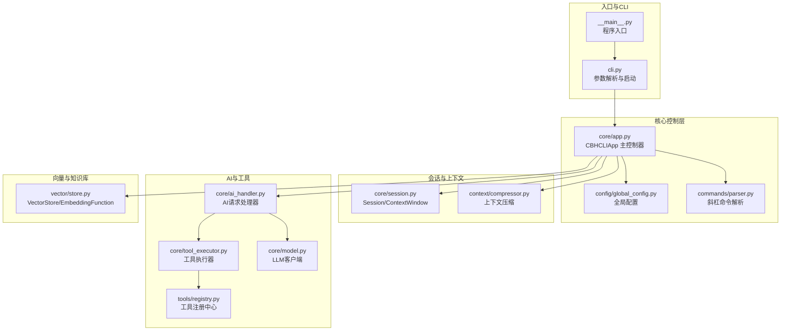
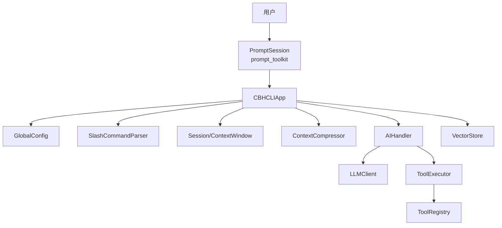
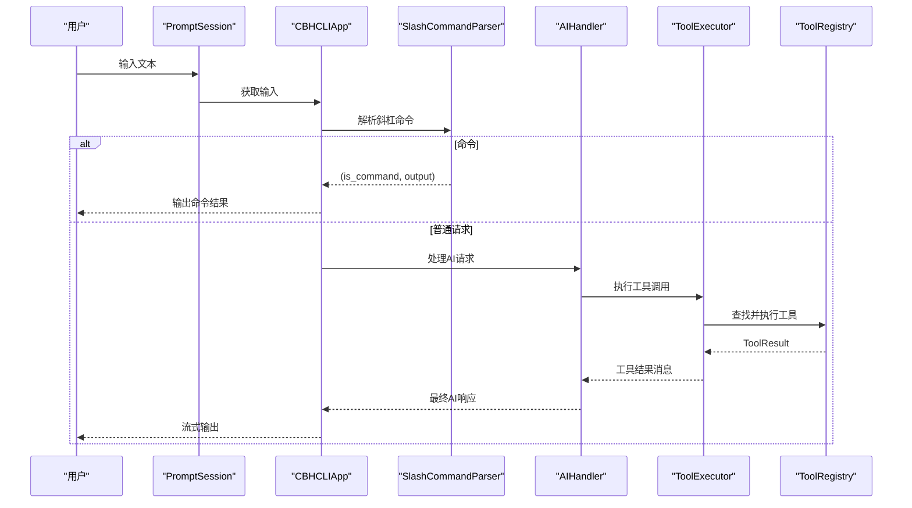
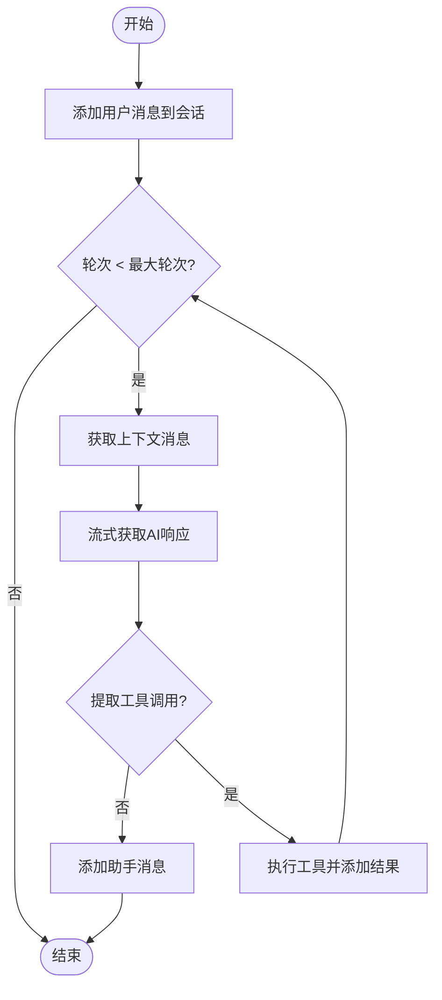
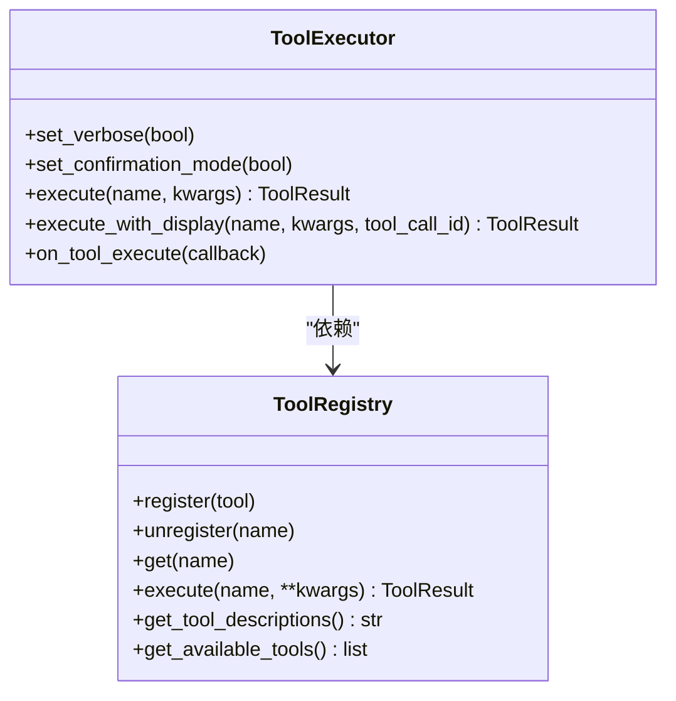
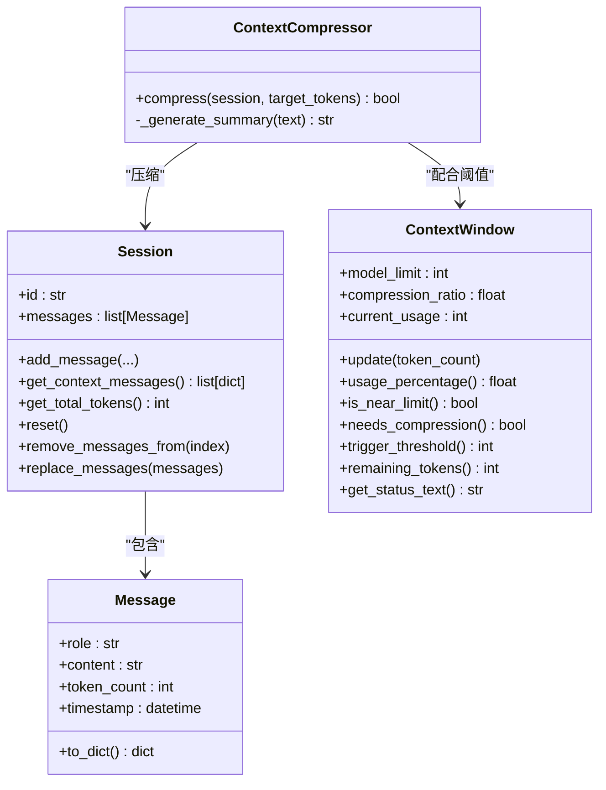
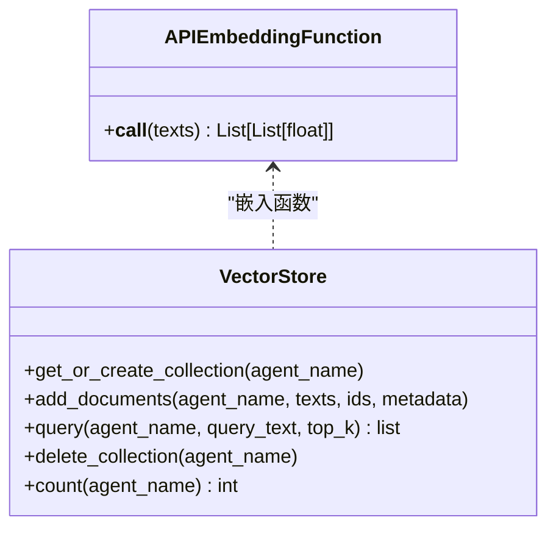
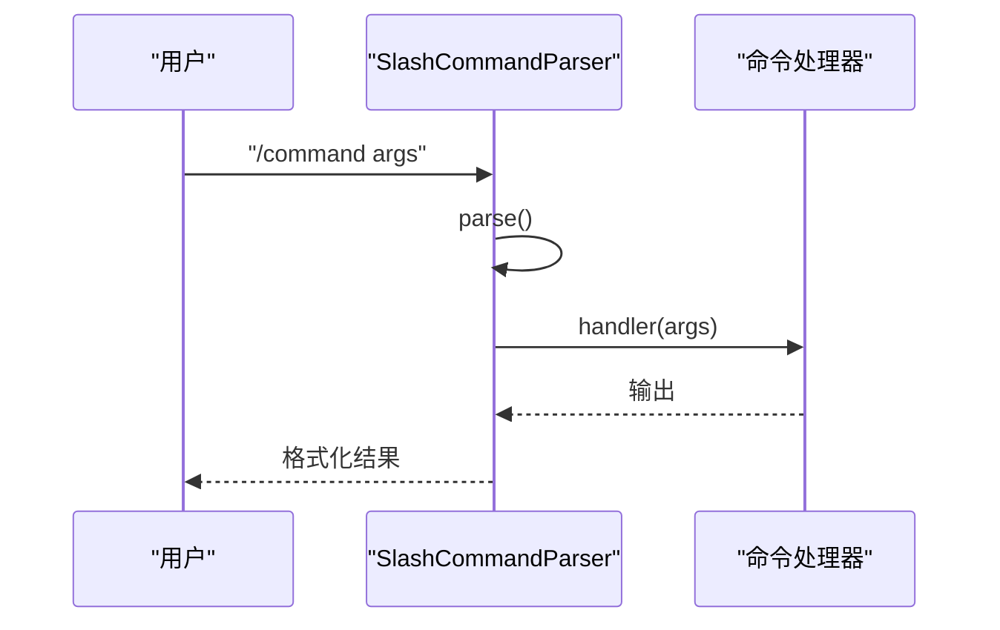
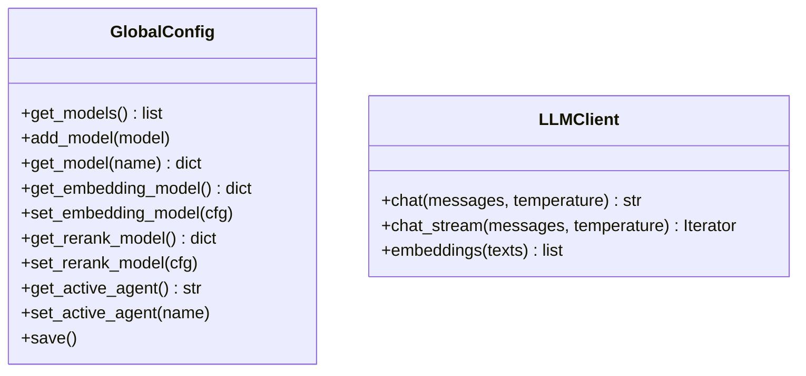
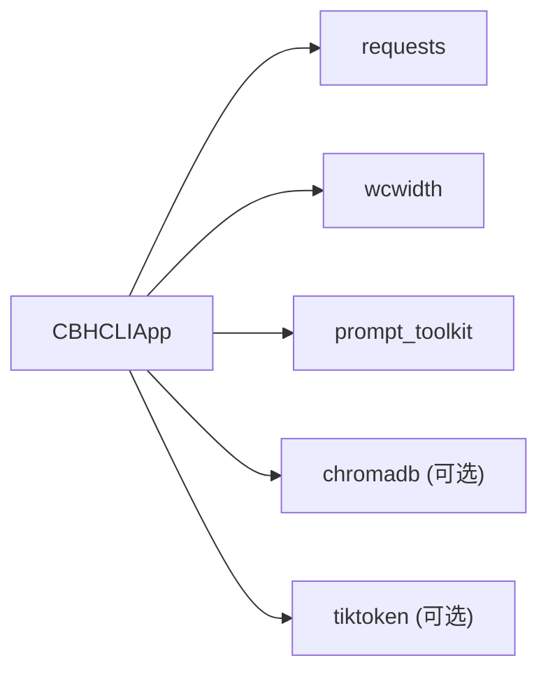

# 技术架构概览

<cite>
**本文档引用的文件**
- [cbhcli_pkg/__main__.py](file://cbhcli_pkg/__main__.py)
- [cbhcli_pkg/cli.py](file://cbhcli_pkg/cli.py)
- [cbhcli_pkg/core/app.py](file://cbhcli_pkg/core/app.py)
- [cbhcli_pkg/core/session.py](file://cbhcli_pkg/core/session.py)
- [cbhcli_pkg/tools/registry.py](file://cbhcli_pkg/tools/registry.py)
- [cbhcli_pkg/core/ai_handler.py](file://cbhcli_pkg/core/ai_handler.py)
- [cbhcli_pkg/vector/store.py](file://cbhcli_pkg/vector/store.py)
- [cbhcli_pkg/commands/parser.py](file://cbhcli_pkg/commands/parser.py)
- [cbhcli_pkg/config/global_config.py](file://cbhcli_pkg/config/global_config.py)
- [cbhcli_pkg/context/compressor.py](file://cbhcli_pkg/context/compressor.py)
- [cbhcli_pkg/core/tool_executor.py](file://cbhcli_pkg/core/tool_executor.py)
- [cbhcli_pkg/core/model.py](file://cbhcli_pkg/core/model.py)
- [requirements.txt](file://requirements.txt)
- [pyproject.toml](file://pyproject.toml)
- [README.md](file://README.md)
</cite>

## 目录
1. [简介](#简介)
2. [项目结构](#项目结构)
3. [核心组件](#核心组件)
4. [架构总览](#架构总览)
5. [详细组件分析](#详细组件分析)
6. [依赖分析](#依赖分析)
7. [性能考量](#性能考量)
8. [故障排查指南](#故障排查指南)
9. [结论](#结论)
10. [附录](#附录)

## 简介
CBHCLI 是一个基于 Python 的 AI 驱动终端助手，采用分层架构与模块化设计，结合事件驱动的交互模式。系统围绕 CBHCLIApp 主控制器组织，通过 Agent 管理、工具注册与执行、会话与上下文管理、向量检索与知识库、斜杠命令解析等模块协同工作，形成“模型-会话-工具-向量”的闭环处理链路。

## 项目结构
项目采用按功能域划分的模块化布局：
- core：核心业务逻辑（应用、会话、AI处理、模型、工具执行、嵌入与重排序、知识库等）
- tools：具体工具实现（终端、文件读写、知识库、内存搜索、Python 会话等）
- config：全局配置管理
- context：上下文压缩与 Token 计数
- vector：向量存储与索引（ChromaDB 封装）
- commands：斜杠命令解析与注册
- 根目录入口：__main__.py 与 cli.py

**图表来源**
- [cbhcli_pkg/__main__.py:1-7](file://cbhcli_pkg/__main__.py#L1-L7)
- [cbhcli_pkg/cli.py:73-112](file://cbhcli_pkg/cli.py#L73-L112)
- [cbhcli_pkg/core/app.py:54-280](file://cbhcli_pkg/core/app.py#L54-L280)
- [cbhcli_pkg/config/global_config.py:13-154](file://cbhcli_pkg/config/global_config.py#L13-L154)
- [cbhcli_pkg/commands/parser.py:16-94](file://cbhcli_pkg/commands/parser.py#L16-L94)
- [cbhcli_pkg/core/session.py:37-190](file://cbhcli_pkg/core/session.py#L37-L190)
- [cbhcli_pkg/context/compressor.py:7-112](file://cbhcli_pkg/context/compressor.py#L7-L112)
- [cbhcli_pkg/core/ai_handler.py:21-96](file://cbhcli_pkg/core/ai_handler.py#L21-L96)
- [cbhcli_pkg/core/tool_executor.py:15-168](file://cbhcli_pkg/core/tool_executor.py#L15-L168)
- [cbhcli_pkg/tools/registry.py:51-115](file://cbhcli_pkg/tools/registry.py#L51-L115)
- [cbhcli_pkg/core/model.py:7-147](file://cbhcli_pkg/core/model.py#L7-L147)
- [cbhcli_pkg/vector/store.py:37-175](file://cbhcli_pkg/vector/store.py#L37-L175)

**章节来源**
- [README.md:269-295](file://README.md#L269-L295)
- [pyproject.toml:5-53](file://pyproject.toml#L5-L53)

## 核心组件
- CBHCLIApp：主应用控制器，负责初始化配置、Agent/会话/工具/命令/UI/向量存储，以及主交互循环与上下文压缩。
- AgentManager：Agent 生命周期与工作空间管理（由 App 在初始化阶段注入）。
- ToolRegistry：工具注册中心，统一管理工具的注册、查找与执行。
- ToolExecutor：工具执行器，负责执行前确认、执行与结果展示，并支持详细/简洁模式切换。
- Session/ContextWindow：会话消息管理与上下文窗口监控，支持自动压缩阈值判断。
- AIHandler：AI 请求处理器，负责流式输出、工具调用提取与多轮工具调用协调。
- VectorStore：向量数据库封装（ChromaDB），支持自定义嵌入模型 API。
- SlashCommandParser：斜杠命令解析器，统一注册与执行命令。
- GlobalConfig：全局配置管理，集中维护模型、嵌入/重排序模型、Agent 与设置。
- ContextCompressor：AI 驱动的上下文压缩器，生成摘要并替换中间对话。
- LLMClient：统一的 LLM API 客户端，支持非流式与流式聊天、嵌入向量获取。

**章节来源**
- [cbhcli_pkg/core/app.py:54-280](file://cbhcli_pkg/core/app.py#L54-L280)
- [cbhcli_pkg/tools/registry.py:51-115](file://cbhcli_pkg/tools/registry.py#L51-L115)
- [cbhcli_pkg/core/tool_executor.py:15-168](file://cbhcli_pkg/core/tool_executor.py#L15-L168)
- [cbhcli_pkg/core/session.py:37-190](file://cbhcli_pkg/core/session.py#L37-L190)
- [cbhcli_pkg/core/ai_handler.py:21-96](file://cbhcli_pkg/core/ai_handler.py#L21-L96)
- [cbhcli_pkg/vector/store.py:37-175](file://cbhcli_pkg/vector/store.py#L37-L175)
- [cbhcli_pkg/commands/parser.py:16-94](file://cbhcli_pkg/commands/parser.py#L16-L94)
- [cbhcli_pkg/config/global_config.py:13-154](file://cbhcli_pkg/config/global_config.py#L13-L154)
- [cbhcli_pkg/context/compressor.py:7-112](file://cbhcli_pkg/context/compressor.py#L7-L112)
- [cbhcli_pkg/core/model.py:7-147](file://cbhcli_pkg/core/model.py#L7-L147)

## 架构总览
CBHCLI 采用“主控制器 + 多子系统”的分层架构：
- 表现层：CLI 与 prompt_toolkit 交互界面，支持快捷键与命令提示。
- 控制层：CBHCLIApp 作为中枢，编排配置、Agent、会话、工具、命令与向量。
- 业务层：AIHandler 负责与 LLM 交互；ToolExecutor 负责工具执行；Session/ContextWindow 负责上下文生命周期。
- 数据层：VectorStore 封装 ChromaDB，提供语义检索；GlobalConfig 管理持久化配置。
- 事件驱动：用户输入触发命令解析或 AI 请求；AIHandler 通过工具调用产生副作用；上下文压缩与会话历史自动保存。

**图表来源**
- [cbhcli_pkg/core/app.py:386-478](file://cbhcli_pkg/core/app.py#L386-L478)
- [cbhcli_pkg/core/ai_handler.py:51-96](file://cbhcli_pkg/core/ai_handler.py#L51-L96)
- [cbhcli_pkg/core/tool_executor.py:42-91](file://cbhcli_pkg/core/tool_executor.py#L42-L91)
- [cbhcli_pkg/tools/registry.py:70-96](file://cbhcli_pkg/tools/registry.py#L70-L96)
- [cbhcli_pkg/vector/store.py:37-175](file://cbhcli_pkg/vector/store.py#L37-L175)
- [cbhcli_pkg/config/global_config.py:13-154](file://cbhcli_pkg/config/global_config.py#L13-L154)
- [cbhcli_pkg/core/session.py:37-190](file://cbhcli_pkg/core/session.py#L37-L190)
- [cbhcli_pkg/context/compressor.py:21-81](file://cbhcli_pkg/context/compressor.py#L21-L81)

## 详细组件分析

### CBHCLIApp 主控制器
职责与流程：
- 初始化配置、工具、向量存储、命令与 UI
- 加载/切换 Agent，初始化 LLM 客户端、上下文压缩器、会话历史与 MCP 管理器
- 主循环：接收用户输入，区分命令与普通请求；命令交由 SlashCommandParser 处理；普通请求交由 AIHandler 处理
- 自动上下文压缩：根据 ContextWindow 判断并调用 ContextCompressor

**图表来源**
- [cbhcli_pkg/core/app.py:386-478](file://cbhcli_pkg/core/app.py#L386-L478)
- [cbhcli_pkg/commands/parser.py:51-78](file://cbhcli_pkg/commands/parser.py#L51-L78)
- [cbhcli_pkg/core/ai_handler.py:51-96](file://cbhcli_pkg/core/ai_handler.py#L51-L96)
- [cbhcli_pkg/core/tool_executor.py:54-91](file://cbhcli_pkg/core/tool_executor.py#L54-L91)
- [cbhcli_pkg/tools/registry.py:70-96](file://cbhcli_pkg/tools/registry.py#L70-L96)

**章节来源**
- [cbhcli_pkg/core/app.py:64-280](file://cbhcli_pkg/core/app.py#L64-L280)

### AIHandler 工具调用提取与多轮协调
- 支持多种工具调用格式：DSML 标签、Python 函数调用、JSON 工具调用、纯文本命令（多轮回退）
- 流式输出处理：分别输出 reasoning、content、tool_calls
- 多轮工具调用：在每轮结束后清理文本中的工具调用命令，避免 API 混淆
- 去重与 OpenAI 格式转换：生成 tool_calls 数组并添加 assistant 与 tool 消息

**图表来源**
- [cbhcli_pkg/core/ai_handler.py:51-96](file://cbhcli_pkg/core/ai_handler.py#L51-L96)
- [cbhcli_pkg/core/ai_handler.py:264-298](file://cbhcli_pkg/core/ai_handler.py#L264-L298)
- [cbhcli_pkg/core/ai_handler.py:664-735](file://cbhcli_pkg/core/ai_handler.py#L664-L735)

**章节来源**
- [cbhcli_pkg/core/ai_handler.py:21-743](file://cbhcli_pkg/core/ai_handler.py#L21-L743)

### 工具系统：注册中心与执行器
- ToolRegistry：统一注册、查找与执行工具，返回标准化 ToolResult
- ToolExecutor：执行前确认、详细/简洁模式输出、回调钩子、参数预览

**图表来源**
- [cbhcli_pkg/tools/registry.py:51-115](file://cbhcli_pkg/tools/registry.py#L51-L115)
- [cbhcli_pkg/core/tool_executor.py:15-168](file://cbhcli_pkg/core/tool_executor.py#L15-L168)

**章节来源**
- [cbhcli_pkg/tools/registry.py:1-115](file://cbhcli_pkg/tools/registry.py#L1-L115)
- [cbhcli_pkg/core/tool_executor.py:1-168](file://cbhcli_pkg/core/tool_executor.py#L1-L168)

### 会话与上下文管理
- Session：消息结构化存储，支持 to_dict API 格式、token 计数、批量替换与截断
- ContextWindow：监控 token 使用率与阈值，触发压缩
- ContextCompressor：基于 LLM 的摘要生成，保留早期与近期消息，插入摘要

**图表来源**
- [cbhcli_pkg/core/session.py:8-190](file://cbhcli_pkg/core/session.py#L8-L190)
- [cbhcli_pkg/context/compressor.py:7-112](file://cbhcli_pkg/context/compressor.py#L7-L112)

**章节来源**
- [cbhcli_pkg/core/session.py:1-190](file://cbhcli_pkg/core/session.py#L1-L190)
- [cbhcli_pkg/context/compressor.py:1-112](file://cbhcli_pkg/context/compressor.py#L1-L112)

### 向量存储与嵌入模型
- VectorStore：封装 ChromaDB，使用自定义嵌入函数，支持按 Agent 创建集合、批量添加与查询
- APIEmbeddingFunction：将外部嵌入客户端与 ChromaDB 集合绑定
- 可选依赖：chromadb（向量检索）、tiktoken（精确 Token 计数）

**图表来源**
- [cbhcli_pkg/vector/store.py:12-175](file://cbhcli_pkg/vector/store.py#L12-L175)

**章节来源**
- [cbhcli_pkg/vector/store.py:1-175](file://cbhcli_pkg/vector/store.py#L1-L175)
- [requirements.txt:1-7](file://requirements.txt#L1-L7)
- [pyproject.toml:32-38](file://pyproject.toml#L32-L38)

### 斜杠命令解析与注册
- SlashCommandParser：注册命令、解析输入、执行并返回结果
- App 初始化时注册 Agent、会话、模型、知识库、嵌入与 MCP 管理相关命令

**图表来源**
- [cbhcli_pkg/commands/parser.py:26-78](file://cbhcli_pkg/commands/parser.py#L26-L78)
- [cbhcli_pkg/core/app.py:151-179](file://cbhcli_pkg/core/app.py#L151-L179)

**章节来源**
- [cbhcli_pkg/commands/parser.py:1-94](file://cbhcli_pkg/commands/parser.py#L1-L94)
- [cbhcli_pkg/core/app.py:151-179](file://cbhcli_pkg/core/app.py#L151-L179)

### 全局配置与模型客户端
- GlobalConfig：统一管理模型、嵌入/重排序模型、Agent 与设置，持久化至 ~/.cbhcli/config.json
- LLMClient：统一 API 调用封装，支持流式与非流式聊天、嵌入向量获取

**图表来源**
- [cbhcli_pkg/config/global_config.py:13-154](file://cbhcli_pkg/config/global_config.py#L13-L154)
- [cbhcli_pkg/core/model.py:7-147](file://cbhcli_pkg/core/model.py#L7-L147)

**章节来源**
- [cbhcli_pkg/config/global_config.py:1-154](file://cbhcli_pkg/config/global_config.py#L1-L154)
- [cbhcli_pkg/core/model.py:1-147](file://cbhcli_pkg/core/model.py#L1-L147)

## 依赖分析
- Python 版本：要求 Python 3.8+
- 核心依赖：requests、wcwidth
- 可选依赖：chromadb（向量检索）、tiktoken（精确 Token 计数）
- prompt_toolkit：交互式命令行界面与快捷键绑定

**图表来源**
- [pyproject.toml:26-30](file://pyproject.toml#L26-L30)
- [requirements.txt:1-7](file://requirements.txt#L1-L7)

**章节来源**
- [pyproject.toml:1-53](file://pyproject.toml#L1-L53)
- [requirements.txt:1-7](file://requirements.txt#L1-L7)

## 性能考量
- 上下文压缩：当使用率达到阈值（默认 80%）时，自动进行摘要压缩，降低 token 使用并维持对话连贯性。
- 向量检索：预计算嵌入向量，避免 ChromaDB 默认模型调用，减少 API 调用次数与延迟。
- 工具执行：支持详细/简洁模式切换，减少输出开销；对工具输出进行长度限制，避免超长响应影响性能。
- 流式输出：AIHandler 采用流式接口，边生成边输出，提升交互体验。

[本节为通用性能建议，不直接分析具体文件]

## 故障排查指南
- 模型未配置：当 Agent 未配置模型时，App 会提示使用 /model 命令配置模型。
- 嵌入模型初始化失败：若嵌入模型配置无效，App 将打印警告并提示配置方式。
- 向量存储初始化失败：若未配置嵌入模型或 ChromaDB 未安装，App 将提示启用向量搜索功能。
- 命令执行失败：SlashCommandParser 捕获异常并返回错误信息，便于定位问题。
- 工具执行失败：ToolExecutor 返回 ToolResult，包含错误信息；可通过详细模式查看更多参数。

**章节来源**
- [cbhcli_pkg/core/app.py:104-150](file://cbhcli_pkg/core/app.py#L104-L150)
- [cbhcli_pkg/commands/parser.py:73-78](file://cbhcli_pkg/commands/parser.py#L73-L78)
- [cbhcli_pkg/core/tool_executor.py:142-158](file://cbhcli_pkg/core/tool_executor.py#L142-L158)

## 结论
CBHCLI 通过清晰的分层架构与模块化设计，实现了从用户输入到工具执行再到向量检索的完整闭环。主控制器 CBHCLIApp 统筹全局，AIHandler 与工具系统解耦协作，Session/ContextWindow 保障上下文可控，VectorStore 提供可扩展的知识检索能力。该架构既保证了可维护性与可扩展性，也为后续引入更多 Agent、工具与外部服务提供了稳定基础。

## 附录
- 系统边界与外部集成点
  - LLM API：统一通过 LLMClient 访问，支持流式与非流式接口
  - 向量数据库：通过 VectorStore 与 ChromaDB 集成，支持自定义嵌入模型
  - 文件系统：Agent 工作空间与知识库目录
  - 配置文件：~/.cbhcli/config.json

- 技术决策与权衡
  - Python 3.8+：兼顾兼容性与现代语法特性
  - prompt_toolkit：提供优秀的交互体验与快捷键支持
  - 可选 chromadb/tiktoken：在需要向量检索与精确 Token 计数时启用，避免强制依赖

**章节来源**
- [README.md:33-61](file://README.md#L33-L61)
- [pyproject.toml:13-30](file://pyproject.toml#L13-L30)
- [cbhcli_pkg/vector/store.py:64-78](file://cbhcli_pkg/vector/store.py#L64-L78)