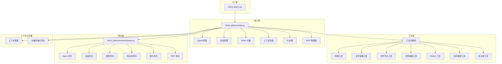
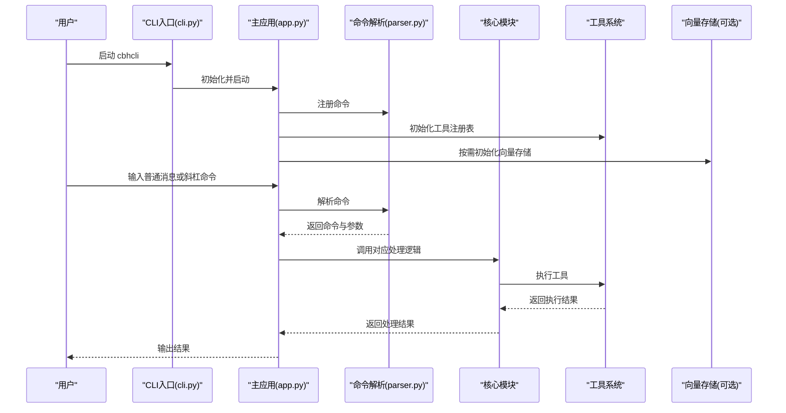
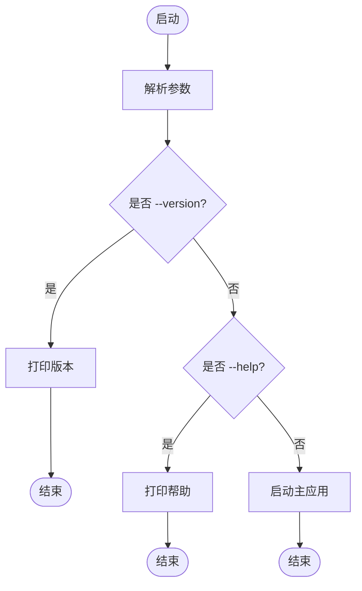
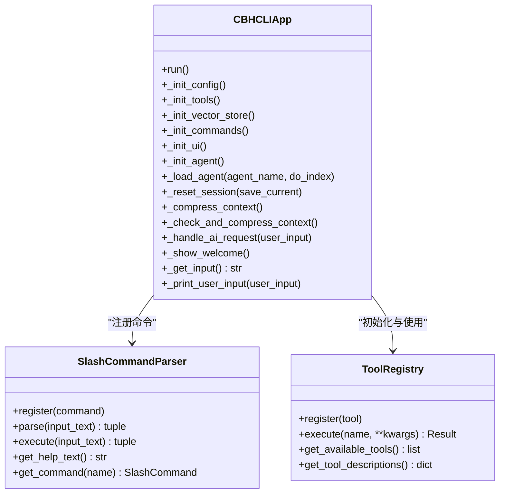
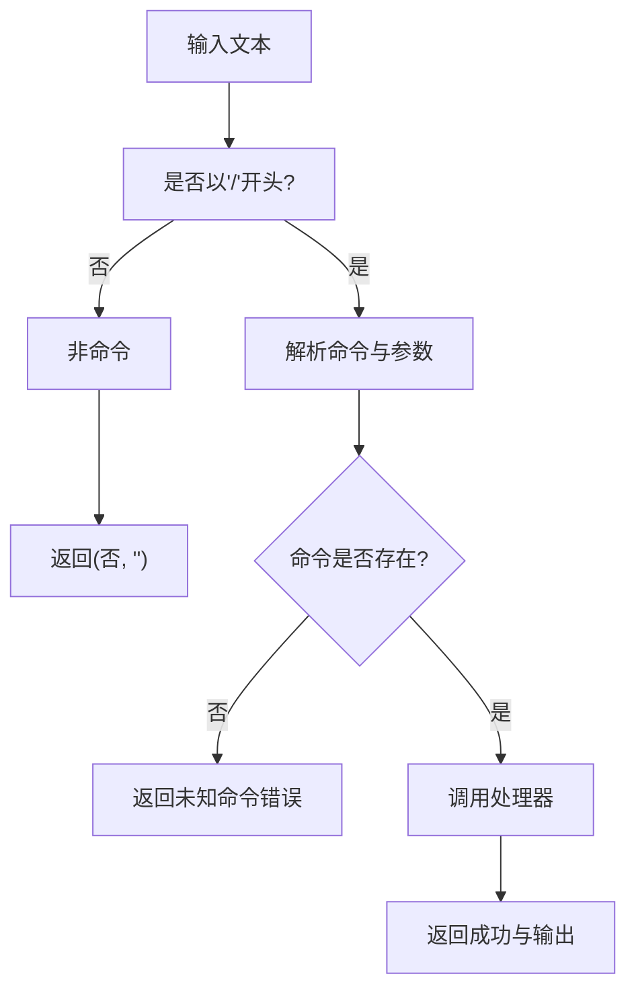
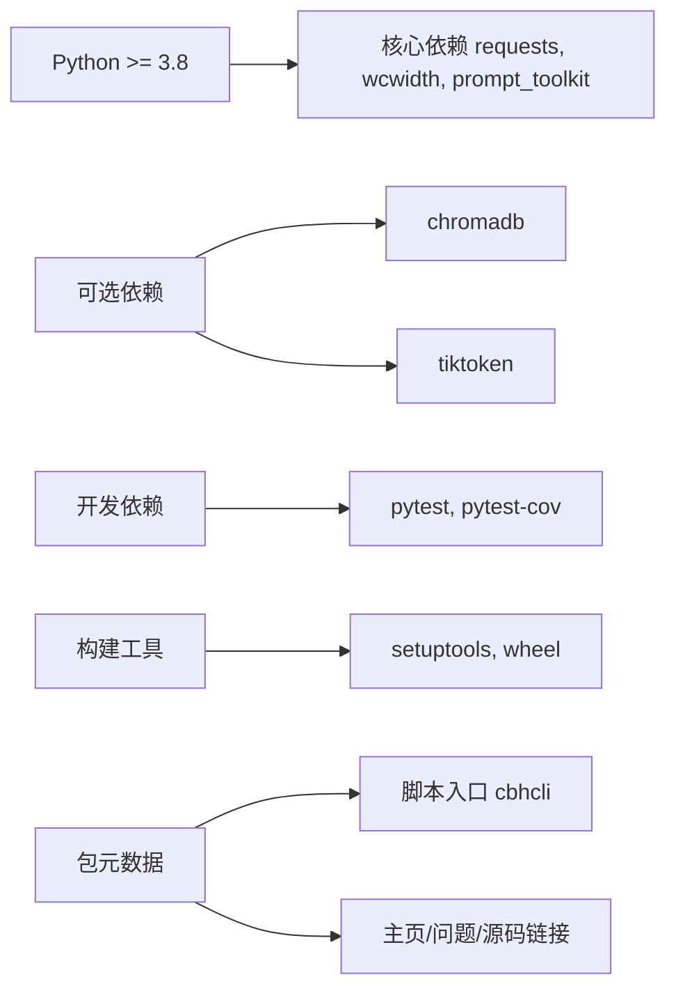

# 许可证与贡献指南

<cite>
**本文引用的文件**
- [README.md](file://README.md)
- [INSTALL.md](file://INSTALL.md)
- [pyproject.toml](file://pyproject.toml)
- [requirements.txt](file://requirements.txt)
- [Makefile](file://Makefile)
- [test_v3.py](file://test_v3.py)
- [package.json](file://package.json)
- [windows使用注意事项.txt](file://windows使用注意事项.txt)
- [install.sh](file://install.sh)
- [cbhcli_pkg/cli.py](file://cbhcli_pkg/cli.py)
- [cbhcli_pkg/core/app.py](file://cbhcli_pkg/core/app.py)
- [cbhcli_pkg/commands/parser.py](file://cbhcli_pkg/commands/parser.py)
- [cbhcli_pkg/__init__.py](file://cbhcli_pkg/__init__.py)
</cite>

## 目录
1. [简介](#简介)
2. [项目结构](#项目结构)
3. [核心组件](#核心组件)
4. [架构总览](#架构总览)
5. [详细组件分析](#详细组件分析)
6. [依赖分析](#依赖分析)
7. [性能考虑](#性能考虑)
8. [故障排查指南](#故障排查指南)
9. [结论](#结论)
10. [附录](#附录)

## 简介
本指南面向使用者与贡献者，全面阐述 CBHCLI 项目的开源许可证与贡献流程，涵盖以下要点：
- MIT 许可证条款与使用权限
- 贡献方式与行为准则
- 开发环境搭建与工作流
- 代码风格与最佳实践
- 问题报告与功能请求模板与流程
- 版本发布策略与维护计划
- 参与路径与期望

## 项目结构
CBHCLI 是一个基于 Python 的 CLI 应用，采用分层模块化设计，核心目录与职责如下：
- cbhcli_pkg/core：核心业务逻辑（应用、会话、Agent、模型、工具执行、AI 处理、MCP 管理等）
- cbhcli_pkg/tools：工具实现（终端、文件读写、编辑、Python 会话、内存搜索、知识库等）
- cbhcli_pkg/commands：斜杠命令解析与注册（Agent、会话、模型、知识库、嵌入、MCP 等）
- cbhcli_pkg/context：上下文管理（Token 计数、上下文压缩）
- cbhcli_pkg/vector：向量数据库与索引（可选依赖）
- cbhcli_pkg/config：全局配置
- cbhcli_pkg/cli.py：命令行入口与帮助输出
- 根目录：安装脚本、构建与测试脚本、依赖声明、发行说明等

**图表来源**
- [cbhcli_pkg/cli.py:73-112](file://cbhcli_pkg/cli.py#L73-L112)
- [cbhcli_pkg/core/app.py:54-280](file://cbhcli_pkg/core/app.py#L54-L280)
- [cbhcli_pkg/commands/parser.py:16-94](file://cbhcli_pkg/commands/parser.py#L16-L94)

**章节来源**
- [README.md: 269-295:269-295](file://README.md#L269-L295)
- [cbhcli_pkg/cli.py: 1-112:1-112](file://cbhcli_pkg/cli.py#L1-L112)
- [cbhcli_pkg/core/app.py: 1-478:1-478](file://cbhcli_pkg/core/app.py#L1-L478)
- [cbhcli_pkg/commands/parser.py: 1-94:1-94](file://cbhcli_pkg/commands/parser.py#L1-L94)

## 核心组件
- CLI 入口与帮助：负责解析参数、打印帮助、启动主应用
- 主应用（CBHCLIApp）：初始化配置、工具、向量存储、命令系统、UI、Agent，并驱动主交互循环
- 命令解析器：统一解析“/”前缀命令，注册与执行各子系统命令
- 工具系统：注册并执行各类工具（终端、文件、Python、内存搜索、知识库等）
- 上下文与 Token：提供 Token 计数与上下文压缩，保障模型上下文窗口安全
- 向量与索引：可选的向量存储与索引器，支持语义搜索与重排序

**章节来源**
- [cbhcli_pkg/cli.py: 73-112:73-112](file://cbhcli_pkg/cli.py#L73-L112)
- [cbhcli_pkg/core/app.py: 54-280:54-280](file://cbhcli_pkg/core/app.py#L54-L280)
- [cbhcli_pkg/commands/parser.py: 16-94:16-94](file://cbhcli_pkg/commands/parser.py#L16-L94)

## 架构总览
CBHCLI 采用“CLI 入口 -> 主应用 -> 子系统”的分层架构。命令通过斜杠命令解析器路由到对应模块；工具通过注册表统一调度；上下文与向量模块按需启用。

**图表来源**
- [cbhcli_pkg/cli.py: 73-112:73-112](file://cbhcli_pkg/cli.py#L73-L112)
- [cbhcli_pkg/core/app.py: 386-421:386-421](file://cbhcli_pkg/core/app.py#L386-L421)
- [cbhcli_pkg/commands/parser.py: 51-78:51-78](file://cbhcli_pkg/commands/parser.py#L51-L78)

## 详细组件分析

### 组件一：CLI 入口与帮助
- 负责解析 --version/--help 参数，打印帮助信息，或启动主应用
- 未识别参数时打印帮助并退出

**图表来源**
- [cbhcli_pkg/cli.py: 73-112:73-112](file://cbhcli_pkg/cli.py#L73-L112)

**章节来源**
- [cbhcli_pkg/cli.py: 73-112:73-112](file://cbhcli_pkg/cli.py#L73-L112)

### 组件二：主应用（CBHCLIApp）
- 初始化配置、Agent 管理、工具系统、向量存储、命令系统、UI
- 维护会话、上下文窗口、模型客户端、MCP 管理器
- 主循环处理用户输入、命令与 AI 请求

**图表来源**
- [cbhcli_pkg/core/app.py: 54-280:54-280](file://cbhcli_pkg/core/app.py#L54-L280)
- [cbhcli_pkg/commands/parser.py: 16-94:16-94](file://cbhcli_pkg/commands/parser.py#L16-L94)

**章节来源**
- [cbhcli_pkg/core/app.py: 54-280:54-280](file://cbhcli_pkg/core/app.py#L54-L280)
- [cbhcli_pkg/commands/parser.py: 16-94:16-94](file://cbhcli_pkg/commands/parser.py#L16-L94)

### 组件三：斜杠命令解析器
- 定义命令结构体，提供注册、解析、执行与帮助文本生成
- 统一处理“/命令 参数”格式，异常捕获并反馈错误

**图表来源**
- [cbhcli_pkg/commands/parser.py: 26-78:26-78](file://cbhcli_pkg/commands/parser.py#L26-L78)

**章节来源**
- [cbhcli_pkg/commands/parser.py: 16-94:16-94](file://cbhcli_pkg/commands/parser.py#L16-L94)

### 组件四：工具系统与执行
- 工具注册表集中管理工具，支持执行与描述查询
- 工具包括终端、文件读写、编辑、Python 会话、内存搜索、知识库等

**章节来源**
- [cbhcli_pkg/core/app.py: 85-96:85-96](file://cbhcli_pkg/core/app.py#L85-L96)

## 依赖分析
- Python 版本要求与核心依赖：requests、wcwidth、prompt_toolkit
- 可选依赖：chromadb（向量搜索）、tiktoken（精确 Token 计数）
- 开发依赖：pytest、pytest-cov
- 构建工具：build、setuptools、wheel
- 脚本与入口：pyproject.toml 定义脚本入口与可选依赖组

**图表来源**
- [pyproject.toml: 13-45:13-45](file://pyproject.toml#L13-L45)
- [requirements.txt: 1-7:1-7](file://requirements.txt#L1-L7)

**章节来源**
- [pyproject.toml: 13-45:13-45](file://pyproject.toml#L13-L45)
- [requirements.txt: 1-7:1-7](file://requirements.txt#L1-L7)

## 性能考虑
- 上下文压缩：当接近模型上下文限制时自动压缩，降低 Token 使用
- Token 计数：可选精确 Token 计数（tiktoken），提升资源估算准确性
- 向量索引：手动触发，避免启动时大量 API 调用与时间消耗
- 工具执行：工具注册表统一调度，减少重复初始化开销

**章节来源**
- [cbhcli_pkg/core/app.py: 361-385:361-385](file://cbhcli_pkg/core/app.py#L361-L385)
- [README.md: 208-229:208-229](file://README.md#L208-L229)

## 故障排查指南
- Windows 控制台颜色显示：按提示设置虚拟终端级别
- 安装后命令不可用：检查 PATH、使用 --user 重装、重启终端
- 构建与清理：使用 Makefile 提供的构建与清理目标
- 测试运行：直接运行测试脚本验证功能

**章节来源**
- [windows使用注意事项.txt: 1-2:1-2](file://windows使用注意事项.txt#L1-L2)
- [INSTALL.md: 63-69:63-69](file://INSTALL.md#L63-L69)
- [Makefile: 1-55:1-55](file://Makefile#L1-L55)
- [test_v3.py: 162-180:162-180](file://test_v3.py#L162-L180)

## 结论
本指南明确了 CBHCLI 的 MIT 许可证使用范围与贡献路径，提供了从开发环境到测试发布的完整工作流，以及代码风格与最佳实践建议。遵循这些规范有助于贡献者高效参与项目，同时保障项目的可持续演进。

## 附录

### 附录A：MIT 许可证条款与使用权限
- 许可证标识：项目在元数据中标注为“MIT”
- 使用权限：允许商业与非商业使用、复制、修改、分发、再许可与销售
- 条件与限制：必须在软件副本中保留版权与许可声明；软件按“现状”提供，不提供任何担保
- 归属要求：在分发中包含原始版权声明与许可声明

**章节来源**
- [pyproject.toml: 17](file://pyproject.toml#L17)
- [README.md: 322-325:322-325](file://README.md#L322-L325)

### 附录B：贡献指南
- 参与路径
  - 提交 Issue：使用问题模板描述现象、预期与复现步骤
  - 提交 Pull Request：关联 Issue，遵循代码风格与测试要求
- 行为准则
  - 尊重与包容，遵守社区礼仪
  - 提供清晰的变更说明与测试覆盖
- 代码风格与最佳实践
  - 使用类型注解与清晰命名
  - 模块化与单一职责，保持高内聚低耦合
  - 为关键流程补充单元测试
- 测试要求
  - 使用 pytest 与 pytest-cov
  - 覆盖核心模块（命令解析、工具执行、会话与 Agent 管理）

**章节来源**
- [pyproject.toml: 39-42:39-42](file://pyproject.toml#L39-L42)
- [test_v3.py: 1-180:1-180](file://test_v3.py#L1-L180)

### 附录C：开发环境搭建与工作流
- 环境准备
  - Python >= 3.8
  - 创建并激活虚拟环境
- 依赖安装
  - 开发模式安装：pip install -e .
  - 可选依赖：pip install chromadb 与 pip install tiktoken
- 测试运行
  - 直接运行测试脚本
- 构建与发布
  - 使用 Makefile 目标进行构建与清理
  - 使用 build 工具链生成源码与轮子包

**章节来源**
- [README.md: 300-314:300-314](file://README.md#L300-L314)
- [INSTALL.md: 8-45:8-45](file://INSTALL.md#L8-L45)
- [Makefile: 1-55:1-55](file://Makefile#L1-L55)
- [requirements.txt: 1-7:1-7](file://requirements.txt#L1-L7)

### 附录D：问题报告与功能请求模板
- 问题报告模板
  - 标题：简明描述问题
  - 描述：复现步骤、期望行为、实际行为、日志与截图
  - 环境：操作系统、Python 版本、CBHCLI 版本
- 功能请求模板
  - 概述：功能目标与价值
  - 场景：使用场景与前置条件
  - 方案：建议实现方式与影响范围
  - 附件：相关截图或草图

[本节为通用模板说明，不直接分析具体文件，故无“章节来源”]

### 附录E：版本发布策略与维护计划
- 版本号：遵循语义化版本
- 发布渠道：PyPI（pip 安装与 Wheel 分发）
- 维护计划：按优先级修复与迭代，重大变更提前公告

**章节来源**
- [cbhcli_pkg/__init__.py: 6](file://cbhcli_pkg/__init__.py#L6)
- [pyproject.toml: 5-8:5-8](file://pyproject.toml#L5-L8)

### 附录F：Windows 使用注意事项
- 控制台颜色显示：按提示设置虚拟终端级别，确保彩色输出正常

**章节来源**
- [windows使用注意事项.txt: 1-2:1-2](file://windows使用注意事项.txt#L1-L2)