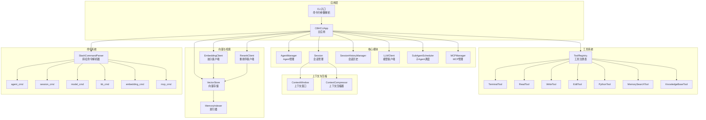
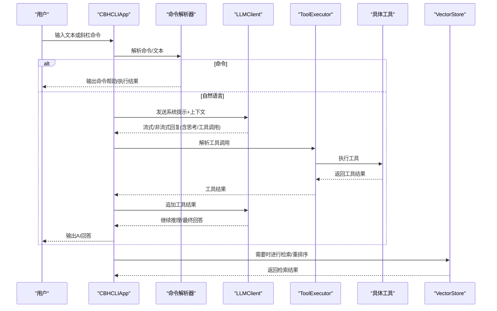
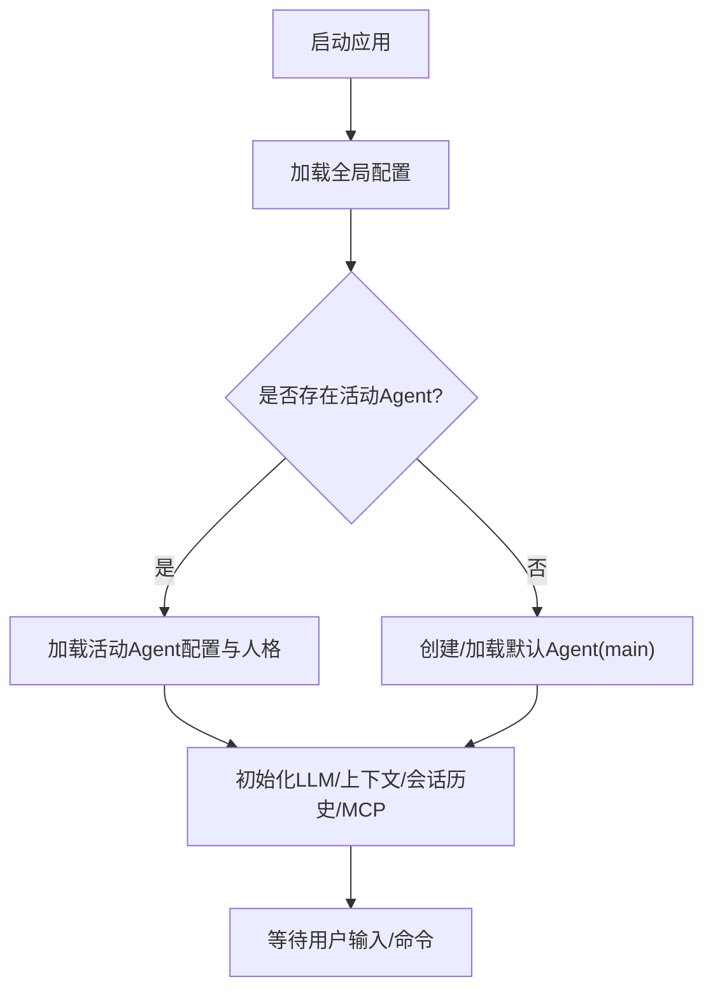
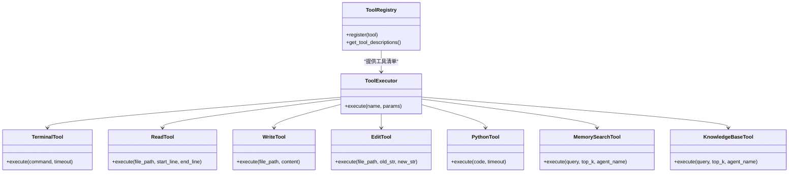
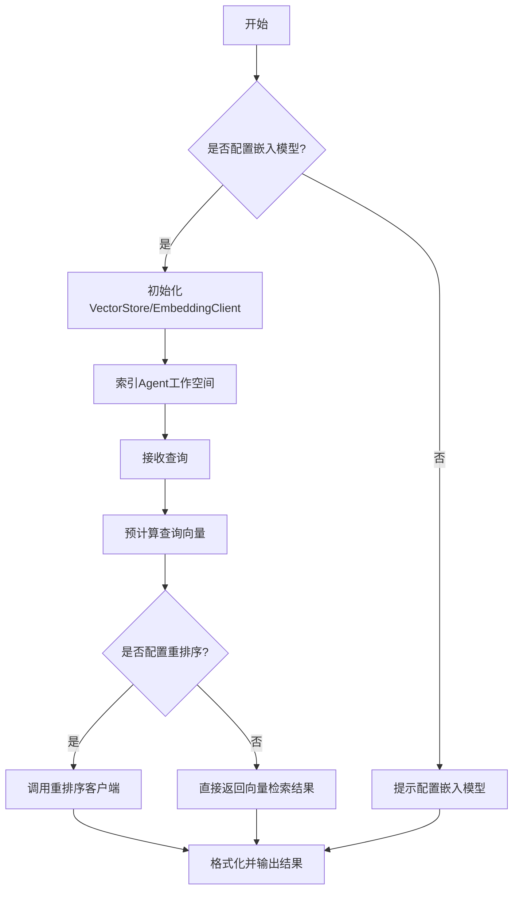
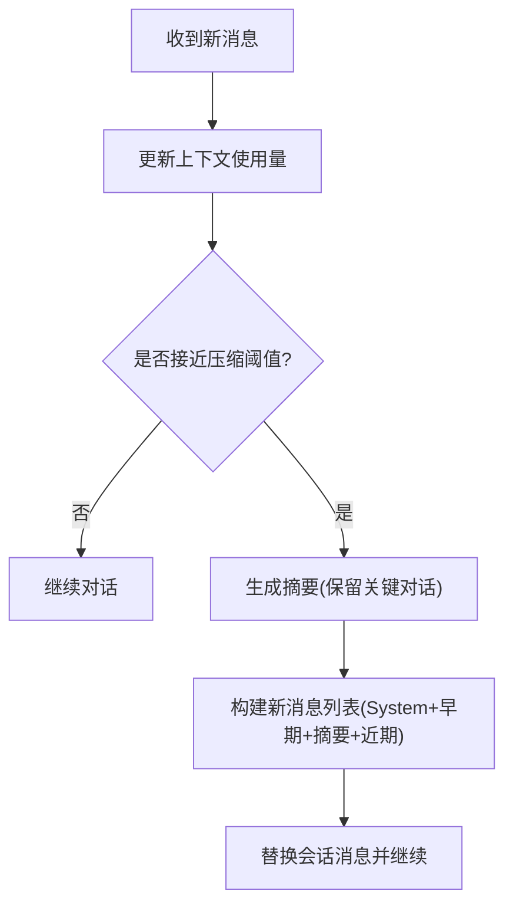
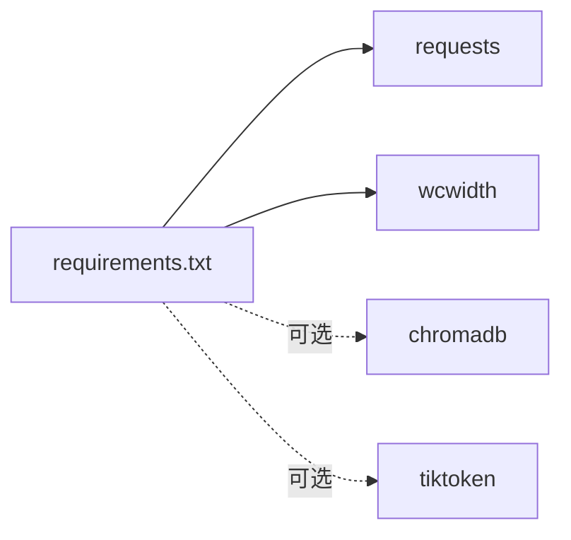

# 项目介绍与特性

<cite>
**本文引用的文件**
- [README.md](file://README.md)
- [NEW_FEATURES.md](file://NEW_FEATURES.md)
- [cbhcli_pkg/__init__.py](file://cbhcli_pkg/__init__.py)
- [cbhcli_pkg/cli.py](file://cbhcli_pkg/cli.py)
- [cbhcli_pkg/core/app.py](file://cbhcli_pkg/core/app.py)
- [cbhcli_pkg/core/model.py](file://cbhcli_pkg/core/model.py)
- [cbhcli_pkg/core/session.py](file://cbhcli_pkg/core/session.py)
- [cbhcli_pkg/context/compressor.py](file://cbhcli_pkg/context/compressor.py)
- [cbhcli_pkg/vector/store.py](file://cbhcli_pkg/vector/store.py)
- [cbhcli_pkg/tools/terminal.py](file://cbhcli_pkg/tools/terminal.py)
- [cbhcli_pkg/tools/file_read.py](file://cbhcli_pkg/tools/file_read.py)
- [cbhcli_pkg/tools/file_write.py](file://cbhcli_pkg/tools/file_write.py)
- [cbhcli_pkg/tools/file_edit.py](file://cbhcli_pkg/tools/file_edit.py)
- [cbhcli_pkg/tools/python_tool.py](file://cbhcli_pkg/tools/python_tool.py)
- [cbhcli_pkg/tools/memory_search.py](file://cbhcli_pkg/tools/memory_search.py)
- [cbhcli_pkg/tools/knowledge_base.py](file://cbhcli_pkg/tools/knowledge_base.py)
- [requirements.txt](file://requirements.txt)
</cite>

## 目录
1. [简介](#简介)
2. [项目结构](#项目结构)
3. [核心组件](#核心组件)
4. [架构总览](#架构总览)
5. [详细组件分析](#详细组件分析)
6. [依赖分析](#依赖分析)
7. [性能考虑](#性能考虑)
8. [故障排查指南](#故障排查指南)
9. [结论](#结论)
10. [附录](#附录)

## 简介
CBHCLI v3.0 是一款面向开发者与系统管理员的“AI驱动终端助手”。其核心价值在于通过多Agent管理、智能工具调用、知识库系统与会话管理，将AI能力无缝集成到日常命令行工作中，显著提升任务自动化与知识检索效率。

- 多Agent管理：每个Agent拥有独立工作空间与人格配置，支持技能、性格、工具指南与长期记忆的分离管理。
- 智能工具调用：AI可自动选择并执行终端命令、文件读写与编辑、Python代码执行等工具，形成“认知-行动”的闭环。
- 知识库系统：为每个Agent建立专属知识库，支持语义检索与问答，结合重排序服务进一步提升命中质量。
- 会话管理：上下文窗口监控、自动压缩、历史会话保存与恢复，确保长对话稳定高效。
- 高级能力：嵌入模型支持、重排序服务、自动上下文压缩、多模型切换，满足多样化部署与性能需求。

## 项目结构
项目采用模块化分层设计，围绕“核心应用”“工具系统”“上下文管理”“向量检索”“命令系统”展开，便于扩展与维护。

图表来源
- [cbhcli_pkg/core/app.py:54-180](file://cbhcli_pkg/core/app.py#L54-L180)
- [cbhcli_pkg/cli.py:73-112](file://cbhcli_pkg/cli.py#L73-L112)
- [cbhcli_pkg/tools/terminal.py:7-30](file://cbhcli_pkg/tools/terminal.py#L7-L30)
- [cbhcli_pkg/tools/file_read.py:6-36](file://cbhcli_pkg/tools/file_read.py#L6-L36)
- [cbhcli_pkg/tools/file_write.py:6-32](file://cbhcli_pkg/tools/file_write.py#L6-L32)
- [cbhcli_pkg/tools/file_edit.py:6-36](file://cbhcli_pkg/tools/file_edit.py#L6-L36)
- [cbhcli_pkg/tools/python_tool.py:127-164](file://cbhcli_pkg/tools/python_tool.py#L127-L164)
- [cbhcli_pkg/tools/memory_search.py:6-45](file://cbhcli_pkg/tools/memory_search.py#L6-L45)
- [cbhcli_pkg/tools/knowledge_base.py:6-47](file://cbhcli_pkg/tools/knowledge_base.py#L6-L47)
- [cbhcli_pkg/core/session.py:37-190](file://cbhcli_pkg/core/session.py#L37-L190)
- [cbhcli_pkg/context/compressor.py:7-82](file://cbhcli_pkg/context/compressor.py#L7-L82)
- [cbhcli_pkg/vector/store.py:37-175](file://cbhcli_pkg/vector/store.py#L37-L175)

章节来源
- [README.md:269-295](file://README.md#L269-L295)
- [NEW_FEATURES.md:65-75](file://NEW_FEATURES.md#L65-L75)

## 核心组件
- 主应用 CBHCLIApp：负责应用初始化、Agent加载、命令路由、会话生命周期管理、上下文压缩与UI交互。
- LLMClient：统一的LLM API封装，支持非流式与流式聊天完成，并提供嵌入接口。
- Session/ContextWindow：消息管理与上下文窗口控制，支持自动压缩阈值判断与剩余token统计。
- 工具系统：包含终端、文件读写编辑、Python执行、记忆搜索、知识库查询等工具，统一注册与执行。
- 向量检索：基于ChromaDB的向量存储与检索，支持自定义嵌入模型API与可选重排序。
- 命令系统：斜杠命令解析器与各功能域命令注册，覆盖Agent、会话、模型、知识库、嵌入与MCP管理。

章节来源
- [cbhcli_pkg/core/app.py:54-180](file://cbhcli_pkg/core/app.py#L54-L180)
- [cbhcli_pkg/core/model.py:7-147](file://cbhcli_pkg/core/model.py#L7-L147)
- [cbhcli_pkg/core/session.py:37-190](file://cbhcli_pkg/core/session.py#L37-L190)
- [cbhcli_pkg/context/compressor.py:7-112](file://cbhcli_pkg/context/compressor.py#L7-L112)
- [cbhcli_pkg/vector/store.py:37-175](file://cbhcli_pkg/vector/store.py#L37-L175)

## 架构总览
CBHCLI采用“应用编排 + 工具执行 + 智能推理 + 知识检索”的整体架构。用户输入经命令解析或自然语言进入AI处理器，AI根据系统提示与工具描述选择合适工具，工具执行后将结果反馈给AI，最终由AI生成下一步动作或结论。同时，上下文窗口持续监控token使用，必要时触发压缩以维持稳定性。

图表来源
- [cbhcli_pkg/core/app.py:422-440](file://cbhcli_pkg/core/app.py#L422-L440)
- [cbhcli_pkg/core/model.py:59-120](file://cbhcli_pkg/core/model.py#L59-L120)
- [cbhcli_pkg/tools/knowledge_base.py:49-121](file://cbhcli_pkg/tools/knowledge_base.py#L49-L121)
- [cbhcli_pkg/tools/memory_search.py:47-103](file://cbhcli_pkg/tools/memory_search.py#L47-L103)

## 详细组件分析

### 多Agent管理
- Agent工作空间：每个Agent拥有独立目录，包含配置、技能、性格、工具指南、长期记忆与知识库。
- Agent切换与持久化：应用启动时加载上次活动Agent，支持创建/切换/删除；会话重置时自动保存历史。
- 子Agent调度：预留子Agent调度器，便于未来扩展复杂任务分解与协作。

图表来源
- [cbhcli_pkg/core/app.py:204-230](file://cbhcli_pkg/core/app.py#L204-L230)
- [cbhcli_pkg/core/app.py:231-279](file://cbhcli_pkg/core/app.py#L231-L279)

章节来源
- [README.md:192-206](file://README.md#L192-L206)
- [cbhcli_pkg/core/app.py:204-279](file://cbhcli_pkg/core/app.py#L204-L279)

### 智能工具调用
- 工具注册与执行：工具统一注册到注册表，执行器按需调用，支持详细/简洁两种展示模式。
- 工具类型与职责：
  - terminal：执行任意shell命令，支持超时控制与错误输出。
  - read：读取文件内容，支持行范围与行号显示。
  - write：创建/覆盖文件，统计字符与行数。
  - edit：精确字符串替换，要求old_str唯一匹配。
  - python：执行Python代码，具备会话变量记忆，支持多次调用共享状态。
  - memory_search：语义搜索Agent向量化知识内容（不含对话历史），支持降级到memory.md关键词匹配。
  - knowledge_base：查询Agent知识库，支持重排序优化。

图表来源
- [cbhcli_pkg/core/app.py:85-96](file://cbhcli_pkg/core/app.py#L85-L96)
- [cbhcli_pkg/tools/terminal.py:7-99](file://cbhcli_pkg/tools/terminal.py#L7-L99)
- [cbhcli_pkg/tools/file_read.py:6-125](file://cbhcli_pkg/tools/file_read.py#L6-L125)
- [cbhcli_pkg/tools/file_write.py:6-83](file://cbhcli_pkg/tools/file_write.py#L6-L83)
- [cbhcli_pkg/tools/file_edit.py:6-134](file://cbhcli_pkg/tools/file_edit.py#L6-L134)
- [cbhcli_pkg/tools/python_tool.py:127-207](file://cbhcli_pkg/tools/python_tool.py#L127-L207)
- [cbhcli_pkg/tools/memory_search.py:6-177](file://cbhcli_pkg/tools/memory_search.py#L6-L177)
- [cbhcli_pkg/tools/knowledge_base.py:6-157](file://cbhcli_pkg/tools/knowledge_base.py#L6-L157)

章节来源
- [README.md:14-23](file://README.md#L14-L23)
- [cbhcli_pkg/tools/terminal.py:31-99](file://cbhcli_pkg/tools/terminal.py#L31-L99)
- [cbhcli_pkg/tools/file_read.py:38-125](file://cbhcli_pkg/tools/file_read.py#L38-L125)
- [cbhcli_pkg/tools/file_write.py:34-83](file://cbhcli_pkg/tools/file_write.py#L34-L83)
- [cbhcli_pkg/tools/file_edit.py:38-134](file://cbhcli_pkg/tools/file_edit.py#L38-L134)
- [cbhcli_pkg/tools/python_tool.py:170-207](file://cbhcli_pkg/tools/python_tool.py#L170-L207)
- [cbhcli_pkg/tools/memory_search.py:47-177](file://cbhcli_pkg/tools/memory_search.py#L47-L177)
- [cbhcli_pkg/tools/knowledge_base.py:49-157](file://cbhcli_pkg/tools/knowledge_base.py#L49-L157)

### 知识库系统与向量检索
- 向量存储：基于ChromaDB，支持自定义嵌入模型API，避免默认模型调用，确保与企业/私有部署一致。
- 索引与查询：支持Agent工作空间文档索引，查询时预计算嵌入向量，减少API调用与延迟。
- 重排序：可选重排序服务（如Jina、Cohere），对候选结果进行再排序，提升检索质量。
- 降级策略：当向量数据库不可用时，memory_search可退化为memory.md关键词匹配。

图表来源
- [cbhcli_pkg/core/app.py:97-150](file://cbhcli_pkg/core/app.py#L97-L150)
- [cbhcli_pkg/vector/store.py:37-175](file://cbhcli_pkg/vector/store.py#L37-L175)
- [cbhcli_pkg/tools/knowledge_base.py:123-157](file://cbhcli_pkg/tools/knowledge_base.py#L123-L157)
- [cbhcli_pkg/tools/memory_search.py:105-177](file://cbhcli_pkg/tools/memory_search.py#L105-L177)

章节来源
- [README.md:107-123](file://README.md#L107-L123)
- [README.md:208-229](file://README.md#L208-L229)
- [cbhcli_pkg/vector/store.py:37-175](file://cbhcli_pkg/vector/store.py#L37-L175)
- [cbhcli_pkg/tools/knowledge_base.py:49-157](file://cbhcli_pkg/tools/knowledge_base.py#L49-L157)
- [cbhcli_pkg/tools/memory_search.py:47-177](file://cbhcli_pkg/tools/memory_search.py#L47-L177)

### 会话管理与上下文压缩
- 会话生命周期：重置会话时自动保存当前上下文到历史目录，支持历史会话恢复与查看。
- 上下文窗口：根据模型上下文限制与配置比例动态判断是否需要压缩。
- 自动压缩：当接近阈值时，保留最早与最近关键轮次，中间对话生成摘要，降低token占用。

图表来源
- [cbhcli_pkg/core/session.py:127-190](file://cbhcli_pkg/core/session.py#L127-L190)
- [cbhcli_pkg/context/compressor.py:21-82](file://cbhcli_pkg/context/compressor.py#L21-L82)
- [cbhcli_pkg/core/app.py:361-385](file://cbhcli_pkg/core/app.py#L361-L385)

章节来源
- [README.md:125-133](file://README.md#L125-L133)
- [cbhcli_pkg/core/session.py:37-190](file://cbhcli_pkg/core/session.py#L37-L190)
- [cbhcli_pkg/context/compressor.py:7-112](file://cbhcli_pkg/context/compressor.py#L7-L112)
- [cbhcli_pkg/core/app.py:361-385](file://cbhcli_pkg/core/app.py#L361-L385)

### 高级功能与技术创新点
- 嵌入模型支持：通过EmbeddingClient对接任意OpenAI兼容的嵌入API，避免ChromaDB默认模型调用。
- 重排序服务：可选RerankClient对接Jina、Cohere等服务，对检索结果进行再排序。
- 自动上下文压缩：基于摘要的AI驱动压缩，兼顾信息完整性与成本控制。
- 多模型支持：全局配置多个模型，随时切换，适配不同场景与预算。

章节来源
- [README.md:25-29](file://README.md#L25-L29)
- [cbhcli_pkg/core/model.py:121-147](file://cbhcli_pkg/core/model.py#L121-L147)
- [cbhcli_pkg/core/app.py:104-118](file://cbhcli_pkg/core/app.py#L104-L118)

## 依赖分析
- 核心依赖：requests（HTTP通信）、wcwidth（终端宽度计算）。
- 可选依赖：chromadb（向量检索）、tiktoken（精确token计数）。

图表来源
- [requirements.txt:1-7](file://requirements.txt#L1-L7)

章节来源
- [requirements.txt:1-7](file://requirements.txt#L1-L7)

## 性能考虑
- Token计数：优先使用精确计数器（如tiktoken），否则采用估算，避免超出模型上下文限制。
- 嵌入与查询：预计算嵌入向量，减少API往返与延迟。
- 压缩策略：保留关键对话轮次，中间部分摘要化，平衡信息密度与成本。
- 超时控制：工具执行（尤其是终端命令）设置合理超时，避免阻塞。
- 重排序：仅在候选较多时启用，避免不必要的额外API调用。

## 故障排查指南
- 模型未配置：当Agent未绑定模型时，应用会提示使用斜杠命令配置模型。
- 向量数据库不可用：若未安装chromadb或未配置嵌入模型，知识库与记忆搜索功能受限，可按提示安装依赖或配置嵌入模型。
- 命令无效：使用/help查看可用命令与用法；检查命令拼写与参数。
- 会话历史：使用/history与/resume查看与恢复历史会话；必要时使用/reset或/new重置。
- 上下文过大：使用/comp手动压缩，或调整自动压缩阈值；检查工具输出是否过多。

章节来源
- [cbhcli_pkg/core/app.py:412-420](file://cbhcli_pkg/core/app.py#L412-L420)
- [cbhcli_pkg/core/app.py:148-149](file://cbhcli_pkg/core/app.py#L148-L149)
- [README.md:231-261](file://README.md#L231-L261)

## 结论
CBHCLI v3.0通过“多Agent + 智能工具 + 知识库 + 会话管理”的一体化设计，将AI能力深度融入终端工作流。其可插拔的工具体系、灵活的嵌入与重排序支持、以及自动上下文压缩机制，既适合初学者快速上手，也为进阶用户提供充分的技术深度与扩展空间。建议结合团队知识沉淀与任务自动化需求，逐步完善Agent人格、工具链与知识库，最大化提升研发效率。

## 附录
- 快速开始与命令参考详见README与NEW_FEATURES文档。
- 版本信息与作者信息可在包元数据中查看。

章节来源
- [README.md:63-150](file://README.md#L63-L150)
- [NEW_FEATURES.md:35-63](file://NEW_FEATURES.md#L35-L63)
- [cbhcli_pkg/__init__.py:1-9](file://cbhcli_pkg/__init__.py#L1-L9)