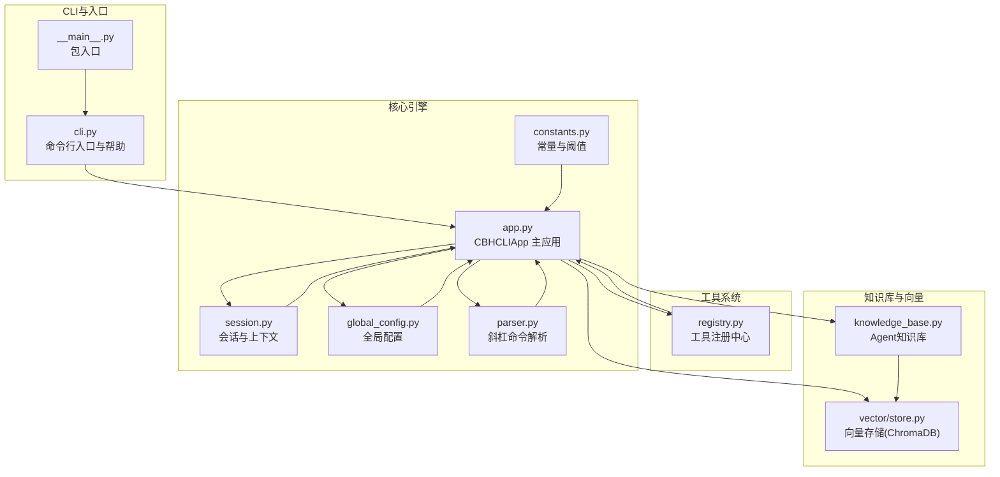
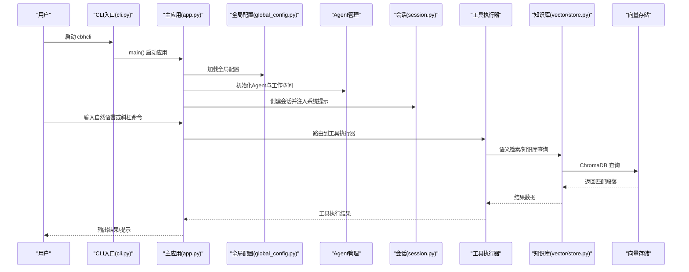
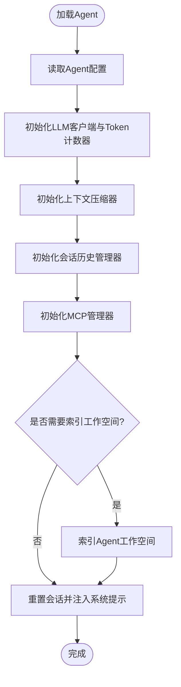
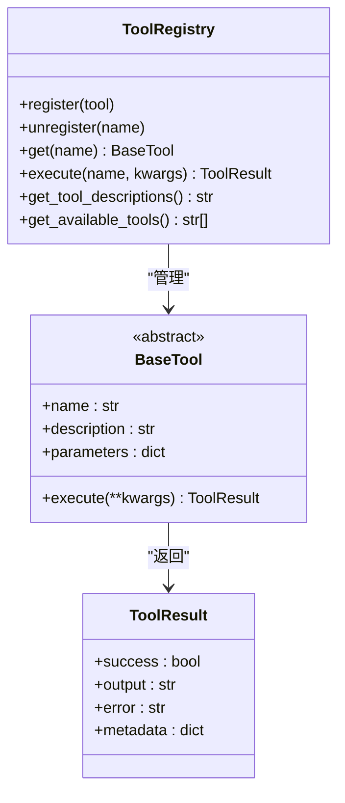
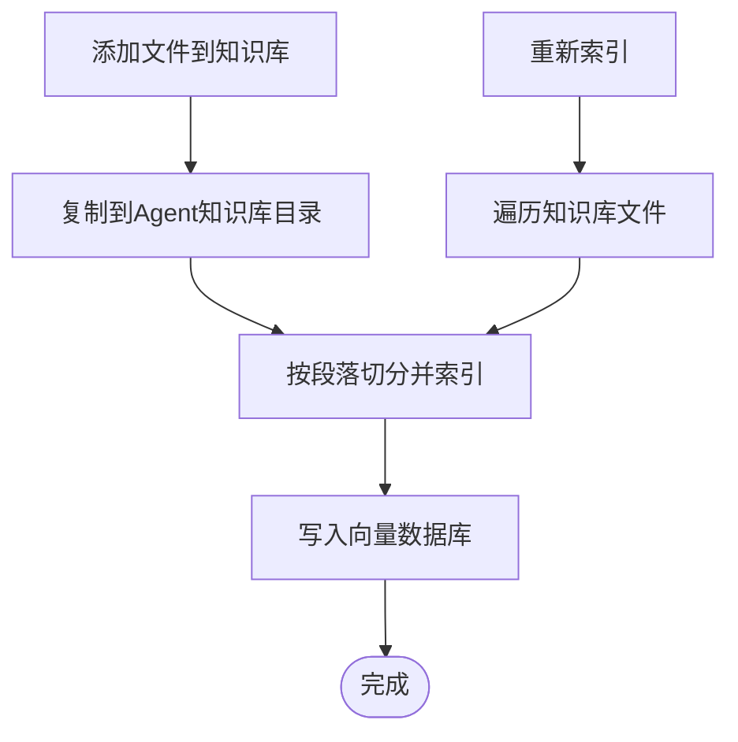
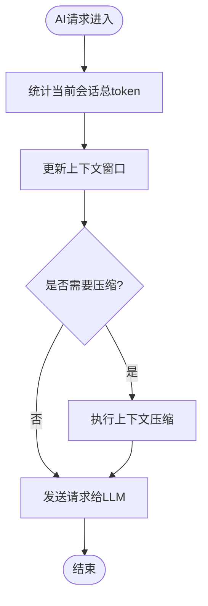
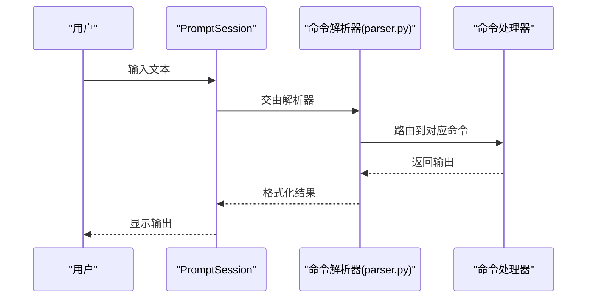
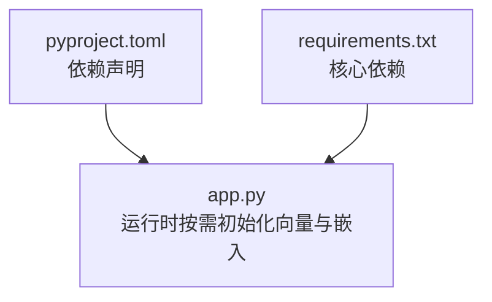

# 项目概述

<cite>
**本文引用的文件**
- [README.md](file://README.md)
- [INSTALL.md](file://INSTALL.md)
- [requirements.txt](file://requirements.txt)
- [pyproject.toml](file://pyproject.toml)
- [cbhcli_pkg/__main__.py](file://cbhcli_pkg/__main__.py)
- [cbhcli_pkg/cli.py](file://cbhcli_pkg/cli.py)
- [cbhcli_pkg/core/app.py](file://cbhcli_pkg/core/app.py)
- [cbhcli_pkg/core/constants.py](file://cbhcli_pkg/core/constants.py)
- [cbhcli_pkg/config/global_config.py](file://cbhcli_pkg/config/global_config.py)
- [cbhcli_pkg/tools/registry.py](file://cbhcli_pkg/tools/registry.py)
- [cbhcli_pkg/core/session.py](file://cbhcli_pkg/core/session.py)
- [cbhcli_pkg/core/knowledge_base.py](file://cbhcli_pkg/core/knowledge_base.py)
- [cbhcli_pkg/vector/store.py](file://cbhcli_pkg/vector/store.py)
- [cbhcli_pkg/commands/parser.py](file://cbhcli_pkg/commands/parser.py)
</cite>

## 目录
1. [简介](#简介)
2. [项目结构](#项目结构)
3. [核心组件](#核心组件)
4. [架构总览](#架构总览)
5. [详细组件分析](#详细组件分析)
6. [依赖分析](#依赖分析)
7. [性能考虑](#性能考虑)
8. [故障排查指南](#故障排查指南)
9. [结论](#结论)
10. [附录](#附录)

## 简介
CBHCLI 是一款面向终端用户的 AI 驱动助手，具备多 Agent 管理、智能工具调用、知识库系统与会话管理能力。其核心价值在于：
- 将“工具即能力”的理念融入自然语言交互，让 AI 能够直接执行终端命令、读写文件、运行代码、检索知识库与历史对话，从而显著提升开发者与运维人员的日常效率。
- 通过可插拔的工具体系与可配置的嵌入模型、重排序服务，兼顾易用性与扩展性。
- 提供上下文窗口监控与自动压缩机制，确保在长对话与复杂任务中保持稳定性能。

适用场景与目标用户：
- 开发者：快速编写/调试代码、查询项目文档、执行构建与测试命令。
- 运维工程师：检索历史操作记录、查询配置与日志、自动化巡检与排障。
- 数据分析师：基于知识库进行语义检索与问答，辅助数据探索与报告生成。
- 学习者与研究者：构建个人知识库，进行跨文档的语义检索与总结。

## 项目结构
项目采用分层与功能域结合的组织方式，核心模块包括：
- 核心引擎：应用主循环、会话与上下文管理、AI 请求处理、工具执行器、MCP 管理等。
- 工具系统：统一的工具注册中心与多种内置工具（终端命令、文件读写/编辑、Python 代码执行、记忆检索、知识库检索）。
- 知识库与向量检索：Agent 级知识库、向量存储（ChromaDB）、嵌入与重排序客户端、索引器。
- 配置与命令：全局配置管理、斜杠命令解析与路由、Agent/会话/模型/知识库/嵌入/向量命令。
- CLI 入口：命令行入口与帮助输出。

图表来源
- [cbhcli_pkg/cli.py:73-112](file://cbhcli_pkg/cli.py#L73-L112)
- [cbhcli_pkg/core/app.py:54-280](file://cbhcli_pkg/core/app.py#L54-L280)
- [cbhcli_pkg/core/session.py:37-190](file://cbhcli_pkg/core/session.py#L37-L190)
- [cbhcli_pkg/config/global_config.py:13-154](file://cbhcli_pkg/config/global_config.py#L13-L154)
- [cbhcli_pkg/tools/registry.py:51-115](file://cbhcli_pkg/tools/registry.py#L51-L115)
- [cbhcli_pkg/core/knowledge_base.py:7-207](file://cbhcli_pkg/core/knowledge_base.py#L7-L207)
- [cbhcli_pkg/vector/store.py:37-175](file://cbhcli_pkg/vector/store.py#L37-L175)
- [cbhcli_pkg/commands/parser.py:16-94](file://cbhcli_pkg/commands/parser.py#L16-L94)

章节来源
- [README.md:269-296](file://README.md#L269-L296)
- [pyproject.toml:52-53](file://pyproject.toml#L52-L53)

## 核心组件
- 多 Agent 管理：每个 Agent 拥有独立工作空间、配置、人格设定与知识库；支持创建、切换、删除与持久化。
- 智能工具调用：工具注册中心统一管理，AI 可根据任务动态选择并调用工具，支持终端命令、文件读写/编辑、Python 代码执行、记忆检索与知识库检索。
- 知识库系统：Agent 级知识库目录，支持添加/删除/列出文件与全量重索引；可选 ChromaDB 向量存储与嵌入模型，实现语义检索与问答。
- 会话管理：上下文窗口监控、自动压缩、历史保存与恢复、系统提示注入长期记忆（memory.md）。
- 命令系统：斜杠命令解析与路由，覆盖 Agent/模型/会话/知识库/嵌入/向量/MCP 等管理命令。
- UI 与交互：基于 prompt_toolkit 的交互界面，支持 Ctrl+R 切换工具显示模式、清晰的提示与颜色编码。

章节来源
- [README.md:5-31](file://README.md#L5-L31)
- [README.md:150-206](file://README.md#L150-L206)
- [cbhcli_pkg/core/app.py:54-280](file://cbhcli_pkg/core/app.py#L54-L280)
- [cbhcli_pkg/tools/registry.py:51-115](file://cbhcli_pkg/tools/registry.py#L51-L115)
- [cbhcli_pkg/core/knowledge_base.py:7-207](file://cbhcli_pkg/core/knowledge_base.py#L7-L207)
- [cbhcli_pkg/core/session.py:37-190](file://cbhcli_pkg/core/session.py#L37-L190)
- [cbhcli_pkg/commands/parser.py:16-94](file://cbhcli_pkg/commands/parser.py#L16-L94)

## 架构总览
CBHCLI 采用“应用主循环 + 模块化子系统”的分层架构：
- CLI 层负责参数解析与帮助输出，随后启动主应用。
- 主应用负责配置加载、Agent 初始化、工具与向量系统的按需初始化、命令路由与用户交互循环。
- 会话与上下文管理贯穿请求处理链路，确保在工具调用前后维持合理的上下文长度。
- 工具系统通过注册中心解耦，AI 通过工具执行器统一调度。
- 知识库与向量系统在嵌入模型可用时启用，提供语义检索能力。

图表来源
- [cbhcli_pkg/cli.py:73-112](file://cbhcli_pkg/cli.py#L73-L112)
- [cbhcli_pkg/core/app.py:386-440](file://cbhcli_pkg/core/app.py#L386-L440)
- [cbhcli_pkg/core/session.py:37-190](file://cbhcli_pkg/core/session.py#L37-L190)
- [cbhcli_pkg/vector/store.py:128-161](file://cbhcli_pkg/vector/store.py#L128-L161)

## 详细组件分析

### 多 Agent 管理
- 设计要点：每个 Agent 拥有独立工作空间与配置，支持加载上次活动 Agent 或回退到默认 Agent；支持手动索引 Agent 工作空间到向量数据库。
- 关键流程：加载 Agent → 初始化 LLM 客户端与上下文压缩器 → 初始化会话历史与 MCP 管理器 → 可选索引工作空间 → 重置会话并注入系统提示。

图表来源
- [cbhcli_pkg/core/app.py:231-279](file://cbhcli_pkg/core/app.py#L231-L279)

章节来源
- [cbhcli_pkg/core/app.py:204-279](file://cbhcli_pkg/core/app.py#L204-L279)
- [README.md:192-206](file://README.md#L192-L206)

### 智能工具调用
- 工具注册中心：统一注册、查找与执行工具，支持批量导出工具描述用于系统提示。
- 工具类型：终端命令、文件读写/编辑、Python 代码执行（带会话记忆）、记忆检索、知识库检索。
- 执行流程：AI 生成工具调用计划 → 工具执行器按需调用 → 返回结果并写入会话 → 可能触发上下文压缩。

图表来源
- [cbhcli_pkg/tools/registry.py:51-115](file://cbhcli_pkg/tools/registry.py#L51-L115)

章节来源
- [cbhcli_pkg/tools/registry.py:51-115](file://cbhcli_pkg/tools/registry.py#L51-L115)
- [README.md:14-24](file://README.md#L14-L24)

### 知识库系统与向量检索
- Agent 级知识库：在 Agent 工作空间内维护知识库目录，支持添加/删除/列出文件与全量重索引。
- 向量检索：在嵌入模型可用时启用，使用 ChromaDB 作为向量存储，支持自定义嵌入模型 API；查询时预计算嵌入向量，避免默认模型调用。
- 索引策略：skills.md、soul.md、tools.md、usage.md 与 knowledge/ 下的文本文件参与索引；memory.md 不索引，但始终作为长期记忆注入系统提示。

图表来源
- [cbhcli_pkg/core/knowledge_base.py:31-207](file://cbhcli_pkg/core/knowledge_base.py#L31-L207)
- [cbhcli_pkg/vector/store.py:99-161](file://cbhcli_pkg/vector/store.py#L99-L161)

章节来源
- [cbhcli_pkg/core/knowledge_base.py:7-207](file://cbhcli_pkg/core/knowledge_base.py#L7-L207)
- [cbhcli_pkg/vector/store.py:37-175](file://cbhcli_pkg/vector/store.py#L37-L175)
- [README.md:208-229](file://README.md#L208-L229)

### 会话管理与上下文压缩
- 会话数据结构：消息包含角色、内容、token 数、时间戳与工具调用元数据；支持 API 格式转换。
- 上下文窗口：根据模型上下文限制与压缩比例动态判断是否需要压缩；提供状态文本与剩余 token 计算。
- 自动压缩：接近阈值时自动触发压缩，减少历史消息以满足模型限制。

图表来源
- [cbhcli_pkg/core/session.py:127-190](file://cbhcli_pkg/core/session.py#L127-L190)
- [cbhcli_pkg/core/app.py:361-385](file://cbhcli_pkg/core/app.py#L361-L385)

章节来源
- [cbhcli_pkg/core/session.py:37-190](file://cbhcli_pkg/core/session.py#L37-L190)
- [cbhcli_pkg/core/app.py:361-385](file://cbhcli_pkg/core/app.py#L361-L385)

### 命令系统与交互
- 斜杠命令解析：支持注册命令、解析输入、执行并返回结果；提供帮助文本与未知命令提示。
- 命令覆盖：Agent 管理、模型配置、会话控制、知识库、嵌入与向量索引、MCP 管理等。
- UI 交互：基于 prompt_toolkit 的输入会话，支持快捷键切换工具显示模式。

图表来源
- [cbhcli_pkg/commands/parser.py:51-94](file://cbhcli_pkg/commands/parser.py#L51-L94)
- [cbhcli_pkg/cli.py:73-112](file://cbhcli_pkg/cli.py#L73-L112)

章节来源
- [cbhcli_pkg/commands/parser.py:16-94](file://cbhcli_pkg/commands/parser.py#L16-L94)
- [cbhcli_pkg/cli.py:7-71](file://cbhcli_pkg/cli.py#L7-L71)

## 依赖分析
- 核心依赖：requests、wcwidth、prompt_toolkit。
- 可选依赖：chromadb（向量检索）、tiktoken（精确 Token 计数）。
- 开发依赖：pytest、pytest-cov。
- 入口脚本：cbhcli 指向包内 CLI 主函数。

图表来源
- [pyproject.toml:26-42](file://pyproject.toml#L26-L42)
- [requirements.txt:1-7](file://requirements.txt#L1-L7)
- [cbhcli_pkg/core/app.py:97-150](file://cbhcli_pkg/core/app.py#L97-L150)

章节来源
- [pyproject.toml:26-42](file://pyproject.toml#L26-L42)
- [requirements.txt:1-7](file://requirements.txt#L1-L7)

## 性能考虑
- Token 计数：支持精确 Token 计数（可选），有助于更准确地评估上下文开销。
- 上下文压缩：当接近模型上下文限制时自动压缩，减少历史消息，避免超限错误。
- 向量检索：预计算嵌入向量，避免向量数据库调用默认模型，降低额外 API 调用与延迟。
- 索引策略：手动触发索引，避免启动时大规模索引导致的资源占用与等待时间。

## 故障排查指南
- 嵌入模型初始化失败：检查配置项与网络连通性；确认已正确配置嵌入模型。
- 向量存储初始化失败：确认已安装可选依赖 chromadb；检查嵌入客户端可用性。
- 未知命令：使用 /help 查看可用命令与用法。
- 退出与中断：支持 Ctrl+C 中断与 quit 退出；应用会在会话重置时清理 Python 会话记忆。

章节来源
- [cbhcli_pkg/core/app.py:108-118](file://cbhcli_pkg/core/app.py#L108-L118)
- [cbhcli_pkg/cli.py:96-112](file://cbhcli_pkg/cli.py#L96-L112)
- [README.md:231-262](file://README.md#L231-L262)

## 结论
CBHCLI 通过“多 Agent + 工具调用 + 知识库 + 会话管理”的组合，为终端用户提供了强大而灵活的 AI 助手能力。其模块化设计与可插拔工具体系便于扩展，向量检索与上下文压缩保障了在复杂任务中的稳定性与性能。对于初学者，项目提供清晰的安装与使用指引；对于有经验的开发者，项目展示了如何在真实工程中组织命令解析、工具系统、向量检索与会话管理。

## 附录
- 安装与卸载：支持从源码安装、标准安装与 Wheel 安装；提供卸载步骤。
- 许可证：MIT 许可证。

章节来源
- [INSTALL.md:1-69](file://INSTALL.md#L1-L69)
- [README.md:322-325](file://README.md#L322-L325)