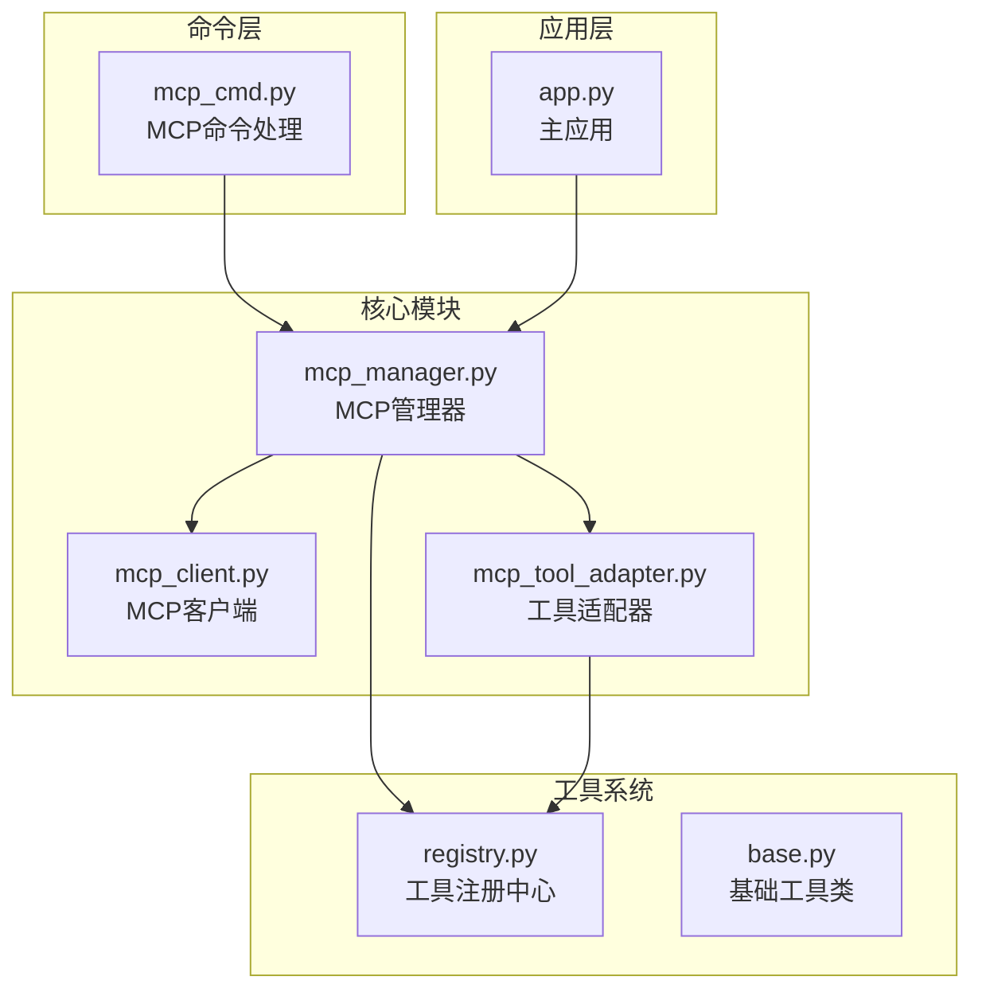
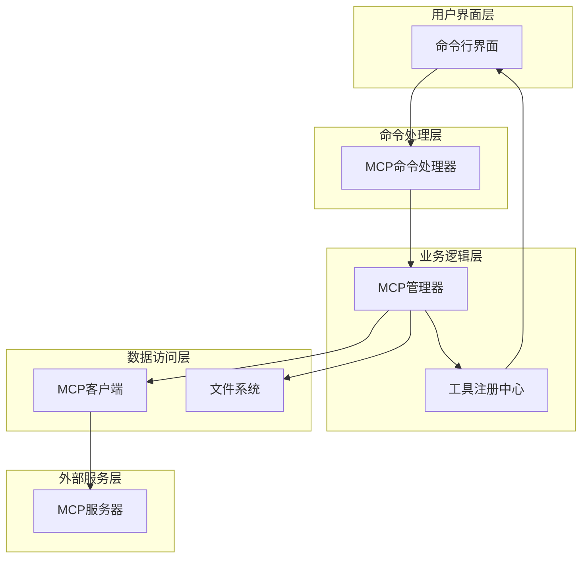
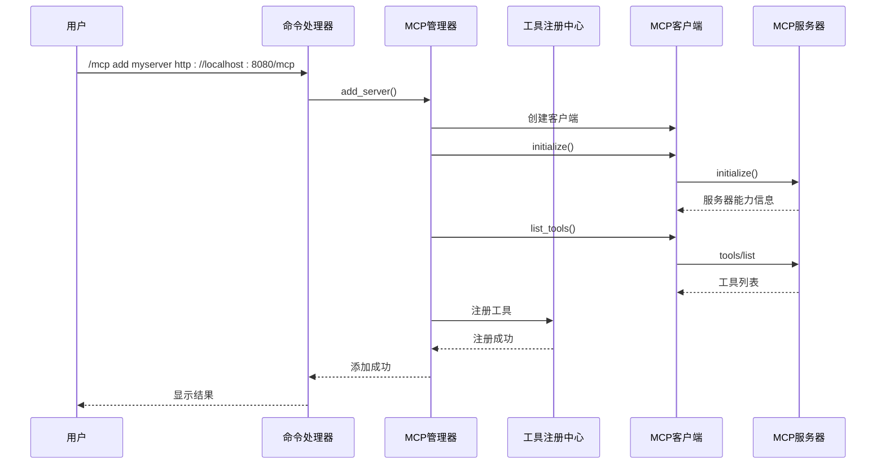
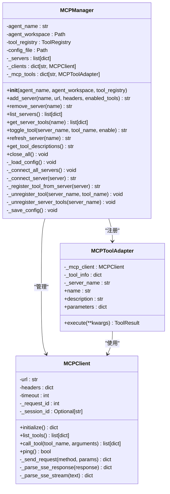
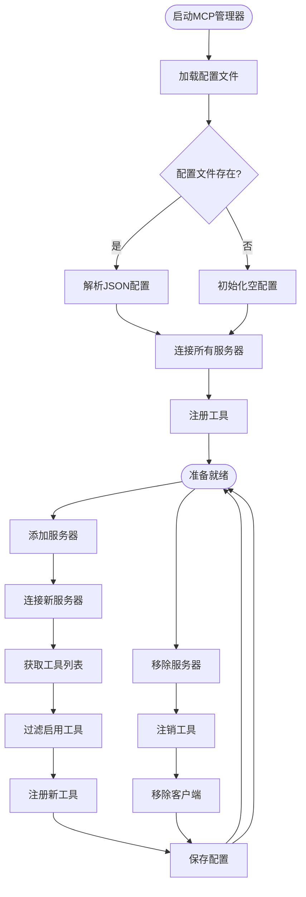
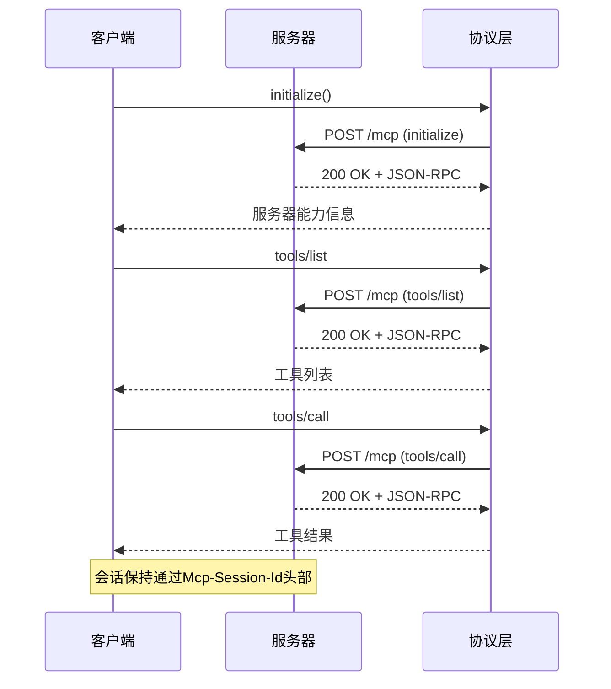
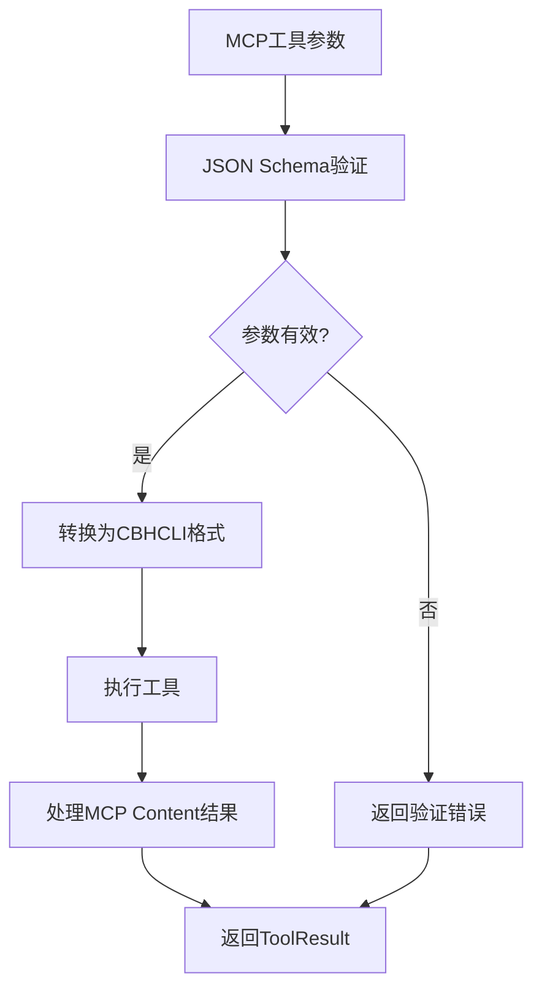
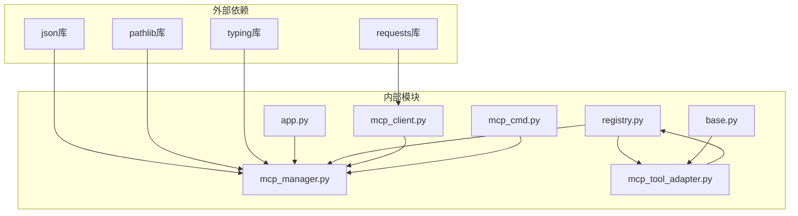
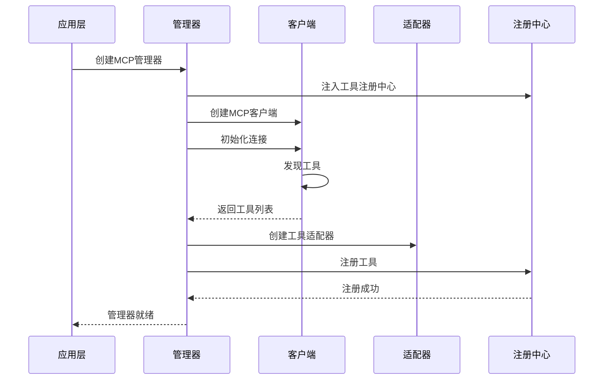

# MCP集成管理

<cite>
**本文档引用的文件**
- [mcp_manager.py](file://cbhcli_pkg/core/mcp_manager.py)
- [mcp_client.py](file://cbhcli_pkg/core/mcp_client.py)
- [mcp_tool_adapter.py](file://cbhcli_pkg/core/mcp_tool_adapter.py)
- [mcp_cmd.py](file://cbhcli_pkg/commands/mcp_cmd.py)
- [registry.py](file://cbhcli_pkg/tools/registry.py)
- [app.py](file://cbhcli_pkg/core/app.py)
- [base.py](file://cbhcli_pkg/tools/base.py)
- [README.md](file://README.md)
</cite>

## 目录
1. [简介](#简介)
2. [项目结构](#项目结构)
3. [核心组件](#核心组件)
4. [架构概览](#架构概览)
5. [详细组件分析](#详细组件分析)
6. [依赖关系分析](#依赖关系分析)
7. [性能考虑](#性能考虑)
8. [故障排除指南](#故障排除指南)
9. [最佳实践](#最佳实践)
10. [结论](#结论)

## 简介

CBHCLI的MCP（Model Context Protocol）集成管理是一个强大的工具管理系统，允许AI助手通过标准化协议访问外部工具和服务。本系统采用每个Agent独立管理MCP连接的设计理念，确保不同Agent之间的工具配置完全隔离，提高了系统的安全性和灵活性。

MCP集成管理的核心特性包括：
- **Agent独立管理**：每个Agent拥有独立的MCP配置和连接
- **动态工具注册**：支持实时发现和注册MCP工具
- **灵活的工具控制**：支持启用/禁用特定工具和服务器
- **完整的生命周期管理**：从连接建立到工具注销的全生命周期管理

## 项目结构

MCP集成管理相关的代码主要分布在以下模块中：

**图表来源**
- [mcp_manager.py:1-366](file://cbhcli_pkg/core/mcp_manager.py#L1-L366)
- [mcp_client.py:1-242](file://cbhcli_pkg/core/mcp_client.py#L1-L242)
- [mcp_tool_adapter.py:1-116](file://cbhcli_pkg/core/mcp_tool_adapter.py#L1-L116)
- [mcp_cmd.py:1-182](file://cbhcli_pkg/commands/mcp_cmd.py#L1-L182)
- [registry.py:1-115](file://cbhcli_pkg/tools/registry.py#L1-L115)
- [app.py:1-478](file://cbhcli_pkg/core/app.py#L1-L478)

**章节来源**
- [mcp_manager.py:1-366](file://cbhcli_pkg/core/mcp_manager.py#L1-L366)
- [mcp_client.py:1-242](file://cbhcli_pkg/core/mcp_client.py#L1-L242)
- [mcp_tool_adapter.py:1-116](file://cbhcli_pkg/core/mcp_tool_adapter.py#L1-L116)
- [mcp_cmd.py:1-182](file://cbhcli_pkg/commands/mcp_cmd.py#L1-L182)
- [registry.py:1-115](file://cbhcli_pkg/tools/registry.py#L1-L115)
- [app.py:1-478](file://cbhcli_pkg/core/app.py#L1-L478)

## 核心组件

### MCP管理器（MCPManager）

MCP管理器是整个MCP集成的核心控制器，负责管理每个Agent的MCP连接和工具注册。其设计特点包括：

- **Agent独立性**：每个Agent拥有独立的配置文件和连接池
- **自动配置加载**：启动时自动加载并连接所有已配置的服务器
- **动态工具管理**：支持实时添加、移除和切换工具
- **状态持久化**：所有配置变更都会自动保存到本地文件

### MCP客户端（MCPClient）

MCP客户端实现了完整的MCP Streamable HTTP协议，支持：
- **JSON-RPC协议**：遵循MCP标准的JSON-RPC 2.0规范
- **SSE响应处理**：支持Server-Sent Events流式响应
- **会话管理**：自动处理MCP Session ID和连接状态
- **错误处理**：完善的异常捕获和错误报告机制

### 工具适配器（MCPToolAdapter）

工具适配器将MCP工具无缝集成到CBHCLI的工具系统中：
- **统一接口**：实现BaseTool抽象基类，提供一致的工具调用接口
- **参数转换**：自动处理MCP工具的JSON Schema参数定义
- **结果处理**：将MCP Content数组转换为CBHCLI可识别的结果格式
- **类型安全**：确保工具调用的类型安全和参数验证

**章节来源**
- [mcp_manager.py:11-366](file://cbhcli_pkg/core/mcp_manager.py#L11-L366)
- [mcp_client.py:8-242](file://cbhcli_pkg/core/mcp_client.py#L8-L242)
- [mcp_tool_adapter.py:7-116](file://cbhcli_pkg/core/mcp_tool_adapter.py#L7-L116)

## 架构概览

MCP集成管理采用分层架构设计，确保各组件职责清晰、耦合度低：

**图表来源**
- [mcp_cmd.py:5-182](file://cbhcli_pkg/commands/mcp_cmd.py#L5-L182)
- [mcp_manager.py:18-366](file://cbhcli_pkg/core/mcp_manager.py#L18-L366)
- [registry.py:51-115](file://cbhcli_pkg/tools/registry.py#L51-L115)
- [mcp_client.py:15-242](file://cbhcli_pkg/core/mcp_client.py#L15-L242)

### 数据流图

**图表来源**
- [mcp_cmd.py:78-97](file://cbhcli_pkg/commands/mcp_cmd.py#L78-L97)
- [mcp_manager.py:69-98](file://cbhcli_pkg/core/mcp_manager.py#L69-L98)
- [mcp_client.py:183-205](file://cbhcli_pkg/core/mcp_client.py#L183-L205)

## 详细组件分析

### MCP管理器详细分析

MCP管理器是系统的核心协调者，负责管理MCP连接的完整生命周期：

#### 关键属性和方法

**图表来源**
- [mcp_manager.py:11-366](file://cbhcli_pkg/core/mcp_manager.py#L11-L366)
- [mcp_client.py:8-242](file://cbhcli_pkg/core/mcp_client.py#L8-L242)
- [mcp_tool_adapter.py:7-116](file://cbhcli_pkg/core/mcp_tool_adapter.py#L7-L116)

#### 配置管理流程

**图表来源**
- [mcp_manager.py:41-67](file://cbhcli_pkg/core/mcp_manager.py#L41-L67)
- [mcp_manager.py:54-61](file://cbhcli_pkg/core/mcp_manager.py#L54-L61)
- [mcp_manager.py:268-315](file://cbhcli_pkg/core/mcp_manager.py#L268-L315)

**章节来源**
- [mcp_manager.py:11-366](file://cbhcli_pkg/core/mcp_manager.py#L11-L366)

### MCP客户端详细分析

MCP客户端实现了MCP协议的完整客户端功能，支持Streamable HTTP协议：

#### 协议实现要点

- **JSON-RPC 2.0**：严格遵循MCP标准的JSON-RPC 2.0协议
- **SSE支持**：能够正确解析Server-Sent Events格式的响应
- **会话管理**：自动处理MCP Session ID，支持持久化会话
- **错误处理**：提供详细的错误信息和异常处理

#### 通信序列图

**图表来源**
- [mcp_client.py:183-241](file://cbhcli_pkg/core/mcp_client.py#L183-L241)

**章节来源**
- [mcp_client.py:8-242](file://cbhcli_pkg/core/mcp_client.py#L8-L242)

### 工具适配器详细分析

工具适配器是MCP系统与CBHCLI工具系统的桥梁，实现了无缝集成：

#### 参数处理机制

**图表来源**
- [mcp_tool_adapter.py:44-116](file://cbhcli_pkg/core/mcp_tool_adapter.py#L44-L116)

#### 结果处理流程

工具适配器能够处理多种类型的MCP Content结果：

- **文本内容**：直接转换为字符串输出
- **图像内容**：提供MIME类型信息的占位符
- **资源内容**：显示URI信息的占位符
- **复杂对象**：转换为JSON字符串进行输出

**章节来源**
- [mcp_tool_adapter.py:7-116](file://cbhcli_pkg/core/mcp_tool_adapter.py#L7-L116)

### 命令处理系统

MCP命令处理系统提供了完整的CLI接口，支持所有MCP管理功能：

#### 命令结构

| 命令 | 参数 | 功能描述 |
|------|------|----------|
| `/mcp add` | `<名称> <URL> [header=值 ...]` | 添加新的MCP服务器 |
| `/mcp list` | 无 | 列出所有MCP服务器 |
| `/mcp remove` | `<名称>` | 移除指定的MCP服务器 |
| `/mcp refresh` | `<名称>` | 重新连接并刷新工具 |
| `/mcp tools` | `<名称>` | 查看服务器工具列表 |
| `/mcp enable` | `<服务器> <工具名>` | 启用指定工具 |
| `/mcp disable` | `<服务器> <工具名>` | 禁用指定工具 |

**章节来源**
- [mcp_cmd.py:5-182](file://cbhcli_pkg/commands/mcp_cmd.py#L5-L182)

## 依赖关系分析

MCP集成管理系统的依赖关系相对简单，体现了良好的模块化设计：

**图表来源**
- [mcp_manager.py:1-8](file://cbhcli_pkg/core/mcp_manager.py#L1-L8)
- [mcp_client.py:1-5](file://cbhcli_pkg/core/mcp_client.py#L1-L5)
- [mcp_tool_adapter.py:1-4](file://cbhcli_pkg/core/mcp_tool_adapter.py#L1-L4)
- [registry.py:1-4](file://cbhcli_pkg/tools/registry.py#L1-L4)

### 模块间交互

**图表来源**
- [app.py:263-264](file://cbhcli_pkg/core/app.py#L263-L264)
- [mcp_manager.py:268-315](file://cbhcli_pkg/core/mcp_manager.py#L268-L315)

**章节来源**
- [app.py:204-280](file://cbhcli_pkg/core/app.py#L204-L280)
- [mcp_manager.py:18-39](file://cbhcli_pkg/core/mcp_manager.py#L18-L39)

## 性能考虑

### 连接管理优化

MCP系统采用了多项性能优化措施：

- **延迟连接**：服务器配置加载后不会立即建立连接，而是在需要时才连接
- **连接池管理**：每个Agent维护独立的连接池，避免跨Agent干扰
- **会话复用**：通过Mcp-Session-Id实现连接复用，减少握手开销

### 工具注册优化

- **增量注册**：只注册启用的工具，避免不必要的资源占用
- **批量操作**：支持批量工具操作，减少配置文件I/O次数
- **缓存机制**：工具描述和配置信息在内存中缓存

### 内存管理

- **及时清理**：工具注销时立即释放相关资源
- **连接清理**：服务器移除时自动清理相关连接和工具
- **配置持久化**：异步保存配置，不影响主线程性能

## 故障排除指南

### 常见问题及解决方案

#### 连接失败问题

**症状**：添加服务器后显示连接失败

**可能原因**：
1. 服务器地址不可达
2. 认证头配置错误
3. 网络防火墙阻止
4. 服务器协议版本不匹配

**解决步骤**：
1. 验证服务器URL可达性
2. 检查认证头格式
3. 确认网络连接正常
4. 验证MCP协议版本

#### 工具注册异常

**症状**：工具列表为空或工具无法使用

**可能原因**：
1. 服务器未正确实现MCP协议
2. 工具参数schema无效
3. 工具执行过程中出现异常

**解决步骤**：
1. 检查服务器日志
2. 验证工具schema定义
3. 测试工具独立执行

#### 配置文件问题

**症状**：MCP配置丢失或损坏

**解决步骤**：
1. 检查配置文件格式
2. 验证JSON语法正确性
3. 重新创建配置文件

### 调试技巧

- **启用详细日志**：通过调试模式查看详细的连接和工具注册信息
- **网络诊断**：使用curl或类似工具测试MCP服务器连通性
- **协议验证**：验证MCP服务器是否正确实现JSON-RPC协议

**章节来源**
- [mcp_client.py:163-181](file://cbhcli_pkg/core/mcp_client.py#L163-L181)
- [mcp_manager.py:314-315](file://cbhcli_pkg/core/mcp_manager.py#L314-L315)

## 最佳实践

### 配置管理最佳实践

1. **命名规范**：为每个MCP服务器使用有意义的名称，避免重复
2. **认证安全**：使用环境变量或配置文件管理敏感的认证信息
3. **工具选择**：根据Agent的具体需求选择合适的工具集
4. **定期维护**：定期检查和更新MCP服务器配置

### 性能优化建议

1. **连接复用**：合理利用Mcp-Session-Id实现连接复用
2. **工具过滤**：只启用必要的工具，减少资源消耗
3. **批量操作**：使用批量命令进行配置管理
4. **监控告警**：建立连接状态监控机制

### 安全考虑

1. **最小权限原则**：为MCP服务器配置最小必要的权限
2. **传输加密**：使用HTTPS确保数据传输安全
3. **访问控制**：实施适当的访问控制和身份验证
4. **审计日志**：记录重要的MCP操作和访问

### 开发指导

1. **协议兼容**：确保MCP服务器实现最新的MCP协议版本
2. **错误处理**：提供清晰的错误信息和恢复机制
3. **文档完善**：为MCP工具提供完整的使用文档
4. **测试覆盖**：进行全面的功能和性能测试

## 结论

CBHCLI的MCP集成管理提供了一个强大、灵活且易于使用的工具扩展平台。通过每个Agent独立管理MCP连接的设计，系统在保证安全性的同时提供了高度的灵活性。

### 主要优势

- **模块化设计**：清晰的组件分离和职责划分
- **Agent隔离**：确保不同Agent之间的配置完全独立
- **协议标准**：严格遵循MCP标准，保证互操作性
- **易用性**：提供直观的CLI命令和完整的管理功能

### 未来发展方向

1. **增强监控**：添加更详细的连接状态和性能监控
2. **自动化管理**：实现自动化的工具发现和配置管理
3. **扩展协议**：支持更多的MCP协议变体和扩展
4. **可视化界面**：提供图形化的MCP管理界面

通过持续的优化和改进，CBHCLI的MCP集成管理将成为AI助手生态系统中的重要基础设施，为用户提供更加丰富和强大的工具扩展能力。