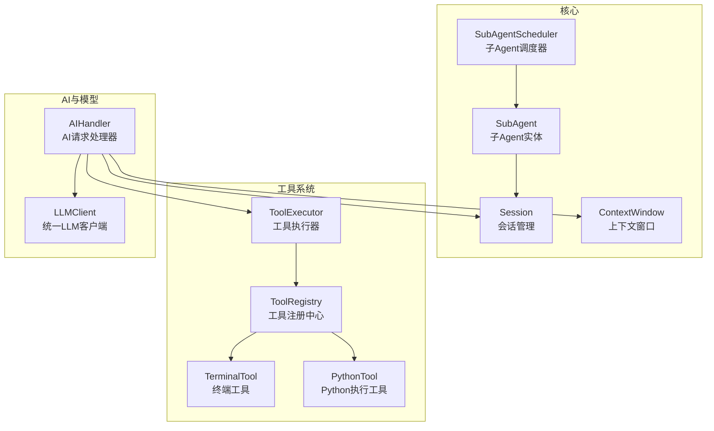
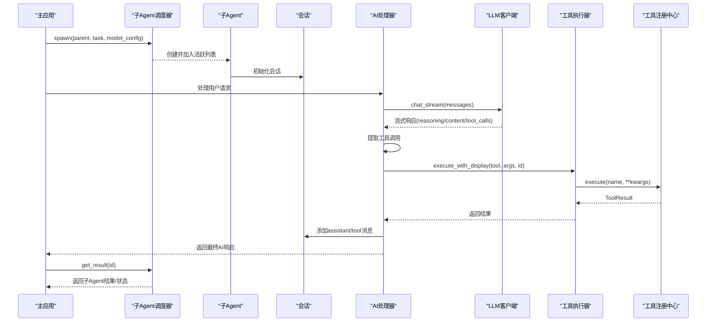
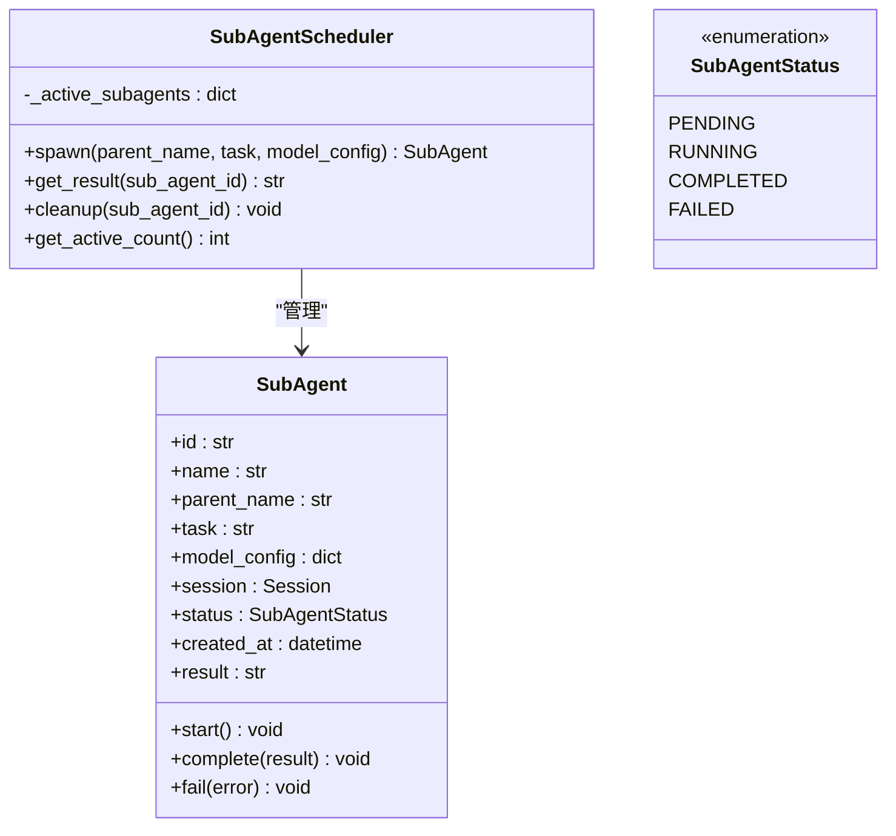
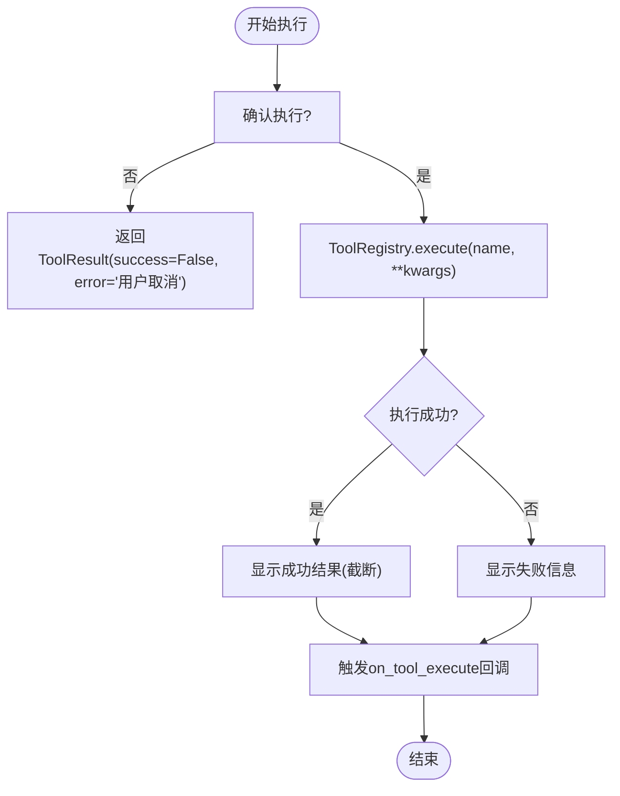
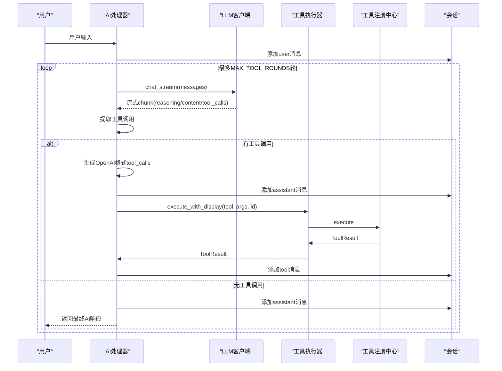
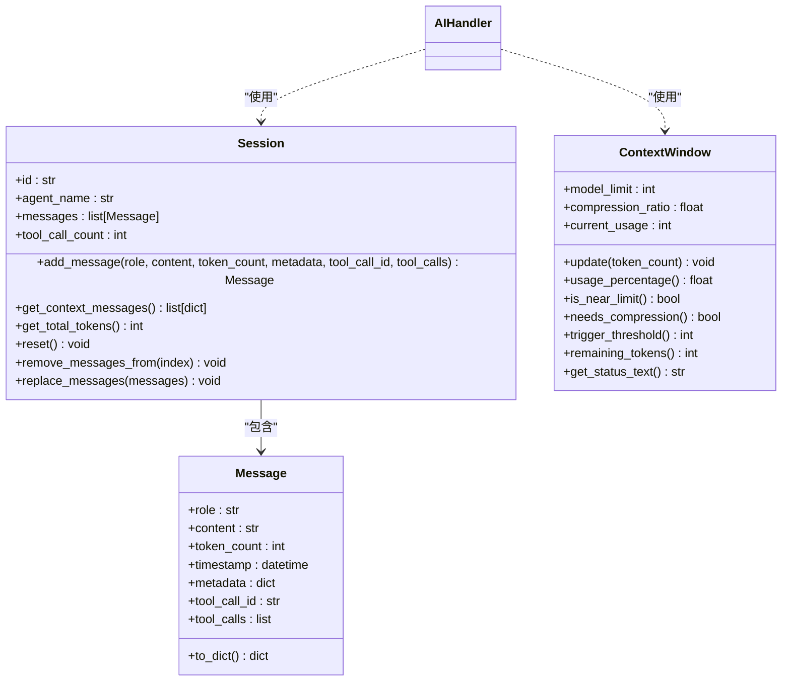
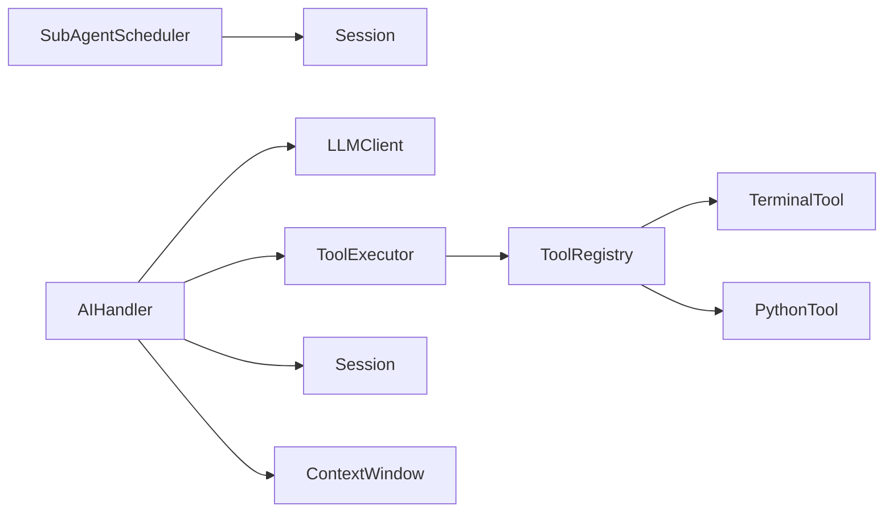

# 子Agent调度

<cite>
**本文引用的文件**
- [subagent.py](file://cbhcli_pkg/core/subagent.py)
- [tool_executor.py](file://cbhcli_pkg/core/tool_executor.py)
- [ai_handler.py](file://cbhcli_pkg/core/ai_handler.py)
- [app.py](file://cbhcli_pkg/core/app.py)
- [session.py](file://cbhcli_pkg/core/session.py)
- [constants.py](file://cbhcli_pkg/core/constants.py)
- [registry.py](file://cbhcli_pkg/tools/registry.py)
- [terminal.py](file://cbhcli_pkg/tools/terminal.py)
- [python_tool.py](file://cbhcli_pkg/tools/python_tool.py)
- [model.py](file://cbhcli_pkg/core/model.py)
- [errors.py](file://cbhcli_pkg/core/errors.py)
</cite>

## 目录
1. [简介](#简介)
2. [项目结构](#项目结构)
3. [核心组件](#核心组件)
4. [架构总览](#架构总览)
5. [详细组件分析](#详细组件分析)
6. [依赖分析](#依赖分析)
7. [性能考量](#性能考量)
8. [故障排查指南](#故障排查指南)
9. [结论](#结论)
10. [附录](#附录)

## 简介
本文件面向CBHCLI的子Agent调度系统，提供从概念设计到实现细节的专业技术文档。重点涵盖：
- 子Agent的概念与生命周期：创建、启动、执行、完成/失败、清理
- 任务分解、并行执行与结果聚合的完整流程
- 工具执行器的高级能力：确认模式、显示与回调、错误处理
- 调度器的简单管理：活跃子Agent数量、结果查询
- 配置参数、执行状态与资源分配机制
- 调度算法建议（优先级、负载均衡、资源竞争）
- 监控与告警、故障恢复与重试策略
- 高级用户自定义调度器扩展指南

## 项目结构
围绕子Agent调度的核心代码位于cbhcli_pkg/core目录，配合工具系统与会话管理模块协同工作。

图表来源
- [subagent.py:55-118](file://cbhcli_pkg/core/subagent.py#L55-L118)
- [session.py:37-190](file://cbhcli_pkg/core/session.py#L37-L190)
- [ai_handler.py:21-743](file://cbhcli_pkg/core/ai_handler.py#L21-L743)
- [tool_executor.py:15-168](file://cbhcli_pkg/core/tool_executor.py#L15-L168)
- [registry.py:51-115](file://cbhcli_pkg/tools/registry.py#L51-L115)
- [terminal.py:7-99](file://cbhcli_pkg/tools/terminal.py#L7-L99)
- [python_tool.py:127-207](file://cbhcli_pkg/tools/python_tool.py#L127-L207)
- [model.py:7-147](file://cbhcli_pkg/core/model.py#L7-L147)

章节来源
- [app.py:54-331](file://cbhcli_pkg/core/app.py#L54-L331)

## 核心组件
- 子Agent调度器：负责创建、查询结果、清理活跃子Agent
- 子Agent实体：封装任务、状态、会话与结果
- 会话与上下文：承载消息、token统计与压缩阈值
- 工具执行器：工具调用前确认、执行、结果显示与回调
- 工具注册中心：统一注册、查找与执行工具
- AI处理器：多轮工具调用、流式输出、工具调用提取与执行
- LLM客户端：统一API封装，支持流式与非流式

章节来源
- [subagent.py:9-118](file://cbhcli_pkg/core/subagent.py#L9-L118)
- [session.py:8-190](file://cbhcli_pkg/core/session.py#L8-L190)
- [tool_executor.py:15-168](file://cbhcli_pkg/core/tool_executor.py#L15-L168)
- [registry.py:7-115](file://cbhcli_pkg/tools/registry.py#L7-L115)
- [ai_handler.py:21-743](file://cbhcli_pkg/core/ai_handler.py#L21-L743)
- [model.py:7-147](file://cbhcli_pkg/core/model.py#L7-L147)

## 架构总览
子Agent调度系统在主应用中初始化，结合AI处理器与工具执行器形成“任务分解-工具执行-结果聚合”的闭环。调度器维护子Agent生命周期，子Agent拥有独立会话，AI处理器在会话中进行多轮工具调用，工具执行器负责具体执行与展示。

图表来源
- [app.py:422-439](file://cbhcli_pkg/core/app.py#L422-L439)
- [ai_handler.py:51-96](file://cbhcli_pkg/core/ai_handler.py#L51-L96)
- [tool_executor.py:54-91](file://cbhcli_pkg/core/tool_executor.py#L54-L91)
- [registry.py:70-96](file://cbhcli_pkg/tools/registry.py#L70-L96)
- [model.py:59-120](file://cbhcli_pkg/core/model.py#L59-L120)
- [session.py:37-125](file://cbhcli_pkg/core/session.py#L37-L125)
- [subagent.py:55-118](file://cbhcli_pkg/core/subagent.py#L55-L118)

## 详细组件分析

### 子Agent与调度器
- 设计理念
  - 子Agent是临时实体，拥有独立会话与状态机，便于任务分解与结果隔离
  - 调度器提供轻量级生命周期管理：spawn、get_result、cleanup、活跃计数
- 关键行为
  - spawn：基于父Agent名称与任务描述创建子Agent，注入模型配置
  - get_result：根据状态返回“运行中/完成/失败/不存在”等信息
  - cleanup：释放内存中的活跃子Agent
  - 状态枚举：PENDING/RUNNING/COMPLETED/FAILED
- 数据结构
  - SubAgent包含id/name/parent/task/model_config/session/status/created_at/result
  - 调度器内部以字典维护活跃子Agent集合

图表来源
- [subagent.py:9-118](file://cbhcli_pkg/core/subagent.py#L9-L118)

章节来源
- [subagent.py:17-118](file://cbhcli_pkg/core/subagent.py#L17-L118)

### 工具执行器与工具注册中心
- 工具执行器
  - 支持确认模式（可跳过确认）、详细/简洁输出、执行回调
  - execute_with_display：先显示调用信息与参数，再执行工具，最后显示结果
  - _confirm_execution：支持“all”跳过后续确认；支持键盘中断/EOF
  - _display_result：截断输出长度，区分成功/失败
- 工具注册中心
  - 统一注册、注销、查找与执行
  - ToolResult封装success/output/error/metadata
  - get_tool_descriptions：用于系统提示

图表来源
- [tool_executor.py:54-168](file://cbhcli_pkg/core/tool_executor.py#L54-L168)
- [registry.py:70-96](file://cbhcli_pkg/tools/registry.py#L70-L96)

章节来源
- [tool_executor.py:15-168](file://cbhcli_pkg/core/tool_executor.py#L15-L168)
- [registry.py:7-115](file://cbhcli_pkg/tools/registry.py#L7-L115)

### AI处理器与多轮工具调用
- 处理流程
  - process_request：循环最多MAX_TOOL_ROUNDS次，每轮获取上下文并请求LLM
  - _get_ai_response：流式接收reasoning/content/tool_calls，增量清理与显示
  - _extract_tool_calls：支持DSML标签、Python函数调用、JSON格式、纯文本命令
  - _execute_tools：去重、生成OpenAI格式tool_calls、添加assistant消息、逐个执行工具并追加tool消息
- 关键常量
  - MAX_TOOL_ROUNDS、MAX_TOOL_OUTPUT_LENGTH、TOOL_PREVIEW_LENGTH等

图表来源
- [ai_handler.py:51-96](file://cbhcli_pkg/core/ai_handler.py#L51-L96)
- [ai_handler.py:98-216](file://cbhcli_pkg/core/ai_handler.py#L98-L216)
- [ai_handler.py:264-735](file://cbhcli_pkg/core/ai_handler.py#L264-L735)
- [model.py:59-120](file://cbhcli_pkg/core/model.py#L59-L120)
- [tool_executor.py:54-91](file://cbhcli_pkg/core/tool_executor.py#L54-L91)
- [registry.py:70-96](file://cbhcli_pkg/tools/registry.py#L70-L96)
- [session.py:37-125](file://cbhcli_pkg/core/session.py#L37-L125)

章节来源
- [ai_handler.py:21-743](file://cbhcli_pkg/core/ai_handler.py#L21-L743)
- [constants.py:13-16](file://cbhcli_pkg/core/constants.py#L13-L16)

### 会话与上下文窗口
- Session：消息结构、to_dict/API格式转换、token统计、重置与替换
- ContextWindow：阈值触发、使用百分比、剩余token、状态文本

图表来源
- [session.py:8-190](file://cbhcli_pkg/core/session.py#L8-L190)
- [ai_handler.py:127-190](file://cbhcli_pkg/core/ai_handler.py#L127-L190)

章节来源
- [session.py:37-190](file://cbhcli_pkg/core/session.py#L37-L190)
- [constants.py:6-8](file://cbhcli_pkg/core/constants.py#L6-L8)

### 主应用集成与初始化
- 主应用在初始化阶段创建AgentManager、SubAgentScheduler、ToolRegistry、LLMClient等
- 初始化工具系统：注册Terminal、Read、Write、Edit、Python等工具
- 初始化向量存储与检索工具（可选），并在配置后动态注册

章节来源
- [app.py:73-150](file://cbhcli_pkg/core/app.py#L73-L150)

## 依赖分析
- 组件耦合
  - SubAgentScheduler依赖Session（每个子Agent拥有独立会话）
  - AIHandler依赖LLMClient、ToolExecutor、Session、ContextWindow
  - ToolExecutor依赖ToolRegistry
  - ToolRegistry提供统一工具接口，TerminalTool与PythonTool作为典型实现
- 外部依赖
  - requests用于LLM API调用
  - subprocess用于TerminalTool命令执行
  - json用于工具调用参数解析与结果序列化

图表来源
- [subagent.py:55-118](file://cbhcli_pkg/core/subagent.py#L55-L118)
- [ai_handler.py:21-743](file://cbhcli_pkg/core/ai_handler.py#L21-L743)
- [tool_executor.py:15-168](file://cbhcli_pkg/core/tool_executor.py#L15-L168)
- [registry.py:51-115](file://cbhcli_pkg/tools/registry.py#L51-L115)
- [terminal.py:31-99](file://cbhcli_pkg/tools/terminal.py#L31-L99)
- [python_tool.py:170-207](file://cbhcli_pkg/tools/python_tool.py#L170-L207)
- [model.py:28-147](file://cbhcli_pkg/core/model.py#L28-L147)
- [session.py:37-125](file://cbhcli_pkg/core/session.py#L37-L125)

## 性能考量
- 上下文管理
  - 使用ContextWindow与ContextCompressor在接近阈值时自动压缩，降低token占用
  - 建议合理设置auto_compress与compression_ratio，平衡性能与准确性
- 工具输出截断
  - MAX_TOOL_OUTPUT_LENGTH与TOOL_PREVIEW_LENGTH控制显示与传输开销
- 并发与流式
  - LLMClient支持流式输出，提升交互体验；工具执行器采用同步执行，若需并发可在上层调度器中引入异步队列与限流

## 故障排查指南
- 常见异常
  - ModelNotConfiguredError：未配置模型导致无法发起AI请求
  - ToolExecutionError：工具执行失败，查看ToolResult.error
  - ContextLimitExceededError：上下文超限，触发压缩或清理历史消息
- 排查步骤
  - 检查Agent模型配置与LLMClient初始化
  - 查看AIHandler的工具调用提取逻辑与去重策略
  - 使用ToolExecutor的详细模式观察参数与输出
  - 检查SubAgentScheduler的活跃子Agent数量与状态

章节来源
- [errors.py:9-32](file://cbhcli_pkg/core/errors.py#L9-L32)
- [tool_executor.py:142-159](file://cbhcli_pkg/core/tool_executor.py#L142-L159)
- [ai_handler.py:664-735](file://cbhcli_pkg/core/ai_handler.py#L664-L735)

## 结论
CBHCLI的子Agent调度系统通过“调度器-子Agent-会话-工具链”的清晰分层，实现了任务分解、工具调用与结果聚合的可扩展框架。当前实现侧重于可靠性和易用性，建议在生产场景中引入更完善的调度算法（优先级、负载均衡、资源竞争处理）、异步执行与重试机制、以及状态持久化与断点续传能力，以满足更高并发与稳定性需求。

## 附录

### 子Agent配置示例与最佳实践
- 配置参数
  - parent_name：父Agent名称，用于标识任务来源
  - task：任务描述，便于追踪与日志
  - model_config：模型配置字典，包含url、apiKey、model、context_limit等
- 生命周期管理
  - spawn后立即start，完成后complete或fail
  - 定期cleanup释放内存
- 执行状态
  - PENDING/RUNNING/COMPLETED/FAILED，结合get_result进行轮询或回调
- 资源分配
  - 每个子Agent独立Session，避免跨任务污染
  - 控制活跃子Agent数量，避免上下文与工具执行资源竞争

章节来源
- [subagent.py:20-53](file://cbhcli_pkg/core/subagent.py#L20-L53)
- [session.py:40-81](file://cbhcli_pkg/core/session.py#L40-L81)

### 工具执行器高级功能
- 异步执行模式
  - 当前实现为同步执行；建议在上层调度器中引入线程池/进程池与队列，实现并发控制
- 并发控制
  - 通过队列长度与超时参数限制同时执行的工具数量
- 错误处理策略
  - ToolResult封装错误信息；ToolExecutor在失败时输出详细错误
  - 支持用户取消（输入n/all）与键盘中断/EOF

章节来源
- [tool_executor.py:122-140](file://cbhcli_pkg/core/tool_executor.py#L122-L140)
- [registry.py:89-96](file://cbhcli_pkg/tools/registry.py#L89-L96)

### 子任务调度算法建议
- 优先级管理
  - 依据任务类型（CPU密集/IO密集）、紧急程度与资源需求设定优先级
- 负载均衡
  - 基于活跃子Agent数量与资源使用率动态分配任务
- 资源竞争处理
  - 限制并发工具执行数量，设置全局与子Agent级超时
  - 引入重试与退避策略，避免雪崩效应

### 高级监控与告警
- 执行进度跟踪
  - 记录子Agent创建时间、状态切换时间、工具调用次数
- 性能指标收集
  - 上下文token使用、平均响应时间、工具执行耗时分布
- 异常告警机制
  - 对工具执行失败、超时、上下文超限等事件触发告警

### 故障恢复与重试策略
- 断点续传
  - 将子Agent状态与会话消息持久化，重启后可恢复
- 状态持久化
  - 使用文件或数据库保存活跃子Agent清单与关键状态
- 一致性保证
  - 工具调用去重（基于工具名与参数JSON），避免重复执行

### 自定义调度器开发与扩展
- 扩展点
  - 在SubAgentScheduler基础上增加优先队列、并发限制、重试队列
  - 将LLMClient替换为本地推理引擎或缓存层
  - 增加工具执行器的异步执行与批量提交
- 接口契约
  - 保持与AIHandler、ToolExecutor、Session的接口一致
  - 通过ToolRegistry扩展新的工具实现

章节来源
- [subagent.py:55-118](file://cbhcli_pkg/core/subagent.py#L55-L118)
- [ai_handler.py:664-735](file://cbhcli_pkg/core/ai_handler.py#L664-L735)
- [tool_executor.py:15-168](file://cbhcli_pkg/core/tool_executor.py#L15-L168)
- [registry.py:51-115](file://cbhcli_pkg/tools/registry.py#L51-L115)