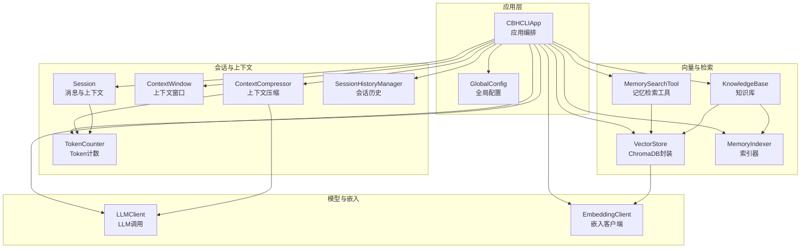
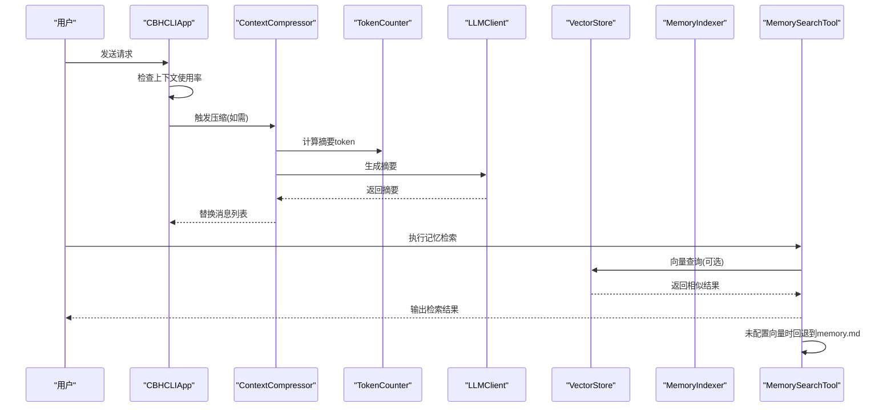
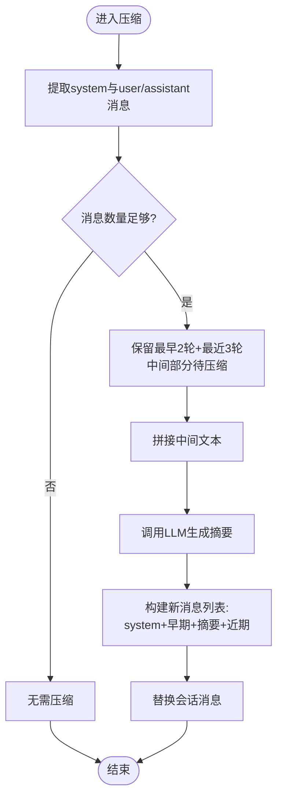
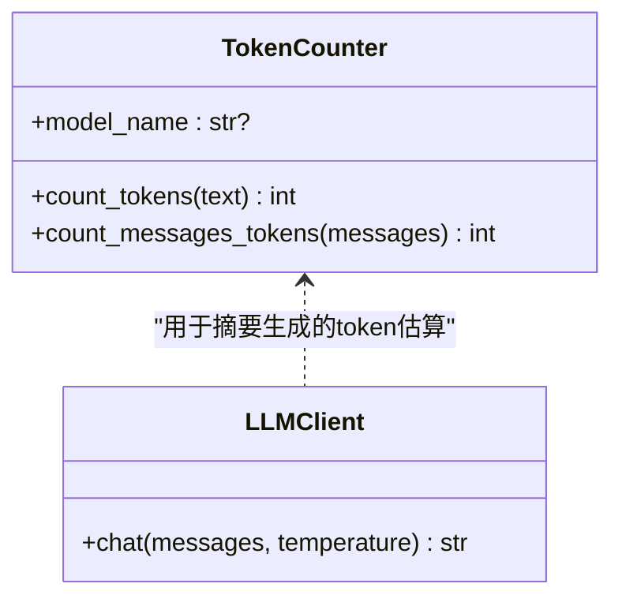
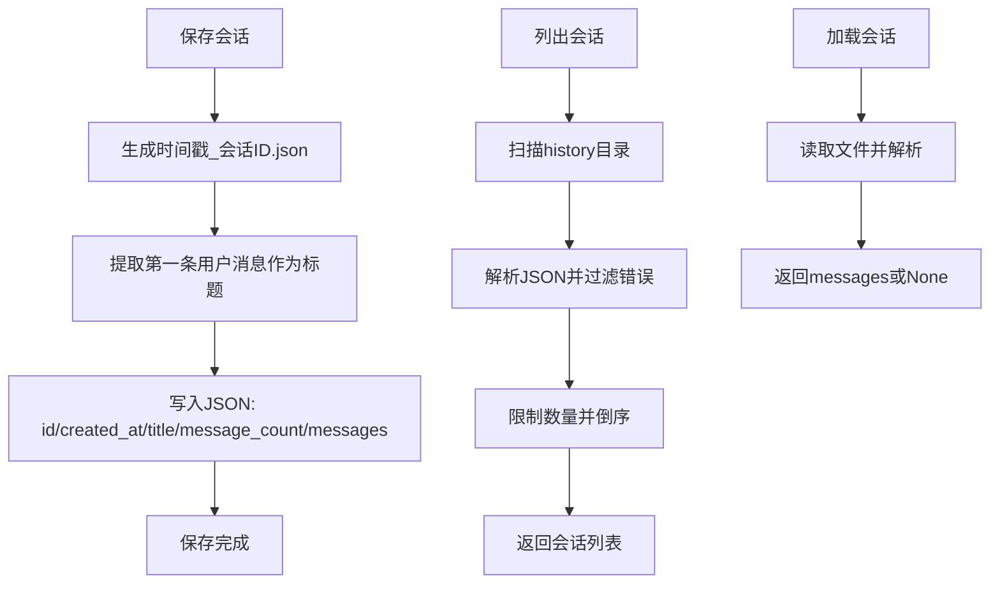
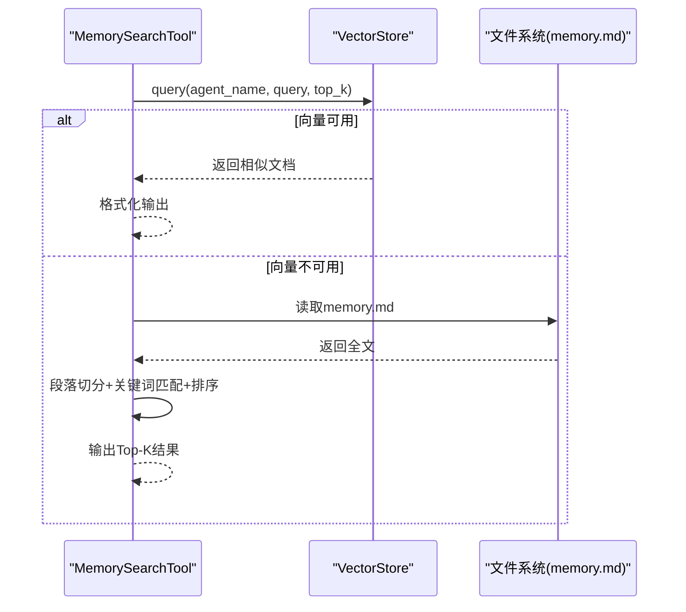
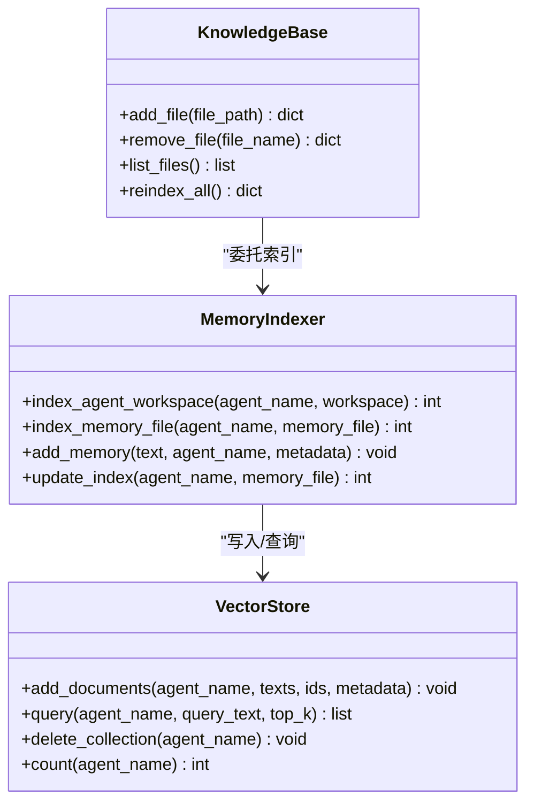
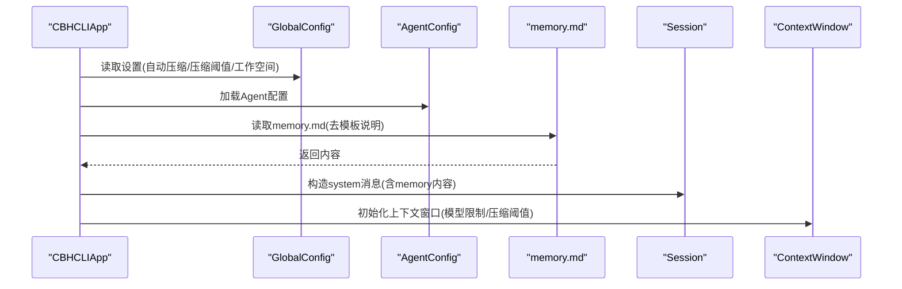
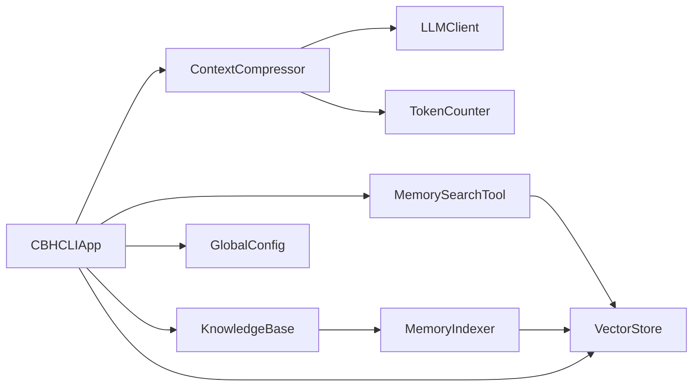

# 长期记忆机制

<cite>
**本文引用的文件**
- [compressor.py](file://cbhcli_pkg/context/compressor.py)
- [token_counter.py](file://cbhcli_pkg/context/token_counter.py)
- [session_history.py](file://cbhcli_pkg/core/session_history.py)
- [memory_search.py](file://cbhcli_pkg/tools/memory_search.py)
- [session.py](file://cbhcli_pkg/core/session.py)
- [store.py](file://cbhcli_pkg/vector/store.py)
- [indexer.py](file://cbhcli_pkg/vector/indexer.py)
- [knowledge_base.py](file://cbhcli_pkg/core/knowledge_base.py)
- [global_config.py](file://cbhcli_pkg/config/global_config.py)
- [app.py](file://cbhcli_pkg/core/app.py)
- [model.py](file://cbhcli_pkg/core/model.py)
- [embedding_client.py](file://cbhcli_pkg/core/embedding_client.py)
</cite>

## 目录
1. [简介](#简介)
2. [项目结构](#项目结构)
3. [核心组件](#核心组件)
4. [架构总览](#架构总览)
5. [组件详解](#组件详解)
6. [依赖关系分析](#依赖关系分析)
7. [性能考量](#性能考量)
8. [故障排查指南](#故障排查指南)
9. [结论](#结论)
10. [附录](#附录)

## 简介
本文件系统性阐述CBHCLI的长期记忆机制，覆盖以下方面：
- 长期记忆的概念与实现边界：重点围绕memory.md的内容组织、向量化索引与检索、以及会话历史的持久化与恢复。
- 上下文压缩算法：智能摘要生成、关键信息提取与压缩比控制。
- Token计数器：精确计数与近似估算策略及性能优化。
- 会话历史管理：存储、时间戳与版本控制。
- 配置项：存储位置、压缩阈值与清理策略。
- 系统提示集成：记忆内容注入、上下文传递与语义关联。
- 内存管理：缓存、垃圾回收与资源释放。
- 性能调优：压缩算法选择、存储格式优化与查询效率提升。
- 扩展与定制：面向开发者的二次开发建议。

## 项目结构
CBHCLI长期记忆相关代码主要分布在以下模块：
- 上下文压缩与计数：context/compressor.py、context/token_counter.py
- 会话与上下文窗口：core/session.py、core/session_history.py
- 向量存储与索引：vector/store.py、vector/indexer.py
- 记忆检索工具：tools/memory_search.py
- 知识库管理：core/knowledge_base.py
- 全局配置：config/global_config.py
- 应用入口与流程编排：core/app.py
- 模型与嵌入客户端：core/model.py、core/embedding_client.py

图表来源
- [app.py:54-478](file://cbhcli_pkg/core/app.py#L54-L478)
- [compressor.py:7-112](file://cbhcli_pkg/context/compressor.py#L7-L112)
- [token_counter.py:14-88](file://cbhcli_pkg/context/token_counter.py#L14-L88)
- [session.py:37-190](file://cbhcli_pkg/core/session.py#L37-L190)
- [session_history.py:8-136](file://cbhcli_pkg/core/session_history.py#L8-L136)
- [store.py:37-175](file://cbhcli_pkg/vector/store.py#L37-L175)
- [indexer.py:7-178](file://cbhcli_pkg/vector/indexer.py#L7-L178)
- [memory_search.py:6-177](file://cbhcli_pkg/tools/memory_search.py#L6-L177)
- [knowledge_base.py:7-207](file://cbhcli_pkg/core/knowledge_base.py#L7-L207)
- [global_config.py:13-154](file://cbhcli_pkg/config/global_config.py#L13-L154)
- [model.py:7-147](file://cbhcli_pkg/core/model.py#L7-L147)
- [embedding_client.py:6-132](file://cbhcli_pkg/core/embedding_client.py#L6-L132)

章节来源
- [app.py:54-478](file://cbhcli_pkg/core/app.py#L54-L478)

## 核心组件
- 上下文压缩器：负责将长对话历史压缩为摘要，减少token占用，维持上下文有效性。
- Token计数器：提供精确（tiktoken）与近似（字符统计）两种计数策略，支撑上下文窗口与压缩阈值。
- 会话与上下文窗口：维护消息列表、累计token数、触发压缩阈值与状态展示。
- 会话历史管理：保存/加载/删除历史会话，支持按时间戳命名与标题提取。
- 向量存储与索引：ChromaDB封装，支持自定义嵌入模型；索引memory.md、skills.md、soul.md、tools.md、usage.md及knowledge目录。
- 记忆检索工具：优先向量检索，降级到memory.md关键词匹配。
- 知识库管理：管理Agent知识库目录、文件增删与批量索引。
- 全局配置：集中管理模型、嵌入、重排序、自动压缩、工作空间等设置。

章节来源
- [compressor.py:7-112](file://cbhcli_pkg/context/compressor.py#L7-L112)
- [token_counter.py:14-88](file://cbhcli_pkg/context/token_counter.py#L14-L88)
- [session.py:37-190](file://cbhcli_pkg/core/session.py#L37-L190)
- [session_history.py:8-136](file://cbhcli_pkg/core/session_history.py#L8-L136)
- [store.py:37-175](file://cbhcli_pkg/vector/store.py#L37-L175)
- [indexer.py:7-178](file://cbhcli_pkg/vector/indexer.py#L7-L178)
- [memory_search.py:6-177](file://cbhcli_pkg/tools/memory_search.py#L6-L177)
- [knowledge_base.py:7-207](file://cbhcli_pkg/core/knowledge_base.py#L7-L207)
- [global_config.py:13-154](file://cbhcli_pkg/config/global_config.py#L13-L154)

## 架构总览
长期记忆涉及“内容持久化”和“检索增强”两条主线：
- 内容持久化：memory.md作为Agent的长期记忆载体，通过索引器拆分为段落并存入向量数据库；同时会话历史自动保存至history目录。
- 检索增强：记忆检索工具优先使用向量相似度搜索，若未配置向量能力则回退到memory.md关键词匹配；知识库工具支持更广泛的文档检索。

图表来源
- [app.py:361-385](file://cbhcli_pkg/core/app.py#L361-L385)
- [compressor.py:21-81](file://cbhcli_pkg/context/compressor.py#L21-L81)
- [token_counter.py:34-75](file://cbhcli_pkg/context/token_counter.py#L34-L75)
- [memory_search.py:47-103](file://cbhcli_pkg/tools/memory_search.py#L47-L103)

## 组件详解

### 上下文压缩算法
- 触发条件：当上下文使用率超过预设阈值（默认80%）时触发压缩。
- 压缩策略：
  - 保留system消息与最近若干轮对话，其余中间轮次合并为摘要。
  - 将中间部分拼接为文本，调用LLM生成摘要，插入一条system类型的摘要消息。
  - 替换会话消息列表，降低整体token消耗。
- 摘要生成：使用专用system提示，强调需求、操作、修改内容、问题与状态，保证技术细节完整性。
- 容错处理：摘要生成异常时，回退为简短原文片段，避免中断。

图表来源
- [compressor.py:21-81](file://cbhcli_pkg/context/compressor.py#L21-L81)
- [compressor.py:83-112](file://cbhcli_pkg/context/compressor.py#L83-L112)

章节来源
- [compressor.py:7-112](file://cbhcli_pkg/context/compressor.py#L7-L112)
- [session.py:127-190](file://cbhcli_pkg/core/session.py#L127-L190)

### Token计数器
- 精确计数：优先使用tiktoken，按模型选择对应编码器；若模型不受支持则回退到通用编码器。
- 近似估算：当未安装tiktoken或未指定模型时，按中文字符与英文字符的平均长度估算token数，兼顾性能与可用性。
- 消息计数：每条消息额外计入基础开销（元数据），用于更贴近真实token占用。

图表来源
- [token_counter.py:14-88](file://cbhcli_pkg/context/token_counter.py#L14-L88)
- [model.py:28-58](file://cbhcli_pkg/core/model.py#L28-L58)

章节来源
- [token_counter.py:14-88](file://cbhcli_pkg/context/token_counter.py#L14-L88)

### 会话历史管理
- 存储位置：Agent工作空间下的history目录，自动创建。
- 文件命名：采用“时间戳_会话ID.json”，便于排序与识别。
- 标题提取：从第一条用户消息截取前50字符作为标题。
- 列表与加载：按时间倒序列出，支持加载指定文件。
- 删除：根据文件名删除历史文件。

图表来源
- [session_history.py:24-136](file://cbhcli_pkg/core/session_history.py#L24-L136)

章节来源
- [session_history.py:8-136](file://cbhcli_pkg/core/session_history.py#L8-L136)

### 记忆检索与memory.md
- 向量检索：优先使用向量数据库查询，返回文档与距离；未配置向量时回退。
- 降级搜索：读取memory.md，按段落切分，计算关键词交集得分，输出Top-K结果。
- 索引范围：memory.md、skills.md、soul.md、tools.md、usage.md及knowledge目录下的文本文件。

图表来源
- [memory_search.py:47-177](file://cbhcli_pkg/tools/memory_search.py#L47-L177)
- [indexer.py:37-135](file://cbhcli_pkg/vector/indexer.py#L37-L135)

章节来源
- [memory_search.py:6-177](file://cbhcli_pkg/tools/memory_search.py#L6-L177)
- [indexer.py:7-178](file://cbhcli_pkg/vector/indexer.py#L7-L178)

### 知识库与向量索引
- 知识库目录：~/.cbhcli/agents/{agent}/knowledge，支持文件增删与批量索引。
- 索引策略：按段落切分，生成唯一ID与元数据，批量嵌入并写入向量数据库。
- 记忆索引器：专门索引Agent工作空间的标准md文件与knowledge目录，支持增量更新与重建。

图表来源
- [knowledge_base.py:16-207](file://cbhcli_pkg/core/knowledge_base.py#L16-L207)
- [indexer.py:28-178](file://cbhcli_pkg/vector/indexer.py#L28-L178)
- [store.py:37-175](file://cbhcli_pkg/vector/store.py#L37-L175)

章节来源
- [knowledge_base.py:7-207](file://cbhcli_pkg/core/knowledge_base.py#L7-L207)
- [indexer.py:7-178](file://cbhcli_pkg/vector/indexer.py#L7-L178)
- [store.py:37-175](file://cbhcli_pkg/vector/store.py#L37-L175)

### 系统提示集成与上下文传递
- 应用启动时读取memory.md内容，去除模板说明标记，注入到系统提示中，确保AI始终具备长期记忆上下文。
- 会话消息列表在每次请求前后动态更新，上下文窗口监控token使用率，必要时触发压缩。

图表来源
- [app.py:332-360](file://cbhcli_pkg/core/app.py#L332-L360)
- [app.py:327-331](file://cbhcli_pkg/core/app.py#L327-L331)
- [global_config.py:31-48](file://cbhcli_pkg/config/global_config.py#L31-L48)

章节来源
- [app.py:311-331](file://cbhcli_pkg/core/app.py#L311-L331)
- [global_config.py:13-154](file://cbhcli_pkg/config/global_config.py#L13-L154)

## 依赖关系分析
- 组件耦合：
  - ContextCompressor依赖LLMClient与TokenCounter，用于摘要生成与token估算。
  - MemorySearchTool依赖VectorStore或memory.md文件，实现检索功能。
  - KnowledgeBase与MemoryIndexer共同维护向量索引，依赖VectorStore。
  - CBHCLIApp协调上述组件，并通过GlobalConfig管理全局设置。
- 外部依赖：
  - ChromaDB（持久化向量数据库）、tiktoken（精确token计数）、requests（HTTP通信）。
- 循环依赖：
  - 未发现直接循环依赖；各模块职责清晰，通过接口与方法调用解耦。

图表来源
- [compressor.py:10-20](file://cbhcli_pkg/context/compressor.py#L10-L20)
- [memory_search.py:18-21](file://cbhcli_pkg/tools/memory_search.py#L18-L21)
- [knowledge_base.py:16-28](file://cbhcli_pkg/core/knowledge_base.py#L16-L28)
- [app.py:75-83](file://cbhcli_pkg/core/app.py#L75-L83)

章节来源
- [compressor.py:7-112](file://cbhcli_pkg/context/compressor.py#L7-L112)
- [memory_search.py:6-177](file://cbhcli_pkg/tools/memory_search.py#L6-L177)
- [knowledge_base.py:7-207](file://cbhcli_pkg/core/knowledge_base.py#L7-L207)
- [app.py:54-478](file://cbhcli_pkg/core/app.py#L54-L478)

## 性能考量
- 压缩算法选择：
  - 在对话轮次较多时启用摘要压缩，显著降低token占用；摘要生成温度较低以保持事实准确性。
- 存储格式优化：
  - 向量数据库采用批量嵌入与预计算查询向量，减少重复调用默认模型的开销。
  - 索引器按段落切分，ID基于序号生成，便于后续更新与检索。
- 查询效率提升：
  - 向量检索优先；未配置向量时，memory.md采用关键词交集评分，Top-K裁剪，避免全量扫描。
- Token计数优化：
  - 优先使用tiktoken精确计数；在大量消息场景下，结合上下文窗口阈值提前触发压缩，避免越界。
- 资源释放：
  - 向量数据库客户端按需初始化；嵌入与重排序客户端在配置缺失时跳过，减少无效初始化。

章节来源
- [store.py:118-149](file://cbhcli_pkg/vector/store.py#L118-L149)
- [indexer.py:108-134](file://cbhcli_pkg/vector/indexer.py#L108-L134)
- [token_counter.py:27-48](file://cbhcli_pkg/context/token_counter.py#L27-L48)
- [app.py:104-149](file://cbhcli_pkg/core/app.py#L104-L149)

## 故障排查指南
- 向量检索失败：
  - 检查嵌入模型配置是否正确；确认向量数据库初始化成功；查看日志输出。
  - 若未配置嵌入模型，工具会自动降级到memory.md关键词匹配。
- memory.md未找到：
  - 确认Agent工作空间下存在memory.md；检查文件权限与编码。
- 压缩失败：
  - 摘要生成异常时会回退为原文片段；检查LLM服务连通性与API密钥。
- 会话历史无法加载：
  - 检查JSON格式与字段完整性；确认文件存在且可读。
- Token计数异常：
  - 未安装tiktoken时使用近似估算；如需精确计数，请安装对应模型编码器。

章节来源
- [memory_search.py:70-103](file://cbhcli_pkg/tools/memory_search.py#L70-L103)
- [compressor.py:107-112](file://cbhcli_pkg/context/compressor.py#L107-L112)
- [session_history.py:113-118](file://cbhcli_pkg/core/session_history.py#L113-L118)
- [token_counter.py:7-12](file://cbhcli_pkg/context/token_counter.py#L7-L12)

## 结论
CBHCLI的长期记忆机制通过“内容持久化（memory.md + 向量索引）+ 会话历史（自动保存）+ 上下文压缩（摘要生成）+ 检索增强（向量/关键词）”形成闭环。该设计在保证上下文有效性的同时，兼顾性能与可维护性。开发者可通过调整压缩阈值、优化嵌入模型与索引策略、以及扩展检索工具，进一步提升长期记忆的效果与稳定性。

## 附录

### 配置选项与最佳实践
- 存储位置
  - 全局配置：工作空间基目录、向量数据库持久化目录、知识库根目录。
  - 会话历史：Agent工作空间/history。
  - 知识库：~/.cbhcli/agents/{agent}/knowledge。
- 压缩阈值
  - 上下文窗口压缩比例默认80%，可在Agent配置中调整。
  - 自动压缩开关受全局设置控制。
- 清理策略
  - 会话历史：定期清理历史文件；删除操作需谨慎，避免误删。
  - 向量索引：内容变更后建议重建索引，确保检索准确。
- 检索策略
  - 优先启用向量检索；未配置时使用memory.md关键词匹配。
  - 知识库文件建议按段落组织，提升检索质量。

章节来源
- [global_config.py:31-48](file://cbhcli_pkg/config/global_config.py#L31-L48)
- [session_history.py:21-22](file://cbhcli_pkg/core/session_history.py#L21-L22)
- [knowledge_base.py:28-29](file://cbhcli_pkg/core/knowledge_base.py#L28-L29)
- [app.py:327-331](file://cbhcli_pkg/core/app.py#L327-L331)

### 开发者扩展与定制建议
- 自定义压缩策略：在ContextCompressor中扩展摘要生成逻辑，引入更细粒度的关键信息抽取。
- 多模态记忆：在VectorStore中接入图像/表格等向量表示，扩展索引器以支持多格式文件。
- 智能清理：基于会话活跃度与时间戳，实现自动清理策略，减少历史文件膨胀。
- 检索增强：在MemorySearchTool中增加重排序（rerank）模块，提升检索相关性。
- 配置热更新：通过GlobalConfig监听配置变更，动态调整上下文窗口与压缩策略。

章节来源
- [compressor.py:83-112](file://cbhcli_pkg/context/compressor.py#L83-L112)
- [store.py:12-35](file://cbhcli_pkg/vector/store.py#L12-L35)
- [indexer.py:87-135](file://cbhcli_pkg/vector/indexer.py#L87-L135)
- [memory_search.py:47-103](file://cbhcli_pkg/tools/memory_search.py#L47-L103)
- [global_config.py:111-114](file://cbhcli_pkg/config/global_config.py#L111-L114)