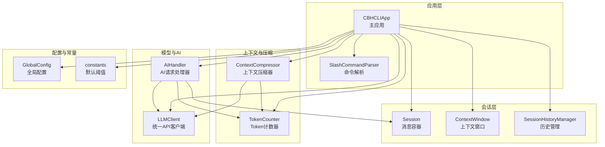
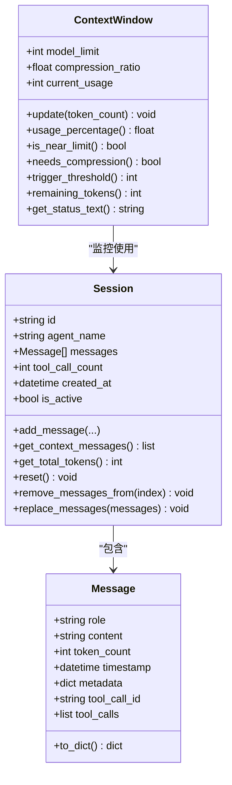
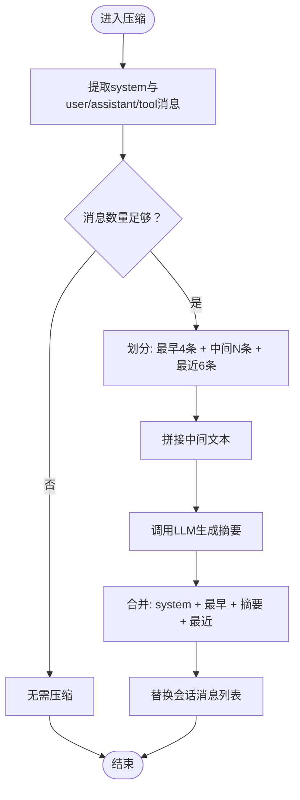
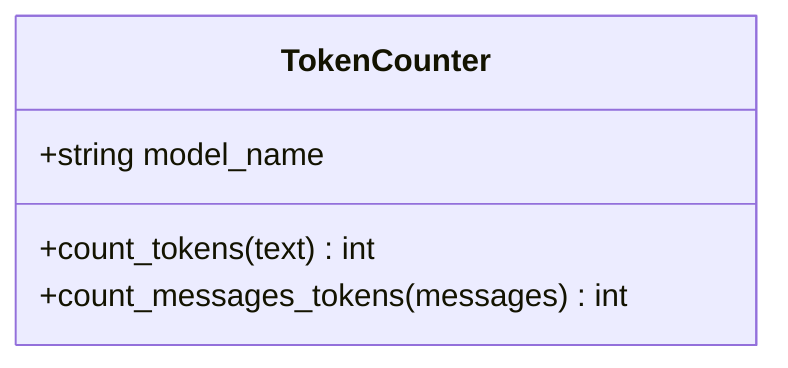
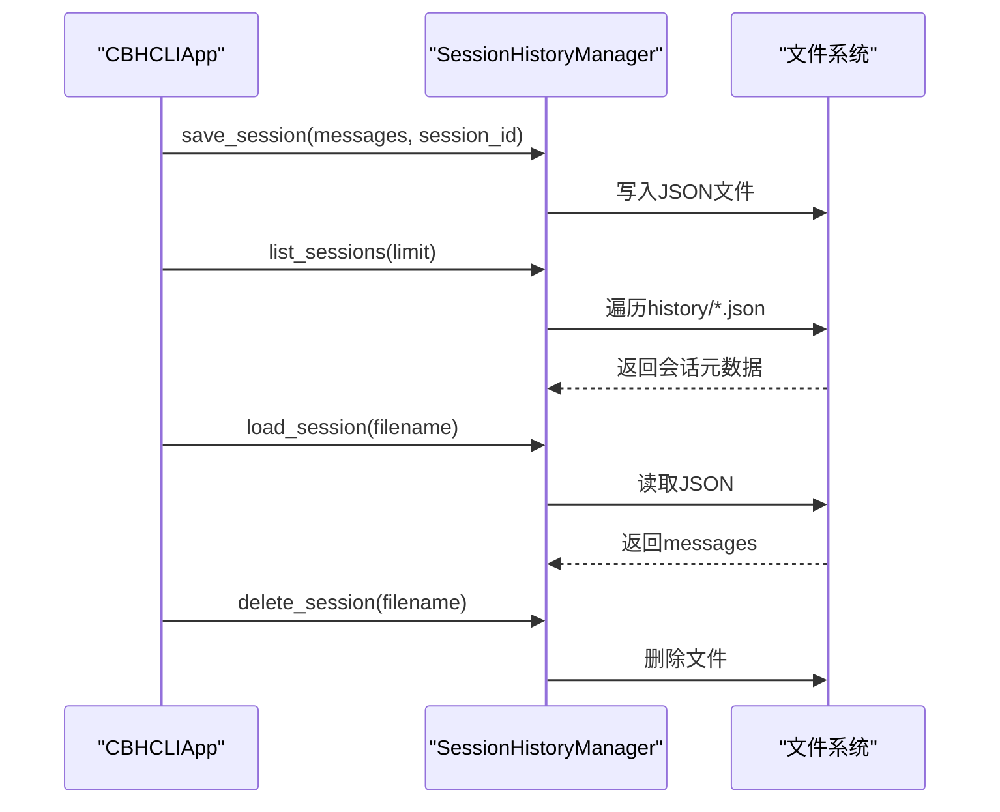
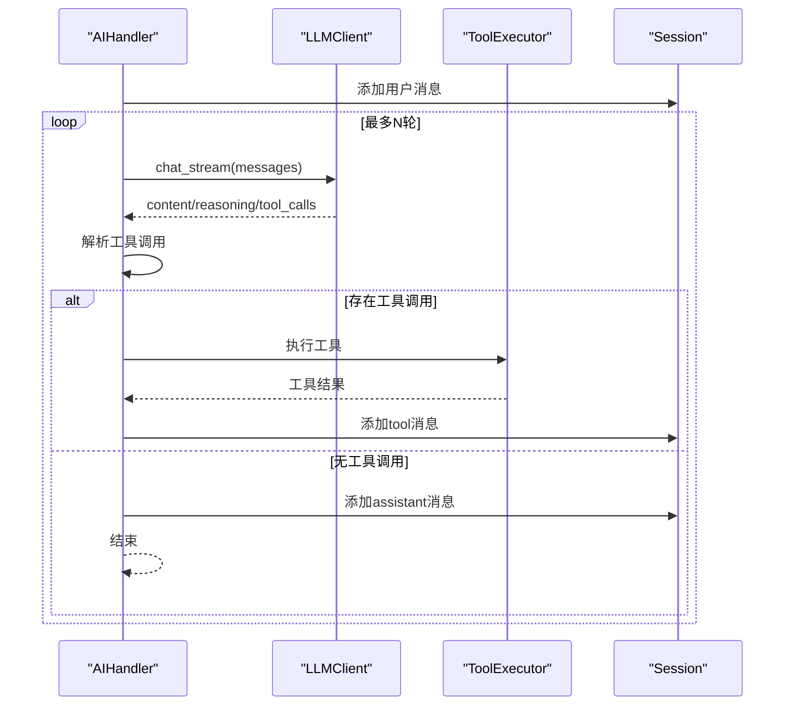
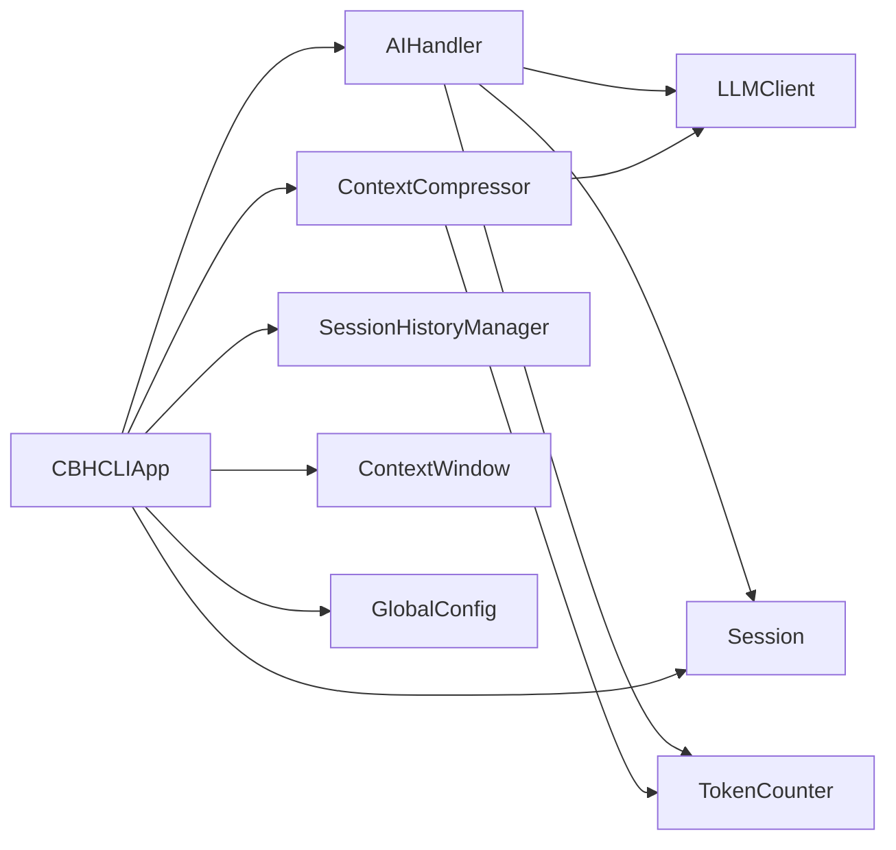

# 高级会话管理

<cite>
**本文引用的文件**
- [README.md](file://README.md)
- [cbhcli_pkg/core/app.py](file://cbhcli_pkg/core/app.py)
- [cbhcli_pkg/core/session.py](file://cbhcli_pkg/core/session.py)
- [cbhcli_pkg/core/session_history.py](file://cbhcli_pkg/core/session_history.py)
- [cbhcli_pkg/context/compressor.py](file://cbhcli_pkg/context/compressor.py)
- [cbhcli_pkg/context/token_counter.py](file://cbhcli_pkg/context/token_counter.py)
- [cbhcli_pkg/core/model.py](file://cbhcli_pkg/core/model.py)
- [cbhcli_pkg/core/ai_handler.py](file://cbhcli_pkg/core/ai_handler.py)
- [cbhcli_pkg/commands/session_cmd.py](file://cbhcli_pkg/commands/session_cmd.py)
- [cbhcli_pkg/config/global_config.py](file://cbhcli_pkg/config/global_config.py)
- [cbhcli_pkg/core/constants.py](file://cbhcli_pkg/core/constants.py)
</cite>

## 目录
1. [简介](#简介)
2. [项目结构](#项目结构)
3. [核心组件](#核心组件)
4. [架构总览](#架构总览)
5. [详细组件分析](#详细组件分析)
6. [依赖分析](#依赖分析)
7. [性能考量](#性能考量)
8. [故障排查指南](#故障排查指南)
9. [结论](#结论)
10. [附录](#附录)

## 简介
本文件面向高级用户，系统化阐述CBHCLI的高级会话管理能力，涵盖多轮对话协调、意图识别与上下文维护、上下文传递与状态管理、会话冻结/恢复与序列化、智能压缩算法、会话历史查询与检索、并发会话处理、会话审计与迁移备份等主题。文档基于代码实现进行深入解析，并提供可视化图示与实践建议。

## 项目结构
CBHCLI采用分层模块化设计，围绕“应用核心”“会话管理”“上下文与压缩”“命令接口”“配置中心”展开。会话生命周期贯穿Agent加载、会话初始化、消息收发、上下文压缩、历史持久化与恢复。

图表来源
- [cbhcli_pkg/core/app.py:54-331](file://cbhcli_pkg/core/app.py#L54-L331)
- [cbhcli_pkg/core/session.py:37-190](file://cbhcli_pkg/core/session.py#L37-L190)
- [cbhcli_pkg/context/compressor.py:7-112](file://cbhcli_pkg/context/compressor.py#L7-L112)
- [cbhcli_pkg/context/token_counter.py:14-88](file://cbhcli_pkg/context/token_counter.py#L14-L88)
- [cbhcli_pkg/core/model.py:7-147](file://cbhcli_pkg/core/model.py#L7-L147)
- [cbhcli_pkg/core/ai_handler.py:21-200](file://cbhcli_pkg/core/ai_handler.py#L21-L200)
- [cbhcli_pkg/config/global_config.py:13-154](file://cbhcli_pkg/config/global_config.py#L13-L154)
- [cbhcli_pkg/core/constants.py:1-50](file://cbhcli_pkg/core/constants.py#L1-L50)

章节来源
- [README.md:269-295](file://README.md#L269-L295)
- [cbhcli_pkg/core/app.py:54-331](file://cbhcli_pkg/core/app.py#L54-L331)

## 核心组件
- 会话容器与消息模型：提供消息结构、上下文序列导出、总Token统计、重置与截断、消息替换等能力。
- 上下文窗口：基于模型上下文上限与压缩阈值，动态评估使用率、触发压缩、剩余Token计算与状态展示。
- 上下文压缩器：在保留系统消息与首尾若干轮的前提下，对中间长对话生成摘要并替换，降低Token占用。
- Token计数器：优先使用精确编码器，降级为估算逻辑，支持消息列表总Token统计。
- 历史管理器：负责会话保存、列出、加载与删除，文件命名含时间戳与会话ID，便于检索。
- AI处理器：负责多轮工具调用协调、流式输出处理、工具调用提取与执行、响应清洗与展示。
- LLM客户端：统一API封装，支持非流式与流式聊天、嵌入向量获取。
- 应用主控：负责Agent加载、会话重置、上下文压缩触发、命令注册与执行、UI与交互。
- 全局配置：集中管理模型、嵌入/重排序模型、Agent与设置项（含自动压缩与压缩阈值）。

章节来源
- [cbhcli_pkg/core/session.py:37-190](file://cbhcli_pkg/core/session.py#L37-L190)
- [cbhcli_pkg/context/compressor.py:7-112](file://cbhcli_pkg/context/compressor.py#L7-L112)
- [cbhcli_pkg/context/token_counter.py:14-88](file://cbhcli_pkg/context/token_counter.py#L14-L88)
- [cbhcli_pkg/core/session_history.py:8-136](file://cbhcli_pkg/core/session_history.py#L8-L136)
- [cbhcli_pkg/core/ai_handler.py:21-200](file://cbhcli_pkg/core/ai_handler.py#L21-L200)
- [cbhcli_pkg/core/model.py:7-147](file://cbhcli_pkg/core/model.py#L7-L147)
- [cbhcli_pkg/core/app.py:54-331](file://cbhcli_pkg/core/app.py#L54-L331)
- [cbhcli_pkg/config/global_config.py:13-154](file://cbhcli_pkg/config/global_config.py#L13-L154)

## 架构总览
下图展示从用户输入到AI响应、工具调用、上下文压缩与历史持久化的端到端流程。

```mermaid
sequenceDiagram
participant U as "用户"
participant APP as "CBHCLIApp"
participant AI as "AIHandler"
participant L as "LLMClient"
participant S as "Session"
participant CW as "ContextWindow"
participant CC as "ContextCompressor"
participant SH as "SessionHistoryManager"
U->>APP : "/new" 或自然语言输入
APP->>SH : 保存上一会话可选
APP->>S : 初始化系统消息与会话
APP->>CW : 初始化上下文窗口
U->>APP : 用户输入
APP->>AI : 处理请求
AI->>S : 添加用户消息
AI->>CW : 更新Token使用量
AI->>CC : 触发压缩条件满足
CC-->>S : 替换消息为摘要+保留片段
AI->>L : chat_stream(messages)
L-->>AI : 流式响应content/reasoning/tool_calls
AI->>S : 添加助手消息/工具结果
AI-->>U : 展示响应
APP->>SH : 会话重置时保存当前会话
```

图表来源
- [cbhcli_pkg/core/app.py:281-331](file://cbhcli_pkg/core/app.py#L281-L331)
- [cbhcli_pkg/core/ai_handler.py:51-97](file://cbhcli_pkg/core/ai_handler.py#L51-L97)
- [cbhcli_pkg/context/compressor.py:21-82](file://cbhcli_pkg/context/compressor.py#L21-L82)
- [cbhcli_pkg/core/session_history.py:24-64](file://cbhcli_pkg/core/session_history.py#L24-L64)

## 详细组件分析

### 会话容器与上下文窗口
- 消息模型：支持角色、内容、Token计数、时间戳、工具调用ID与工具调用列表；提供API格式转换。
- 会话管理：添加消息、导出上下文、统计总Token、重置（保留system）、从指定索引截断、替换消息列表。
- 上下文窗口：基于模型上下文上限与压缩阈值，计算使用率、是否接近上限、触发阈值、剩余Token与状态文本。

图表来源
- [cbhcli_pkg/core/session.py:8-190](file://cbhcli_pkg/core/session.py#L8-L190)

章节来源
- [cbhcli_pkg/core/session.py:37-190](file://cbhcli_pkg/core/session.py#L37-L190)
- [cbhcli_pkg/core/constants.py:6-9](file://cbhcli_pkg/core/constants.py#L6-L9)

### 上下文压缩算法
- 压缩策略：保留system消息与最早2轮、最近3轮，中间部分生成摘要并插入为system消息，从而大幅降低Token占用。
- 触发条件：当会话消息数量超过阈值且接近模型上限比例时自动触发。
- 质量保障：摘要由专用系统提示驱动，强调保留关键需求、操作、文件、问题与状态；失败时回退为部分原文摘要。

图表来源
- [cbhcli_pkg/context/compressor.py:21-82](file://cbhcli_pkg/context/compressor.py#L21-L82)

章节来源
- [cbhcli_pkg/context/compressor.py:7-112](file://cbhcli_pkg/context/compressor.py#L7-L112)

### Token计数与上下文评估
- 精确计数：优先使用tiktoken编码器（若可用），否则降级为估算逻辑（中文与英文不同权重）。
- 消息计数：每条消息包含基础开销，再叠加内容Token数。
- 上下文评估：结合模型上下文上限与压缩阈值，动态更新使用量并决定是否压缩。

图表来源
- [cbhcli_pkg/context/token_counter.py:14-88](file://cbhcli_pkg/context/token_counter.py#L14-L88)

章节来源
- [cbhcli_pkg/context/token_counter.py:14-88](file://cbhcli_pkg/context/token_counter.py#L14-L88)
- [cbhcli_pkg/core/app.py:361-385](file://cbhcli_pkg/core/app.py#L361-L385)

### 会话历史管理与恢复
- 保存：会话重置或新会话创建时，自动将当前上下文消息保存为JSON文件，文件名包含时间戳与会话ID，标题取自第一条用户消息。
- 列表：按时间倒序列出历史会话，包含ID、标题、创建时间与消息数。
- 加载：根据文件名或序号恢复，恢复时跳过system消息以避免重复。
- 删除：支持删除指定历史文件。

图表来源
- [cbhcli_pkg/core/session_history.py:24-136](file://cbhcli_pkg/core/session_history.py#L24-L136)

章节来源
- [cbhcli_pkg/core/session_history.py:8-136](file://cbhcli_pkg/core/session_history.py#L8-L136)
- [cbhcli_pkg/commands/session_cmd.py:33-94](file://cbhcli_pkg/commands/session_cmd.py#L33-L94)

### 多轮对话协调与意图识别
- 多轮工具调用：AI处理器在每轮结束后检查是否仍有工具调用，若有则执行工具并将结果注入会话，直至无工具调用或达到最大轮次。
- 意图识别与格式强化：在存在工具结果时，注入系统提示以强化后续工具调用格式，提升一致性与可执行性。
- 响应清洗：对流式输出进行增量清洗，去除工具调用命令片段，仅展示解释性文本。

图表来源
- [cbhcli_pkg/core/ai_handler.py:51-97](file://cbhcli_pkg/core/ai_handler.py#L51-L97)
- [cbhcli_pkg/core/ai_handler.py:98-200](file://cbhcli_pkg/core/ai_handler.py#L98-L200)

章节来源
- [cbhcli_pkg/core/ai_handler.py:21-200](file://cbhcli_pkg/core/ai_handler.py#L21-L200)

### 命令接口与上下文状态展示
- /reset 或 /new：重置当前会话并自动保存上一会话至history。
- /resume：列出或恢复历史会话；支持编号或文件名恢复。
- /history：历史会话列表（/resume别名）。
- /comp：手动触发上下文压缩。
- /ctx：展示Agent、模型、上下文使用、剩余Token、消息数、工具调用次数与自动压缩开关与阈值。

章节来源
- [cbhcli_pkg/commands/session_cmd.py:5-183](file://cbhcli_pkg/commands/session_cmd.py#L5-L183)

### 配置选项与默认行为
- 全局设置：自动压缩开关、压缩阈值、工作空间基座、嵌入/重排序模型配置等。
- Agent设置：每个Agent可独立设置上下文压缩阈值。
- 默认常量：默认上下文上限与默认压缩阈值。

章节来源
- [cbhcli_pkg/config/global_config.py:13-154](file://cbhcli_pkg/config/global_config.py#L13-L154)
- [cbhcli_pkg/core/constants.py:6-9](file://cbhcli_pkg/core/constants.py#L6-L9)
- [cbhcli_pkg/core/app.py:322-331](file://cbhcli_pkg/core/app.py#L322-L331)

## 依赖分析
- 组件耦合：AIHandler依赖LLMClient、Session与TokenCounter；ContextCompressor依赖LLMClient与TokenCounter；App负责装配与调度。
- 外部依赖：requests用于HTTP通信；tiktoken用于精确Token计数（可选）；prompt_toolkit用于交互界面。
- 循环依赖：未发现循环导入；模块间通过参数注入与方法调用解耦。

图表来源
- [cbhcli_pkg/core/ai_handler.py:31-50](file://cbhcli_pkg/core/ai_handler.py#L31-L50)
- [cbhcli_pkg/context/compressor.py:10-20](file://cbhcli_pkg/context/compressor.py#L10-L20)
- [cbhcli_pkg/core/app.py:54-331](file://cbhcli_pkg/core/app.py#L54-L331)

章节来源
- [cbhcli_pkg/core/app.py:54-331](file://cbhcli_pkg/core/app.py#L54-L331)
- [cbhcli_pkg/core/ai_handler.py:21-200](file://cbhcli_pkg/core/ai_handler.py#L21-L200)
- [cbhcli_pkg/context/compressor.py:7-112](file://cbhcli_pkg/context/compressor.py#L7-L112)

## 性能考量
- Token计数优化：优先启用tiktoken以获得更准确的上下文评估；在无依赖场景下，估算逻辑仍可满足基本需求。
- 压缩策略：保留关键早期与近期对话，中间部分摘要化，显著降低Token占用；仅在消息数量与使用率超过阈值时触发，避免不必要的开销。
- 流式输出：AI响应采用流式输出，边接收边渲染，减少等待时间；同时对推理内容与工具调用分别处理，提升可读性。
- 历史持久化：按需保存，避免频繁IO；文件名包含时间戳与会话ID，便于快速定位与检索。

## 故障排查指南
- 上下文接近上限但未压缩
  - 检查Agent配置中的自动压缩开关与压缩阈值。
  - 使用/ctx查看当前使用率与阈值。
- 压缩失败
  - 检查LLM客户端连通性与模型可用性。
  - 查看压缩器异常回退逻辑（保留部分原文）。
- 历史恢复失败
  - 确认文件名正确或使用列表中的序号。
  - 检查history目录权限与JSON格式完整性。
- Token计数不准确
  - 安装tiktoken以启用精确计数。
  - 若使用非主流模型，确认编码器是否可用。

章节来源
- [cbhcli_pkg/context/compressor.py:107-112](file://cbhcli_pkg/context/compressor.py#L107-L112)
- [cbhcli_pkg/core/app.py:368-385](file://cbhcli_pkg/core/app.py#L368-L385)
- [cbhcli_pkg/core/session_history.py:108-136](file://cbhcli_pkg/core/session_history.py#L108-L136)
- [cbhcli_pkg/context/token_counter.py:7-12](file://cbhcli_pkg/context/token_counter.py#L7-L12)

## 结论
CBHCLI的高级会话管理以“可感知、可压缩、可恢复”为核心设计，通过精确的Token计数、智能的上下文摘要与严格的会话生命周期管理，实现了在长对话场景下的高效与稳定。配合命令接口与历史管理，用户可在复杂任务中保持上下文连贯与可追溯性。

## 附录

### 会话冻结、恢复与序列化
- 冻结：通过会话重置或新会话创建触发自动保存。
- 恢复：使用/restore或/ctx命令加载历史文件，系统自动重建会话消息（跳过system）。
- 序列化：以JSON格式保存，包含会话ID、创建时间、标题与消息列表。

章节来源
- [cbhcli_pkg/core/session_history.py:24-64](file://cbhcli_pkg/core/session_history.py#L24-L64)
- [cbhcli_pkg/commands/session_cmd.py:33-94](file://cbhcli_pkg/commands/session_cmd.py#L33-L94)

### 会话历史的高级功能
- 历史查询：/history列出最近会话，支持按标题、时间筛选。
- 时间范围筛选：通过文件名时间戳实现粗粒度筛选。
- 内容检索：当前实现以文件存取为主，建议结合外部工具或扩展向量检索。

章节来源
- [cbhcli_pkg/core/session_history.py:66-97](file://cbhcli_pkg/core/session_history.py#L66-L97)

### 并发会话处理
- Agent隔离：每个Agent拥有独立工作空间、配置、会话与历史目录，天然隔离。
- 资源共享：LLM客户端与Token计数器可按Agent配置独立实例化。
- 冲突解决：命令解析器与应用主控确保同一时刻仅处理一个Agent的交互请求。

章节来源
- [cbhcli_pkg/core/app.py:231-279](file://cbhcli_pkg/core/app.py#L231-L279)

### 会话审计与合规
- 日志记录：当前未内置专门的操作日志模块；可通过外部日志系统集成。
- 变更追踪：历史文件记录会话变更；建议结合版本控制工具进行合规审计。
- 合规检查：建议在生产环境增加访问控制与数据脱敏策略。

### 会话迁移与备份恢复
- 数据导出：历史JSON文件可直接复制到其他Agent或机器。
- 批量导入：通过命令行脚本遍历history目录并导入目标Agent。
- 版本兼容：保持JSON字段稳定；新增字段建议向后兼容。

章节来源
- [cbhcli_pkg/core/session_history.py:24-64](file://cbhcli_pkg/core/session_history.py#L24-L64)

### 高级用户定制与扩展
- 自定义压缩策略：可扩展ContextCompressor以实现更复杂的摘要算法。
- 自定义Token计数：支持自定义编码器或替换估算逻辑。
- 自定义历史存储：可替换SessionHistoryManager以接入云存储或数据库。
- 自定义命令：通过SlashCommandParser注册新命令，扩展会话管理能力。

章节来源
- [cbhcli_pkg/context/compressor.py:7-112](file://cbhcli_pkg/context/compressor.py#L7-L112)
- [cbhcli_pkg/context/token_counter.py:14-88](file://cbhcli_pkg/context/token_counter.py#L14-L88)
- [cbhcli_pkg/core/session_history.py:8-136](file://cbhcli_pkg/core/session_history.py#L8-L136)
- [cbhcli_pkg/commands/session_cmd.py:5-183](file://cbhcli_pkg/commands/session_cmd.py#L5-L183)