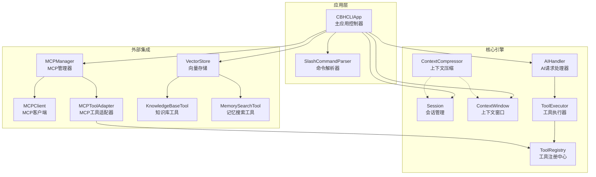
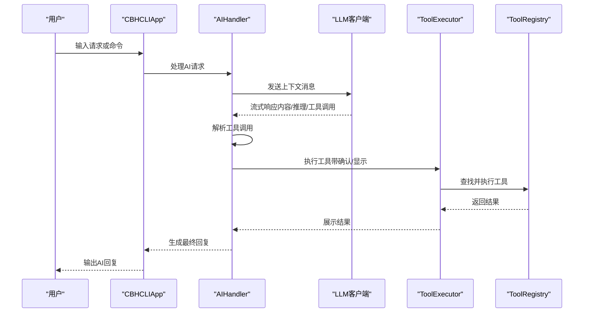
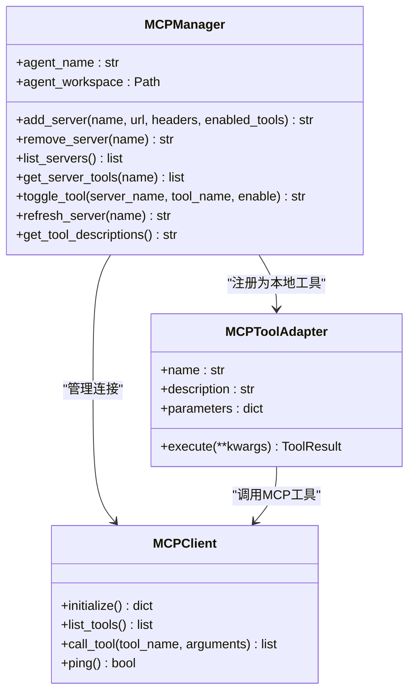
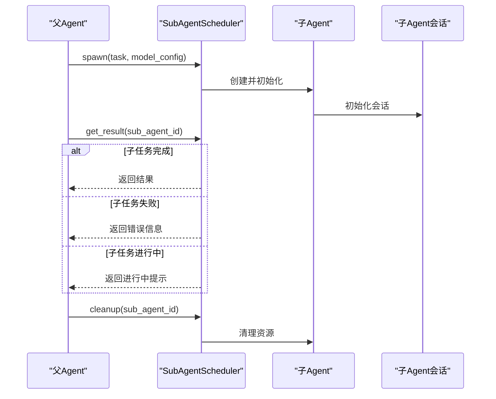
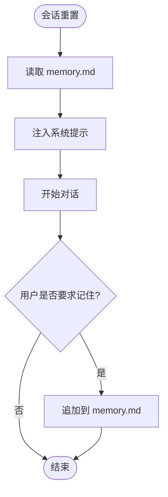
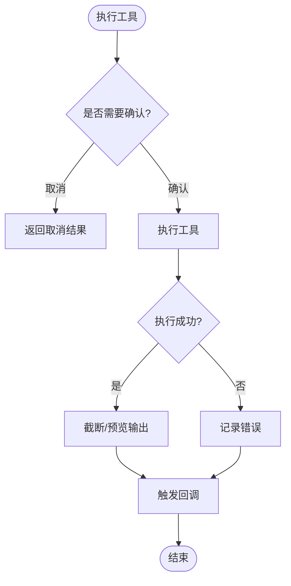
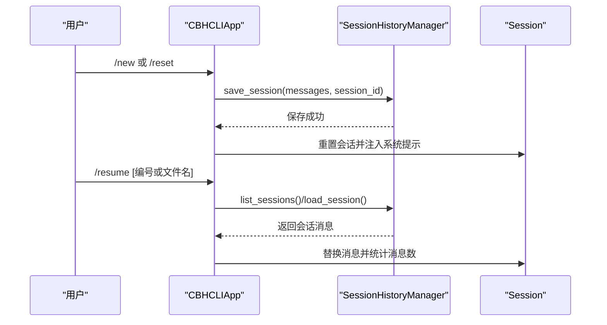
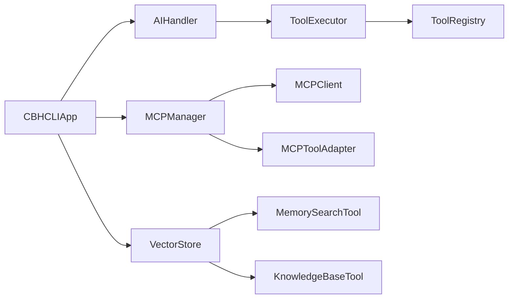

# 高级功能

<cite>
**本文引用的文件**
- [README.md](file://README.md)
- [cbhcli_pkg/core/app.py](file://cbhcli_pkg/core/app.py)
- [cbhcli_pkg/core/mcp_manager.py](file://cbhcli_pkg/core/mcp_manager.py)
- [cbhcli_pkg/core/mcp_client.py](file://cbhcli_pkg/core/mcp_client.py)
- [cbhcli_pkg/core/mcp_tool_adapter.py](file://cbhcli_pkg/core/mcp_tool_adapter.py)
- [cbhcli_pkg/core/subagent.py](file://cbhcli_pkg/core/subagent.py)
- [cbhcli_pkg/core/tool_executor.py](file://cbhcli_pkg/core/tool_executor.py)
- [cbhcli_pkg/core/session.py](file://cbhcli_pkg/core/session.py)
- [cbhcli_pkg/core/session_history.py](file://cbhcli_pkg/core/session_history.py)
- [cbhcli_pkg/core/ai_handler.py](file://cbhcli_pkg/core/ai_handler.py)
- [cbhcli_pkg/tools/memory_search.py](file://cbhcli_pkg/tools/memory_search.py)
- [cbhcli_pkg/tools/registry.py](file://cbhcli_pkg/tools/registry.py)
- [cbhcli_pkg/commands/mcp_cmd.py](file://cbhcli_pkg/commands/mcp_cmd.py)
- [cbhcli_pkg/commands/session_cmd.py](file://cbhcli_pkg/commands/session_cmd.py)
- [cbhcli_pkg/config/global_config.py](file://cbhcli_pkg/config/global_config.py)
</cite>

## 目录
1. [简介](#简介)
2. [项目结构](#项目结构)
3. [核心组件](#核心组件)
4. [架构总览](#架构总览)
5. [详细组件分析](#详细组件分析)
6. [依赖分析](#依赖分析)
7. [性能考量](#性能考量)
8. [故障排除指南](#故障排除指南)
9. [结论](#结论)
10. [附录](#附录)

## 简介
本文件面向高级用户，系统化阐述CBHCLI的高级功能与实现细节，涵盖：
- MCP（Model Context Protocol）管理器的集成与使用：服务器配置、协议通信、工具适配与动态启停
- 子Agent调度机制：子任务分解、并行执行与结果聚合
- 长期记忆机制：memory.md文件管理、内容持久化与系统提示集成
- 工具执行器的高级功能：确认模式、详细输出、回调与结果展示
- 高级会话管理：多轮对话协调、上下文传递、状态保持与历史恢复
- 高级配置选项与性能调优：全局配置、上下文压缩策略、向量检索优化
- 安全与权限控制：访问控制、数据保护与审计思路
- 高级故障排除与调试：日志与错误定位、网络与协议问题排查
- 扩展开发与定制：工具注册、MCP适配器、子Agent扩展点

## 项目结构
CBHCLI采用模块化设计，核心围绕“应用主控”“会话与上下文”“工具系统”“MCP集成”“向量检索”“命令路由”展开。

图示来源
- [cbhcli_pkg/core/app.py:54-280](file://cbhcli_pkg/core/app.py#L54-L280)
- [cbhcli_pkg/core/ai_handler.py:21-743](file://cbhcli_pkg/core/ai_handler.py#L21-L743)
- [cbhcli_pkg/core/tool_executor.py:15-168](file://cbhcli_pkg/core/tool_executor.py#L15-L168)
- [cbhcli_pkg/tools/registry.py:51-115](file://cbhcli_pkg/tools/registry.py#L51-L115)
- [cbhcli_pkg/core/mcp_manager.py:11-366](file://cbhcli_pkg/core/mcp_manager.py#L11-L366)
- [cbhcli_pkg/core/mcp_client.py:8-242](file://cbhcli_pkg/core/mcp_client.py#L8-L242)
- [cbhcli_pkg/core/mcp_tool_adapter.py:7-116](file://cbhcli_pkg/core/mcp_tool_adapter.py#L7-L116)
- [cbhcli_pkg/tools/memory_search.py:6-177](file://cbhcli_pkg/tools/memory_search.py#L6-L177)

章节来源
- [README.md:269-295](file://README.md#L269-L295)
- [cbhcli_pkg/core/app.py:54-280](file://cbhcli_pkg/core/app.py#L54-L280)

## 核心组件
- 应用主控（CBHCLIApp）：负责初始化全局配置、Agent、会话、向量存储、命令系统与UI；协调AIHandler、ToolExecutor、MCPManager等模块。
- 会话与上下文（Session/ContextWindow）：维护消息序列、Token统计与上下文压缩阈值；支持手动压缩与自动压缩。
- 工具系统（ToolRegistry/ToolExecutor）：统一注册与执行工具，支持确认模式、详细输出、回调与结果展示。
- MCP集成（MCPManager/MCPClient/MCPToolAdapter）：管理MCP服务器配置、连接与工具注册，适配为本地工具。
- 向量检索（VectorStore/MemorySearch/KnowledgeBase）：基于嵌入模型的语义检索与知识库查询。
- 命令系统（SlashCommandParser及各命令模块）：提供/agent、/mcp、/session、/kb、/embedding等命令。

章节来源
- [cbhcli_pkg/core/app.py:54-280](file://cbhcli_pkg/core/app.py#L54-L280)
- [cbhcli_pkg/core/session.py:37-190](file://cbhcli_pkg/core/session.py#L37-L190)
- [cbhcli_pkg/core/tool_executor.py:15-168](file://cbhcli_pkg/core/tool_executor.py#L15-L168)
- [cbhcli_pkg/tools/registry.py:51-115](file://cbhcli_pkg/tools/registry.py#L51-L115)
- [cbhcli_pkg/core/mcp_manager.py:11-366](file://cbhcli_pkg/core/mcp_manager.py#L11-L366)
- [cbhcli_pkg/core/mcp_client.py:8-242](file://cbhcli_pkg/core/mcp_client.py#L8-L242)
- [cbhcli_pkg/core/mcp_tool_adapter.py:7-116](file://cbhcli_pkg/core/mcp_tool_adapter.py#L7-L116)
- [cbhcli_pkg/tools/memory_search.py:6-177](file://cbhcli_pkg/tools/memory_search.py#L6-L177)

## 架构总览
CBHCLI采用“应用主控 + 多模块协作”的架构。AIHandler负责与LLM交互与工具调用协调；ToolExecutor负责工具执行与展示；Session/ContextWindow负责上下文管理；MCPManager/MCPClient/MCPToolAdapter负责外部工具生态接入；VectorStore与相关工具提供语义检索能力；命令系统提供用户交互入口。

图示来源
- [cbhcli_pkg/core/ai_handler.py:51-96](file://cbhcli_pkg/core/ai_handler.py#L51-L96)
- [cbhcli_pkg/core/tool_executor.py:42-91](file://cbhcli_pkg/core/tool_executor.py#L42-L91)
- [cbhcli_pkg/tools/registry.py:70-96](file://cbhcli_pkg/tools/registry.py#L70-L96)

## 详细组件分析

### MCP（Model Context Protocol）管理器
- 集成目标：为每个Agent独立管理MCP连接与工具注册，配置文件位于Agent工作空间下的mcp.json。
- 关键能力：
  - 服务器配置与持久化：支持添加/移除/刷新服务器，保存为JSON。
  - 自动连接与工具注册：启动时自动连接并注册启用的工具。
  - 工具启停控制：支持按服务器维度启用/禁用工具，并即时生效。
  - 工具描述注入：将MCP工具描述注入系统提示，增强AI对工具的认知。
- 协议与通信：
  - 使用HTTP POST与SSE（text/event-stream）结合的Streamable HTTP协议。
  - 支持MCP JSON-RPC方法：initialize、tools/list、tools/call。
  - 自动维护Mcp-Session-Id，支持跨请求会话。
- 工具适配：
  - MCPToolAdapter将MCP工具包装为本地BaseTool，统一参数Schema与执行接口。
  - 支持Content数组解析（text、image、resource），并对超长输出进行摘要或截断。

图示来源
- [cbhcli_pkg/core/mcp_manager.py:11-366](file://cbhcli_pkg/core/mcp_manager.py#L11-L366)
- [cbhcli_pkg/core/mcp_client.py:8-242](file://cbhcli_pkg/core/mcp_client.py#L8-L242)
- [cbhcli_pkg/core/mcp_tool_adapter.py:7-116](file://cbhcli_pkg/core/mcp_tool_adapter.py#L7-L116)

章节来源
- [cbhcli_pkg/core/mcp_manager.py:11-366](file://cbhcli_pkg/core/mcp_manager.py#L11-L366)
- [cbhcli_pkg/core/mcp_client.py:8-242](file://cbhcli_pkg/core/mcp_client.py#L8-L242)
- [cbhcli_pkg/core/mcp_tool_adapter.py:7-116](file://cbhcli_pkg/core/mcp_tool_adapter.py#L7-L116)
- [cbhcli_pkg/commands/mcp_cmd.py:5-182](file://cbhcli_pkg/commands/mcp_cmd.py#L5-L182)

### 子Agent调度机制
- 设计目标：在复杂任务中创建临时子Agent，实现子任务分解、并行执行与结果聚合。
- 关键点：
  - 子Agent生命周期：创建、启动、完成/失败、清理。
  - 结果等待与聚合：父Agent可等待子Agent完成并汇总结果。
  - 会话隔离：子Agent拥有独立Session，避免与父Agent上下文混淆。
- 并发与状态：
  - 通过状态枚举（PENDING/RUNNING/COMPLETED/FAILED）跟踪子Agent状态。
  - 提供活跃数量统计，便于资源管理。

图示来源
- [cbhcli_pkg/core/subagent.py:17-118](file://cbhcli_pkg/core/subagent.py#L17-L118)

章节来源
- [cbhcli_pkg/core/subagent.py:17-118](file://cbhcli_pkg/core/subagent.py#L17-L118)

### 长期记忆机制（memory.md）
- 存储位置：位于Agent工作空间，文件名为memory.md。
- 管理策略：
  - 内容持久化：仅当用户明确要求“记住/记录”时写入；普通对话历史通过会话历史管理器保存。
  - 系统提示集成：每次会话重置时读取memory.md内容并注入系统提示，确保AI始终具备长期记忆上下文。
- 检索能力：
  - 向量化检索：若配置嵌入模型与向量数据库，则通过MemorySearchTool进行语义检索。
  - 降级检索：若未配置向量存储，则回退到memory.md的段落级关键词匹配。

图示来源
- [cbhcli_pkg/core/app.py:332-360](file://cbhcli_pkg/core/app.py#L332-L360)
- [cbhcli_pkg/tools/memory_search.py:47-104](file://cbhcli_pkg/tools/memory_search.py#L47-L104)
- [cbhcli_pkg/tools/memory_search.py:105-177](file://cbhcli_pkg/tools/memory_search.py#L105-L177)

章节来源
- [cbhcli_pkg/core/app.py:332-360](file://cbhcli_pkg/core/app.py#L332-L360)
- [cbhcli_pkg/tools/memory_search.py:47-104](file://cbhcli_pkg/tools/memory_search.py#L47-L104)
- [cbhcli_pkg/tools/memory_search.py:105-177](file://cbhcli_pkg/tools/memory_search.py#L105-L177)

### 工具执行器高级功能
- 确认模式：支持跳过确认（all）、取消执行（n/no）与继续执行（默认）。
- 详细输出：通过Ctrl+R切换详细/简洁模式，便于调试与审计。
- 回调机制：执行完成后触发回调，可用于日志、指标或后续处理。
- 结果展示：对工具输出进行长度截断与预览，避免界面拥挤。
- 错误处理：捕获工具执行异常并返回标准化结果，保证流程稳定。

图示来源
- [cbhcli_pkg/core/tool_executor.py:42-91](file://cbhcli_pkg/core/tool_executor.py#L42-L91)
- [cbhcli_pkg/core/tool_executor.py:122-160](file://cbhcli_pkg/core/tool_executor.py#L122-L160)

章节来源
- [cbhcli_pkg/core/tool_executor.py:15-168](file://cbhcli_pkg/core/tool_executor.py#L15-L168)

### 高级会话管理
- 多轮对话协调：AIHandler在多轮工具调用中维持上下文，必要时注入格式提示，确保AI遵循工具调用规范。
- 上下文传递：Session维护消息序列与Token统计；ContextWindow提供阈值与压缩策略；自动/手动压缩保障上下文长度。
- 状态保持：会话历史管理器自动保存当前会话至history目录，支持/resume恢复与/history查看。
- 历史恢复：支持按编号或文件名恢复历史会话，自动跳过system消息并补充用户消息。

图示来源
- [cbhcli_pkg/core/session_history.py:24-118](file://cbhcli_pkg/core/session_history.py#L24-L118)
- [cbhcli_pkg/commands/session_cmd.py:8-183](file://cbhcli_pkg/commands/session_cmd.py#L8-L183)
- [cbhcli_pkg/core/session.py:37-125](file://cbhcli_pkg/core/session.py#L37-L125)

章节来源
- [cbhcli_pkg/core/session.py:37-190](file://cbhcli_pkg/core/session.py#L37-L190)
- [cbhcli_pkg/core/session_history.py:8-136](file://cbhcli_pkg/core/session_history.py#L8-L136)
- [cbhcli_pkg/commands/session_cmd.py:5-183](file://cbhcli_pkg/commands/session_cmd.py#L5-L183)

### 向量检索与知识库
- 向量检索：MemorySearchTool支持语义检索，若未配置向量存储则回退到memory.md段落匹配。
- 知识库工具：KnowledgeBaseTool提供知识库查询与重排序能力（若配置重排序模型）。
- 索引策略：手动触发索引，避免启动时大量API调用；支持重新索引与状态查询。

章节来源
- [cbhcli_pkg/tools/memory_search.py:47-104](file://cbhcli_pkg/tools/memory_search.py#L47-L104)
- [cbhcli_pkg/core/app.py:97-150](file://cbhcli_pkg/core/app.py#L97-L150)

## 依赖分析
- 模块耦合：
  - CBHCLIApp集中编排Agent、会话、MCP、向量检索与命令系统，是核心控制点。
  - AIHandler依赖LLM客户端、ToolExecutor与Token计数器，负责多轮工具调用协调。
  - MCPManager依赖MCPClient与MCPToolAdapter，实现外部工具生态接入。
  - 工具系统通过ToolRegistry统一管理，ToolExecutor负责执行与展示。
- 外部依赖：
  - requests（MCP客户端HTTP通信）
  - chromadb/tiktoken（可选，向量检索与Token计数）

图示来源
- [cbhcli_pkg/core/app.py:54-280](file://cbhcli_pkg/core/app.py#L54-L280)
- [cbhcli_pkg/core/ai_handler.py:21-743](file://cbhcli_pkg/core/ai_handler.py#L21-L743)
- [cbhcli_pkg/core/mcp_manager.py:11-366](file://cbhcli_pkg/core/mcp_manager.py#L11-L366)
- [cbhcli_pkg/tools/registry.py:51-115](file://cbhcli_pkg/tools/registry.py#L51-L115)

章节来源
- [cbhcli_pkg/core/app.py:54-280](file://cbhcli_pkg/core/app.py#L54-L280)
- [cbhcli_pkg/core/ai_handler.py:21-743](file://cbhcli_pkg/core/ai_handler.py#L21-L743)
- [cbhcli_pkg/tools/registry.py:51-115](file://cbhcli_pkg/tools/registry.py#L51-L115)

## 性能考量
- 上下文压缩：
  - 自动压缩：当上下文使用率超过阈值（默认80%）时自动压缩，减少Token占用。
  - 手动压缩：通过/comp命令强制压缩，适合长对话或批量任务。
- Token计数：
  - 使用精确Token计数器（可选tiktoken）提升上下文估算准确性。
- 向量检索：
  - 手动索引避免启动时大量API调用；合理设置重排序模型（如Jina/Cohere）提升检索质量。
- 工具执行：
  - 通过确认模式与详细输出平衡安全性与可观测性；对超长输出进行截断与摘要。

章节来源
- [cbhcli_pkg/core/session.py:127-190](file://cbhcli_pkg/core/session.py#L127-L190)
- [cbhcli_pkg/core/app.py:361-385](file://cbhcli_pkg/core/app.py#L361-L385)
- [README.md:150-229](file://README.md#L150-L229)

## 故障排除指南
- MCP连接问题：
  - 检查服务器URL与认证头；使用/ping或/refresh刷新连接。
  - 若SSE解析失败，确认服务器返回Content-Type包含application/json与text/event-stream。
- 工具调用失败：
  - 确认工具名称存在于注册表；检查参数Schema与必填项。
  - 使用详细输出模式（Ctrl+R）查看工具预览与完整参数。
- 会话历史恢复失败：
  - 确认文件存在且为合法JSON；使用/history查看文件列表与时间戳。
- 向量检索异常：
  - 检查嵌入模型配置与API连通性；确认已执行/index并处于可用状态。
- 日志与审计：
  - 工具执行回调可用于记录执行轨迹；会话历史自动保存便于回溯。

章节来源
- [cbhcli_pkg/core/mcp_client.py:38-130](file://cbhcli_pkg/core/mcp_client.py#L38-L130)
- [cbhcli_pkg/core/tool_executor.py:94-160](file://cbhcli_pkg/core/tool_executor.py#L94-L160)
- [cbhcli_pkg/core/session_history.py:99-136](file://cbhcli_pkg/core/session_history.py#L99-L136)
- [cbhcli_pkg/core/app.py:104-149](file://cbhcli_pkg/core/app.py#L104-L149)

## 结论
CBHCLI通过模块化架构实现了强大的AI驱动终端助手能力。MCP管理器打通外部工具生态，子Agent机制支撑复杂任务分解与并行执行，memory.md与会话历史共同构成完整的长期记忆体系，工具执行器与AIHandler协同确保安全、可观测与高效的工具调用流程。配合向量检索与上下文压缩策略，可在长对话与大规模知识场景下保持良好性能与稳定性。

## 附录
- 命令参考与快捷键：
  - 斜杠命令：/agent、/model、/reset/new、/resume/history、/comp、/ctx、/kb、/embedding、/mcp、/help、quit
  - 快捷键：Ctrl+R切换工具显示详细/简洁模式
- 全局配置与Agent工作空间：
  - 全局配置文件：~/.cbhcli/config.json
  - Agent工作空间：~/.cbhcli/agents/<agent_name>/，包含config.json、skills.md、soul.md、tools.md、memory.md、usage.md、history/、knowledge/

章节来源
- [README.md:231-268](file://README.md#L231-L268)
- [README.md:150-206](file://README.md#L150-L206)
- [cbhcli_pkg/config/global_config.py:13-154](file://cbhcli_pkg/config/global_config.py#L13-L154)