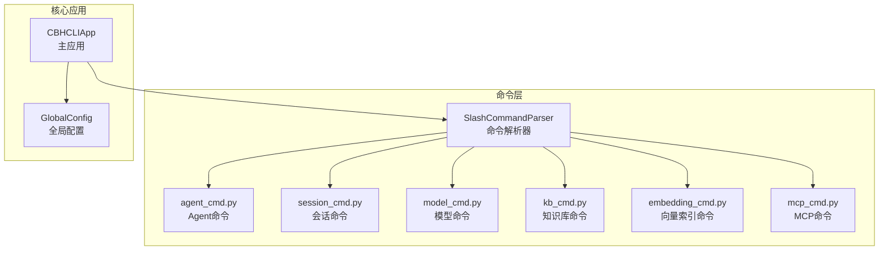
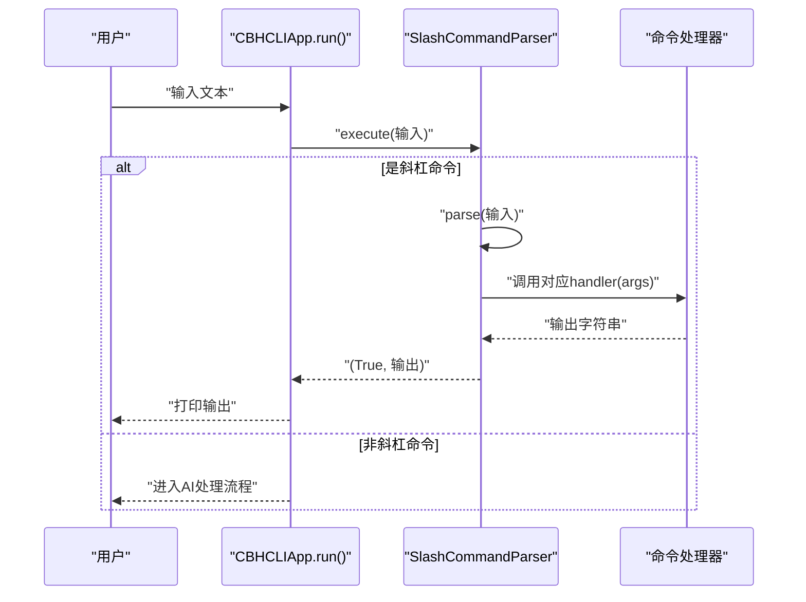
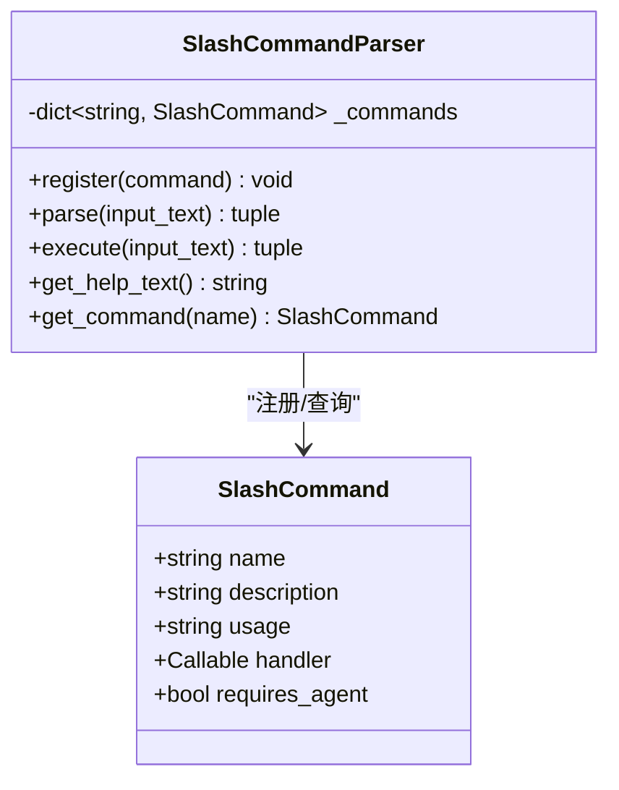
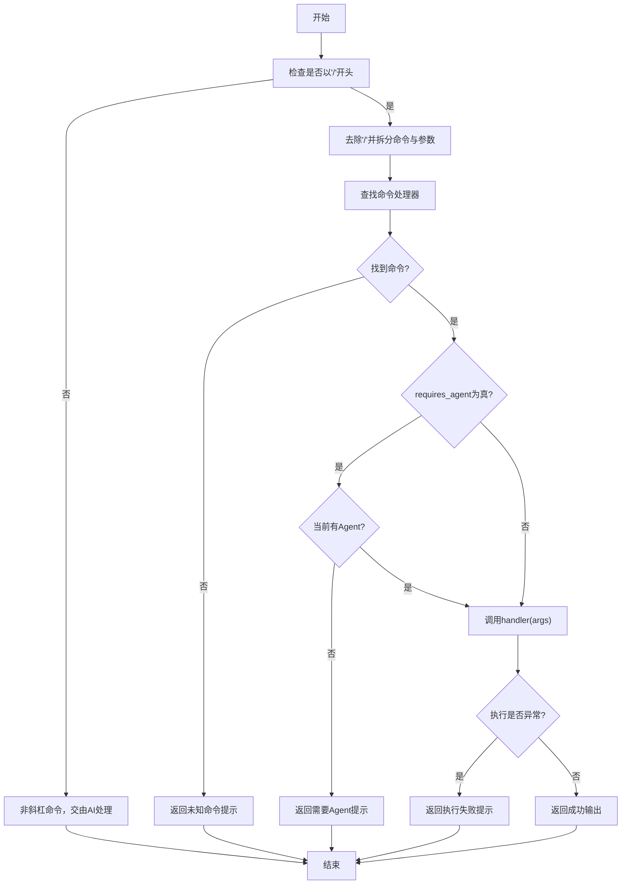
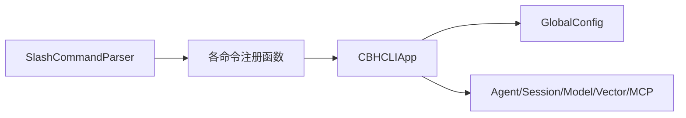

# 命令系统API

<cite>
**本文引用的文件**
- [parser.py](file://cbhcli_pkg/commands/parser.py)
- [agent_cmd.py](file://cbhcli_pkg/commands/agent_cmd.py)
- [session_cmd.py](file://cbhcli_pkg/commands/session_cmd.py)
- [model_cmd.py](file://cbhcli_pkg/commands/model_cmd.py)
- [kb_cmd.py](file://cbhcli_pkg/commands/kb_cmd.py)
- [embedding_cmd.py](file://cbhcli_pkg/commands/embedding_cmd.py)
- [mcp_cmd.py](file://cbhcli_pkg/commands/mcp_cmd.py)
- [app.py](file://cbhcli_pkg/core/app.py)
- [global_config.py](file://cbhcli_pkg/config/global_config.py)
- [constants.py](file://cbhcli_pkg/core/constants.py)
- [cli.py](file://cbhcli_pkg/cli.py)
- [registry.py](file://cbhcli_pkg/tools/registry.py)
</cite>

## 目录
1. [简介](#简介)
2. [项目结构](#项目结构)
3. [核心组件](#核心组件)
4. [架构总览](#架构总览)
5. [详细组件分析](#详细组件分析)
6. [依赖分析](#依赖分析)
7. [性能考虑](#性能考虑)
8. [故障排查指南](#故障排查指南)
9. [结论](#结论)
10. [附录](#附录)

## 简介
本文件为 CBHCLI 命令系统API的完整参考文档，聚焦SlashCommandParser命令解析器与SlashCommand命令定义，系统化说明命令注册、参数解析与路由分发机制；详解各内置命令（Agent管理、会话管理、模型配置、知识库、向量索引、MCP管理）的接口与行为；提供命令扩展开发指南、参数验证与错误处理机制、上下文环境与权限控制、配置与定制方法，以及与核心功能模块的集成方式，并给出使用示例与最佳实践。

## 项目结构
命令系统位于 cbhcli_pkg/commands 目录，围绕 SlashCommandParser 与一组命令注册函数组织；主应用在 cbhcli_pkg/core/app.py 中完成命令初始化与路由；配置在 cbhcli_pkg/config/global_config.py 中集中管理；工具系统在 cbhcli_pkg/tools/registry.py 中统一注册与执行。

图表来源
- [parser.py:16-94](file://cbhcli_pkg/commands/parser.py#L16-L94)
- [agent_cmd.py:5-47](file://cbhcli_pkg/commands/agent_cmd.py#L5-L47)
- [session_cmd.py:5-102](file://cbhcli_pkg/commands/session_cmd.py#L5-L102)
- [model_cmd.py:5-61](file://cbhcli_pkg/commands/model_cmd.py#L5-L61)
- [kb_cmd.py:5-54](file://cbhcli_pkg/commands/kb_cmd.py#L5-L54)
- [embedding_cmd.py:5-39](file://cbhcli_pkg/commands/embedding_cmd.py#L5-L39)
- [mcp_cmd.py:5-50](file://cbhcli_pkg/commands/mcp_cmd.py#L5-L50)
- [app.py:151-179](file://cbhcli_pkg/core/app.py#L151-L179)
- [global_config.py:13-154](file://cbhcli_pkg/config/global_config.py#L13-L154)

章节来源
- [parser.py:16-94](file://cbhcli_pkg/commands/parser.py#L16-L94)
- [app.py:151-179](file://cbhcli_pkg/core/app.py#L151-L179)

## 核心组件
- SlashCommand 数据结构：包含命令名称、描述、用法、处理器函数及“是否需要当前Agent”的标记。
- SlashCommandParser：负责命令注册、解析输入文本为命令与参数、执行命令并返回结果，同时提供帮助文本生成与命令查询能力。

章节来源
- [parser.py:6-14](file://cbhcli_pkg/commands/parser.py#L6-L14)
- [parser.py:16-94](file://cbhcli_pkg/commands/parser.py#L16-L94)

## 架构总览
命令系统在应用启动时初始化，注册所有内置命令，随后在主循环中优先判断输入是否为斜杠命令，若是则通过解析器执行；否则交由AI处理流程。

图表来源
- [app.py:404-413](file://cbhcli_pkg/core/app.py#L404-L413)
- [parser.py:51-78](file://cbhcli_pkg/commands/parser.py#L51-L78)

章节来源
- [app.py:386-421](file://cbhcli_pkg/core/app.py#L386-L421)
- [parser.py:51-78](file://cbhcli_pkg/commands/parser.py#L51-L78)

## 详细组件分析

### SlashCommandParser 与 SlashCommand
- SlashCommand 字段
  - name: 命令名（唯一标识）
  - description: 命令描述
  - usage: 用法说明
  - handler: 处理函数（接收字符串参数，返回字符串输出）
  - requires_agent: 是否需要当前Agent（影响路由与权限校验）
- SlashCommandParser 方法
  - register(command): 注册命令
  - parse(input_text): 解析斜杠命令，返回(命令名, 参数)或None
  - execute(input_text): 执行命令，返回(是否成功, 输出字符串)
  - get_help_text(): 生成帮助文本
  - get_command(name): 查询命令定义

图表来源
- [parser.py:6-14](file://cbhcli_pkg/commands/parser.py#L6-L14)
- [parser.py:16-94](file://cbhcli_pkg/commands/parser.py#L16-L94)

章节来源
- [parser.py:6-14](file://cbhcli_pkg/commands/parser.py#L6-L14)
- [parser.py:16-94](file://cbhcli_pkg/commands/parser.py#L16-L94)

### Agent 管理命令（/agent）
- 子命令
  - create <name>: 创建Agent
  - list: 列出Agent
  - switch [<name>]: 切换Agent（可交互选择）
  - delete <name>: 删除Agent（保护main不可删）
- 关键行为
  - 交互式菜单：列出Agent并支持编号或名称切换
  - 创建Agent：可选择首选模型并加载Agent
  - 删除Agent：需确认，禁止删除当前激活Agent与主Agent

章节来源
- [agent_cmd.py:5-47](file://cbhcli_pkg/commands/agent_cmd.py#L5-L47)
- [agent_cmd.py:50-97](file://cbhcli_pkg/commands/agent_cmd.py#L50-L97)
- [agent_cmd.py:99-130](file://cbhcli_pkg/commands/agent_cmd.py#L99-L130)
- [agent_cmd.py:132-151](file://cbhcli_pkg/commands/agent_cmd.py#L132-L151)
- [agent_cmd.py:154-161](file://cbhcli_pkg/commands/agent_cmd.py#L154-L161)
- [agent_cmd.py:164-180](file://cbhcli_pkg/commands/agent_cmd.py#L164-L180)

### 会话管理命令（/reset, /new, /resume, /history, /comp, /ctx）
- /reset 或 /new：重置当前会话（自动保存上一会话）
- /resume [<编号|文件名>]：列出或恢复历史会话
- /history：历史会话列表（别名）
- /comp [指令]：手动压缩上下文（v4.9.9 起支持带保留/丢弃指令）
- /ctx：显示上下文使用情况（模型、剩余tokens、消息数、工具调用等）
- requires_agent: true（除help外）

### Harness 命令（/mode, /permissions, /hooks, /undo）v4.9.9 新增
- /mode [readonly|standard|auto|yolo|list|default <模式>]：权限模式切换（Shift+Tab 循环切换同效；yolo 需二次确认）
- /permissions [list|add <allow|ask|deny> <规则>|rm <allow|ask|deny> <规则>]：权限规则管理（~/.cbhcli/permissions.json）
- /hooks [list|reload|test <事件名>]：生命周期钩子管理（SessionStart/UserPromptSubmit/PreToolUse/PostToolUse/SubagentStop/Stop）
- /undo [<备份ID>|list]：回滚 write/edit 的文件修改（自动检查点，保留最近50份）
- requires_agent: true

章节来源
- [session_cmd.py:5-31](file://cbhcli_pkg/commands/session_cmd.py#L5-L31)
- [session_cmd.py:33-94](file://cbhcli_pkg/commands/session_cmd.py#L33-L94)
- [session_cmd.py:104-115](file://cbhcli_pkg/commands/session_cmd.py#L104-L115)
- [session_cmd.py:117-140](file://cbhcli_pkg/commands/session_cmd.py#L117-L140)
- [session_cmd.py:142-182](file://cbhcli_pkg/commands/session_cmd.py#L142-L182)

### 模型配置命令（/model）
- 主命令：/model
- 子命令
  - add：添加模型（交互式输入API Key、Base URL、模型ID、上下文限制）
  - list：列出模型
  - use <name>：使用指定模型（更新Agent主模型并重载Agent）
  - delete <name>：删除模型
  - info：查看当前模型信息
  - config：修改模型参数（上下文长度、温度等）
  - embedding：嵌入模型配置菜单（add/info/delete）
  - rerank：重排序模型配置菜单（add/info/delete）
- 行为要点
  - use后会更新Agent配置并重载Agent以应用新模型
  - info显示当前Agent主模型、上下文限制与当前上下文使用百分比

章节来源
- [model_cmd.py:5-61](file://cbhcli_pkg/commands/model_cmd.py#L5-L61)
- [model_cmd.py:64-104](file://cbhcli_pkg/commands/model_cmd.py#L64-L104)
- [model_cmd.py:107-127](file://cbhcli_pkg/commands/model_cmd.py#L107-L127)
- [model_cmd.py:130-149](file://cbhcli_pkg/commands/model_cmd.py#L130-L149)
- [model_cmd.py:152-156](file://cbhcli_pkg/commands/model_cmd.py#L152-L156)
- [model_cmd.py:159-175](file://cbhcli_pkg/commands/model_cmd.py#L159-L175)
- [model_cmd.py:182-204](file://cbhcli_pkg/commands/model_cmd.py#L182-L204)
- [model_cmd.py:207-237](file://cbhcli_pkg/commands/model_cmd.py#L207-L237)
- [model_cmd.py:240-257](file://cbhcli_pkg/commands/model_cmd.py#L240-L257)
- [model_cmd.py:260-272](file://cbhcli_pkg/commands/model_cmd.py#L260-L272)
- [model_cmd.py:279-301](file://cbhcli_pkg/commands/model_cmd.py#L279-L301)
- [model_cmd.py:304-335](file://cbhcli_pkg/commands/model_cmd.py#L304-L335)
- [model_cmd.py:338-355](file://cbhcli_pkg/commands/model_cmd.py#L338-L355)
- [model_cmd.py:358-370](file://cbhcli_pkg/commands/model_cmd.py#L358-L370)

### 知识库命令（/kb）
- 子命令
  - add <file_path>：添加文件到知识库
  - list：列出知识库文件
  - remove <file_name>：从知识库删除文件
  - reindex：重新索引整个知识库
  - status：查看知识库状态（Agent、目录、文件数、向量文档数、索引器状态）
- requires_agent: true

章节来源
- [kb_cmd.py:5-54](file://cbhcli_pkg/commands/kb_cmd.py#L5-L54)
- [kb_cmd.py:57-76](file://cbhcli_pkg/commands/kb_cmd.py#L57-L76)
- [kb_cmd.py:79-102](file://cbhcli_pkg/commands/kb_cmd.py#L79-L102)
- [kb_cmd.py:105-123](file://cbhcli_pkg/commands/kb_cmd.py#L105-L123)
- [kb_cmd.py:126-144](file://cbhcli_pkg/commands/kb_cmd.py#L126-L144)
- [kb_cmd.py:147-185](file://cbhcli_pkg/commands/kb_cmd.py#L147-L185)

### 向量索引命令（/embedding）
- 子命令
  - index：索引当前Agent工作空间到向量数据库
  - status：查看索引状态（Agent、索引状态、向量数量）
  - clear：清除当前Agent的索引
  - reindex：先清除再索引
- 依赖：嵌入模型配置与向量存储可用

章节来源
- [embedding_cmd.py:5-39](file://cbhcli_pkg/commands/embedding_cmd.py#L5-L39)
- [embedding_cmd.py:42-69](file://cbhcli_pkg/commands/embedding_cmd.py#L42-L69)
- [embedding_cmd.py:72-91](file://cbhcli_pkg/commands/embedding_cmd.py#L72-L91)
- [embedding_cmd.py:94-107](file://cbhcli_pkg/commands/embedding_cmd.py#L94-L107)
- [embedding_cmd.py:110-121](file://cbhcli_pkg/commands/embedding_cmd.py#L110-L121)

### MCP 命令（/mcp）
- 子命令
  - add <name> <url> [headers...]: 添加MCP服务器（支持Authorization等header）
  - list：列出服务器（连接状态、工具、已启用工具）
  - remove <name>：移除服务器
  - refresh <name>：重新连接并刷新工具
  - tools <name>：查看服务器工具列表
  - enable/disable <server> <tool>：启用/禁用工具
  - help：显示帮助
- requires_agent: true

章节来源
- [mcp_cmd.py:5-50](file://cbhcli_pkg/commands/mcp_cmd.py#L5-L50)
- [mcp_cmd.py:53-75](file://cbhcli_pkg/commands/mcp_cmd.py#L53-L75)
- [mcp_cmd.py:78-97](file://cbhcli_pkg/commands/mcp_cmd.py#L78-L97)
- [mcp_cmd.py:100-124](file://cbhcli_pkg/commands/mcp_cmd.py#L100-L124)
- [mcp_cmd.py:127-138](file://cbhcli_pkg/commands/mcp_cmd.py#L127-L138)
- [mcp_cmd.py:141-164](file://cbhcli_pkg/commands/mcp_cmd.py#L141-L164)
- [mcp_cmd.py:167-181](file://cbhcli_pkg/commands/mcp_cmd.py#L167-L181)

### 命令解析与路由流程
- 解析：以'/'开头，首个空格分割命令名与参数；命令名转小写
- 路由：根据命令名查找处理器；若requires_agent为真，需满足当前Agent存在
- 执行：调用handler(args)，捕获异常并返回错误信息
- 帮助：/help无参输出全部命令列表，有参输出单个命令详情

图表来源
- [parser.py:26-78](file://cbhcli_pkg/commands/parser.py#L26-L78)
- [session_cmd.py:17-23](file://cbhcli_pkg/commands/session_cmd.py#L17-L23)
- [session_cmd.py:96-102](file://cbhcli_pkg/commands/session_cmd.py#L96-L102)
- [kb_cmd.py:48-54](file://cbhcli_pkg/commands/kb_cmd.py#L48-L54)
- [mcp_cmd.py:44-50](file://cbhcli_pkg/commands/mcp_cmd.py#L44-L50)

章节来源
- [parser.py:26-78](file://cbhcli_pkg/commands/parser.py#L26-L78)

## 依赖分析
- 命令层依赖
  - SlashCommandParser 依赖 SlashCommand 定义
  - 各命令注册函数依赖 SlashCommand 定义
- 应用层依赖
  - CBHCLIApp 在初始化阶段注册所有命令，并注入app实例供命令处理器使用
  - 命令处理器通过app访问Agent管理、会话、模型、向量存储、MCP管理等核心能力
- 配置层依赖
  - GlobalConfig 提供模型、嵌入模型、重排序模型、Agent与设置的持久化与查询

图表来源
- [app.py:151-179](file://cbhcli_pkg/core/app.py#L151-L179)
- [global_config.py:13-154](file://cbhcli_pkg/config/global_config.py#L13-L154)

章节来源
- [app.py:151-179](file://cbhcli_pkg/core/app.py#L151-L179)
- [global_config.py:13-154](file://cbhcli_pkg/config/global_config.py#L13-L154)

## 性能考虑
- 上下文压缩：当上下文接近模型限制时自动压缩，减少Token消耗，提升响应效率
- 向量索引：仅在配置嵌入模型后启用向量存储，避免不必要的IO开销
- 工具执行：工具结果截断与轮次限制，防止长输出阻塞交互

章节来源
- [constants.py:6-16](file://cbhcli_pkg/core/constants.py#L6-L16)
- [app.py:361-384](file://cbhcli_pkg/core/app.py#L361-L384)

## 故障排查指南
- 未知命令：检查命令名大小写与拼写，确认已在初始化中注册
- 需要Agent：部分命令requires_agent=true，需先通过/agent切换Agent
- 模型未配置：/model info显示当前Agent未配置模型时，需先配置模型
- 向量索引失败：确认嵌入模型已配置且向量存储初始化成功
- MCP服务器问题：检查服务器URL、Headers与连接状态，使用/tools查看工具列表

章节来源
- [parser.py:68-77](file://cbhcli_pkg/commands/parser.py#L68-L77)
- [session_cmd.py:10-12](file://cbhcli_pkg/commands/session_cmd.py#L10-L12)
- [model_cmd.py:159-162](file://cbhcli_pkg/commands/model_cmd.py#L159-L162)
- [embedding_cmd.py:44-45](file://cbhcli_pkg/commands/embedding_cmd.py#L44-L45)
- [mcp_cmd.py:10-14](file://cbhcli_pkg/commands/mcp_cmd.py#L10-L14)

## 结论
CBHCLI命令系统以SlashCommandParser为核心，采用轻量级数据结构与清晰的注册/解析/执行流程，覆盖Agent、会话、模型、知识库、向量索引与MCP管理等关键领域。通过requires_agent标记与app注入，命令在统一上下文中安全执行；结合GlobalConfig与核心模块，实现可配置、可扩展、可维护的命令生态。

## 附录

### 命令注册与扩展开发指南
- 新增命令步骤
  - 定义命令处理器函数（接收字符串参数，返回字符串输出）
  - 使用SlashCommand(name, description, usage, handler[, requires_agent])构造命令对象
  - 在应用初始化时调用parser.register注册
- 最佳实践
  - 参数解析：先trim，再按空格拆分，区分action与param
  - 错误处理：显式检查必填参数与前置条件（如Agent存在），捕获异常并返回友好提示
  - 交互式菜单：提供清晰的列表与选择逻辑，支持编号与名称两种输入
  - 权限控制：对需要Agent的操作设置requires_agent=True并在处理器中校验

章节来源
- [parser.py:22-24](file://cbhcli_pkg/commands/parser.py#L22-L24)
- [agent_cmd.py:9-40](file://cbhcli_pkg/commands/agent_cmd.py#L9-L40)
- [session_cmd.py:8-31](file://cbhcli_pkg/commands/session_cmd.py#L8-L31)
- [kb_cmd.py:8-46](file://cbhcli_pkg/commands/kb_cmd.py#L8-L46)
- [mcp_cmd.py:8-42](file://cbhcli_pkg/commands/mcp_cmd.py#L8-L42)

### 命令参数验证与错误处理机制
- 必填参数校验：对create/delete/use等命令进行参数完整性检查
- 前置条件检查：/model use需存在模型配置；/kb系列需当前Agent；/embedding需嵌入模型与向量存储
- 异常捕获：命令执行异常统一转换为错误提示，避免崩溃

章节来源
- [agent_cmd.py:20-40](file://cbhcli_pkg/commands/agent_cmd.py#L20-L40)
- [model_cmd.py:34-42](file://cbhcli_pkg/commands/model_cmd.py#L34-L42)
- [kb_cmd.py:26-46](file://cbhcli_pkg/commands/kb_cmd.py#L26-L46)
- [embedding_cmd.py:42-69](file://cbhcli_pkg/commands/embedding_cmd.py#L42-L69)
- [parser.py:73-77](file://cbhcli_pkg/commands/parser.py#L73-L77)

### 命令执行上下文与权限控制
- 上下文：命令处理器接收app实例，可访问Agent、会话、模型、向量存储、MCP管理等
- 权限：requires_agent为true的命令在无Agent时拒绝执行；删除Agent时禁止删除当前Agent与主Agent

章节来源
- [app.py:151-179](file://cbhcli_pkg/core/app.py#L151-L179)
- [agent_cmd.py:164-171](file://cbhcli_pkg/commands/agent_cmd.py#L164-L171)
- [session_cmd.py:17-23](file://cbhcli_pkg/commands/session_cmd.py#L17-L23)
- [kb_cmd.py:48-54](file://cbhcli_pkg/commands/kb_cmd.py#L48-L54)
- [mcp_cmd.py:44-50](file://cbhcli_pkg/commands/mcp_cmd.py#L44-L50)

### 命令系统配置选项与定制方法
- 全局设置
  - auto_compress：自动压缩开关
  - compression_ratio：压缩阈值比例
  - workspace_base：Agent工作空间基础路径
  - knowledge_base_dir：知识库根目录
- 模型与嵌入/重排序
  - 模型列表、嵌入模型、重排序模型配置均持久化于~/.cbhcli/config.json
- 定制方法
  - 修改GlobalConfig中的默认设置
  - 在命令处理器中扩展业务逻辑（如新增校验、日志、缓存）

章节来源
- [global_config.py:31-48](file://cbhcli_pkg/config/global_config.py#L31-L48)
- [global_config.py:107-114](file://cbhcli_pkg/config/global_config.py#L107-L114)
- [global_config.py:117-154](file://cbhcli_pkg/config/global_config.py#L117-L154)

### 命令与核心功能模块的集成方式
- Agent/会话：通过AgentManager与Session管理生命周期与上下文
- 模型：通过LLMClient与ContextWindow控制上下文与压缩
- 向量存储：通过EmbeddingClient、RerankClient与VectorStore/MemoryIndexer实现检索增强
- MCP：通过MCPManager管理外部工具服务器与工具启用/禁用
- 工具系统：通过ToolRegistry统一注册与执行，支持工具描述注入到系统提示

章节来源
- [app.py:85-150](file://cbhcli_pkg/core/app.py#L85-L150)
- [app.py:231-279](file://cbhcli_pkg/core/app.py#L231-L279)
- [registry.py:51-115](file://cbhcli_pkg/tools/registry.py#L51-L115)

### 命令使用示例与最佳实践
- Agent管理
  - /agent create <name>：创建Agent并选择主模型
  - /agent list：查看Agent列表
  - /agent switch <name>：切换Agent
  - /agent delete <name>：删除Agent（需确认）
- 会话管理
  - /reset：重置会话并保存上一会话
  - /resume：<编号|文件名>：恢复历史会话
  - /comp：手动压缩上下文
  - /ctx：查看上下文使用情况
- 模型配置
  - /model add：交互式添加模型
  - /model use <name>：切换Agent主模型并重载
  - /model embedding add：配置嵌入模型
  - /model rerank add：配置重排序模型
- 知识库
  - /kb add <file>：添加文件
  - /kb list：列出文件
  - /kb reindex：重新索引
  - /kb status：查看状态
- 向量索引
  - /embedding index：索引工作空间
  - /embedding status：查看索引状态
  - /embedding reindex：清除后重建
- MCP
  - /mcp add <name> <url> [headers...]：添加服务器
  - /mcp list：查看服务器与工具
  - /mcp enable/disable <server> <tool>：启用/禁用工具
- 最佳实践
  - 命令参数先trim再拆分，严格校验必填项
  - 对可能失败的操作提供确认流程（如删除Agent/模型）
  - 在requires_agent为true的命令中，优先引导用户选择Agent
  - 对长输出进行截断与分页展示，提升交互体验

章节来源
- [cli.py:17-67](file://cbhcli_pkg/cli.py#L17-L67)
- [agent_cmd.py:9-40](file://cbhcli_pkg/commands/agent_cmd.py#L9-L40)
- [session_cmd.py:8-31](file://cbhcli_pkg/commands/session_cmd.py#L8-L31)
- [model_cmd.py:28-54](file://cbhcli_pkg/commands/model_cmd.py#L28-L54)
- [kb_cmd.py:26-46](file://cbhcli_pkg/commands/kb_cmd.py#L26-L46)
- [embedding_cmd.py:23-32](file://cbhcli_pkg/commands/embedding_cmd.py#L23-L32)
- [mcp_cmd.py:25-42](file://cbhcli_pkg/commands/mcp_cmd.py#L25-L42)